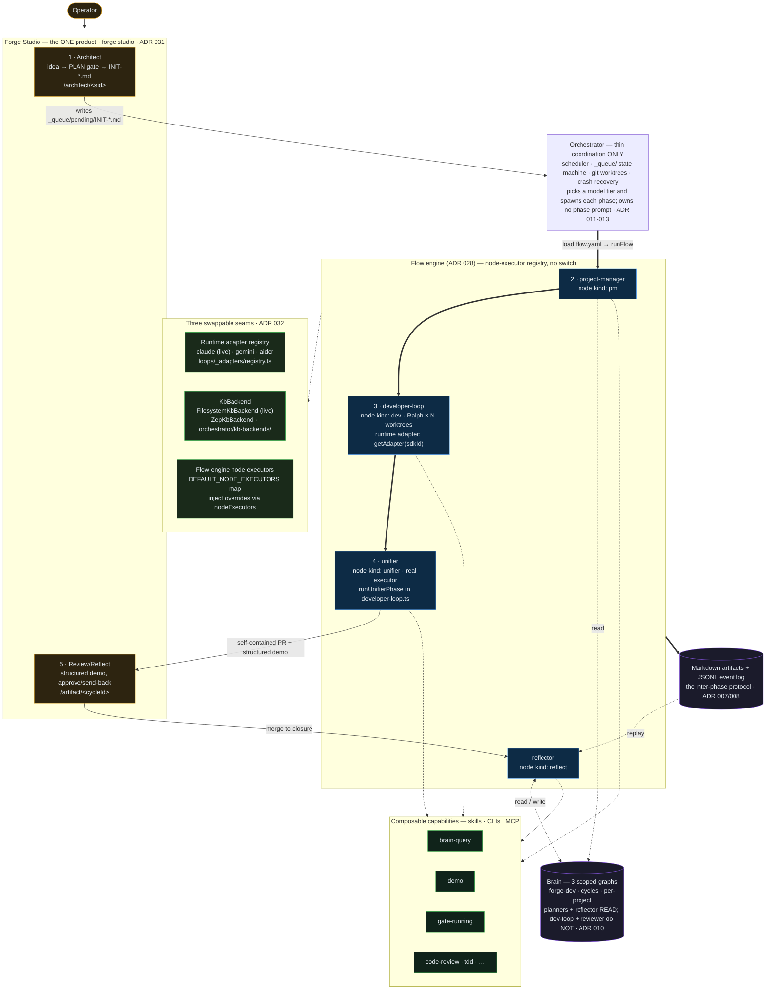

# Architecture

> This document is the **narrative / intended** architecture. The
> **canonical current architecture** is captured in [`docs/phases/`](./docs/phases/),
> [`docs/decisions/`](./docs/decisions/), and [`docs/forge-project-contract.md`](./docs/forge-project-contract.md).
> The 2026-05-17 as-built snapshot and the pre-simplification refocus-architecture design docs
> were archived prior art (removed 2026-06-07 — see git history). ADRs in [`docs/decisions/`](./docs/decisions/) record load-bearing decisions.
>
> **Reconciled 2026-05-16**, refreshed **2026-05-17** post-closure,
> **refreshed 2026-06-14** post-M7/M8 consolidation. Key load-bearing facts:
> (a) **Forge Studio is the one product ([ADR 031](./docs/decisions/031-studio-consolidation.md))** —
> the pre-Studio `/dashboard` is deleted; `forge studio` is the canonical launcher
> (`forge watch` is gone); all human moments are Studio screens; (b) **brain-first
> is narrowed** — the planner and reflector read the brain; the dev-loop and
> reviewer do not ([ADR 010](./docs/decisions/010-brain-first.md));
> (c) **no auto-merge** — the GitHub PR is the operator's merge surface;
> `closure.ts` is the single terminal-move authority; (d) **Forge Studio is the
> sole operator surface** ([ADR 023](./docs/decisions/023-ui-sole-operator-surface.md),
> extended by ADR 031 — architect runs natively in Studio; review/reflect render
> on the unified `/artifact` viewer); (e) **three swappable seams are real and
> used in production** ([ADR 032](./docs/decisions/032-subsumption-proof.md)):
> runtime adapter registry, KbBackend, and the unifier as an independently-
> dispatchable flow node — each with a second implementation shipped.

## Overview

Forge is six phases backed by a brain. The flow engine
([`orchestrator/flow-runner.ts`](./orchestrator/flow-runner.ts)) walks a
`FlowDefinition` (a YAML-declared DAG, ADR 028) in topological order, dispatching
each node through a **node-executor registry** — no `classifyNode` switch. The
forge cycle flow (`studio/flows/forge-cycle/flow.yaml`) defines the canonical
PM → dev → unifier → review → reflect sequence; `runCycle` reduces to "load
flow.yaml → runFlow". The brain is read by the **planning** phases and the
reflector; the dev-loop and reviewer take their intent solely from the planner's
work items.

> **High-level view (refreshed 2026-06-14 — M7/M8).** The diagram below reflects
> the as-built Studio-as-one-product and three-seam architecture. The structural
> reference is [`docs/phases/`](./docs/phases/) and [`docs/decisions/`](./docs/decisions/).



The same flow in one line (terminal-friendly fallback): the operator works only
on **Forge Studio** (`forge studio`; architect → review/reflect on `/artifact`);
the **flow engine** walks a YAML DAG dispatching nodes through a **registry** (no
switch); agents are created via `getAdapter(sdkId).createAgent` (runtime adapter
seam); the brain's store is behind a swappable `KbBackend`; the **brain** is
read by planners + reflector and written by the reflector.

```
operator ─(Studio only)─► ① architect ─INIT-*.md─► [orchestrator: load flow.yaml → runFlow]
         │                                                │
         │                                                ▼
         │                       ② PM ─► ③ dev-loop ─► ④ unifier ──► ⑤ review/reflect
         │                        └──── node-executor registry · runtime adapter seam ──┘
         └──────────────────────────────  brain (3 scopes) · KbBackend seam ◄── write ──┘
```

### Artifact flow

```
Roadmap ──► Initiative ──► Work item ──┐
                                         │
                                         ▼
                              (developer loop iterates)
                                         │
                                         ▼
                                  Review-ready PR
```

### Branch flow

```
main ◄── (review loop merges) ──── initiative branch ◄── per-work-item branches
```

## The phases

### 1. Brain

The brain is the system's memory. It is a **Karpathy-style LLM wiki** with three layers:

After the **Tier 4 three-brain restructure (2026-05-26)**, three scoped brains:
- **Brain 1 (forge-dev):** `brain/forge-dev/` — forge TypeScript source knowledge + ADRs + engineering notes.
- **Brain 2 (cycles):** `brain/cycles/` — cycle-derived patterns, antipatterns, raw archives. `brain/cycles/_raw/` holds immutable cycle records.
- **Brain 3 (per-project):** `<project-repo>/brain/` — lives inside each managed project's repo.

Layer structure (each brain follows this pattern):
1. **`_raw/`** — immutable raw sources. Ground truth.
2. **`themes/`** — small (~15-40 line) theme pages indexing the raw layer.
3. **Category indexes + `profile.md`** — navigation pointing to theme pages.

The brain is **rendered as an Obsidian vault** so humans navigate the same graph the agents query.

The brain is itself a small set of agents (Claude Code skills):
- **`brain-ingest`** — writes new theme pages / appends raw sources from research or learnings.
- **`brain-lint`** — surfaces conflicts, fixes structural issues, raises ambiguities to the human.
- **`brain-query`** — efficient lookup for use by every other skill (mandated as their first action).

### 2. Architect *(human-in-the-loop)*

The architect runs **natively inside Forge Studio** on the dedicated
`/architect/<sid>` screen ([ADR 020](./docs/decisions/020-architect-in-ui.md),
extended by [ADR 031](./docs/decisions/031-studio-consolidation.md)).

Responsibility: turn ideas + existing roadmap + brain knowledge into **initiatives** — coherent units of work, each carrying Given/When/Then acceptance criteria in its body, that move a project to a desired state.

The architect uses the **LLM Council pattern** ([`skills/architect-llm-council/`](./skills/architect-llm-council/)) — a chain of perspectives (CEO, eng, design, DX) that auto-resolves mechanical questions and only escalates the taste decisions. The PLAN gate (a human approval step on the Studio screen) is satisfied before the scheduler picks up the run.

**Intentionally out-of-cycle (by design, not a gap).** The architect is
**not** wired into `runCycle` and is **not** auto-invoked: it is a
deliberate human moment. Its only handoff is the files it writes
(`_queue/pending/INIT-*.md`); the scheduler picks those up unattended.
The roadmap is **not** written by the architect — it is a derived view
of the `_queue/` manifests + their `depends_on_initiatives` chain. Design of record:
[`brain/forge-dev/themes/human-interaction-via-own-session.md`](./brain/forge-dev/themes/human-interaction-via-own-session.md).

### 3. Project Manager *(unattended)*

Responsibility: decompose the initiative body's Given-When-Then acceptance criteria directly into **work items** with explicit dependencies and acceptance criteria.

Work items follow a **spec-driven format** designed for the agentic developer loop:
- Atomic scope (1-3 files where possible).
- Given-When-Then acceptance criteria.
- Explicit success signals the developer loop can verify.
- Designed for *iteration*, not one-shotting.
- Inter-item dependencies declared so parallel work is safe.

The PM uses the brain first; researches more broadly only when the brain is insufficient. It is fully automated and emits structured logs that the reflector reads.

### 4. Developer Loop *(unattended)*

The developer loop is **the Ralph loop pattern** ([ghuntley/how-to-ralph-wiggum](https://github.com/ghuntley/how-to-ralph-wiggum)) run as a flow DAG node (`kind: dev`, `fanOut: work-items`).

```
loop:
  read PROMPT.md, AGENT.md (institutional memory), fix_plan.md
  call query() against the worktree via getAdapter(sdkId).createAgent(...)
  commit changes
  check stop conditions (quality gates pass | iteration budget)
```

Key properties:
- **Runtime adapter seam (ADR 029)** — agents are created via `getAdapter(sdkId).createAgent`, not `createClaudeAgent` directly. The registry (`loops/_adapters/registry.ts`) holds `claudeAdapter` (live), `geminiAdapter`, and `aiderAdapter` (both DEP+CREDS-GATED; `available:false` until provisioned). A second adapter is a one-file drop-in that passes the conformance suite.
- **Unifier is its own DAG node** — `runUnifierPhase` (`orchestrator/phases/developer-loop.ts`) is extracted from the dev-loop tail and registered as `node kind: unifier` in `DEFAULT_NODE_EXECUTORS`. The flow's `resumeFrom: 'unifier'` path targets this node directly; the per-WI dev node self-no-ops (emitting start/end{resumed:true} so the hex resolves complete).
- **Parallel work** = N git worktrees × N Ralph instances, coordinated by the orchestrator's scheduler.
- **The developer loop is *complete* for an initiative** when all work items have landed in the initiative branch with all checks passing.
- **Merge conflict handling** is part of the loop, not the orchestrator.

### 5. Review Loop *(human-in-the-loop)*

Responsibility: closeout of an initiative back to main.

**Unified Ralph runner** (post-pass-1 design — earlier drafts had this split into two phases; the implementation collapsed them after the e2e bench surfaced redundant state shuffling). One Ralph loop on the initiative branch, parameterised by a reviewer system prompt + a verdict-aware quality gate. Iteration 1 prepares the demo + PR draft from scratch; iterations 2+ react to send-back feedback the verdict gate appends to `fix_plan.md`.

The verdict gate (the developer-loop unifier sub-phase's quality gate in [`orchestrator/unifier-invocation.ts`](./orchestrator/unifier-invocation.ts) + verdict provider in [`orchestrator/file-verdict.ts`](./orchestrator/file-verdict.ts)) runs between iterations and:

1. **Re-runs the project quality gate** (orchestrator-verified — never trusts the agent's claim).
2. **Asks the verdict provider** — production: the operator reviews via the **`/artifact/<cycleId>`** Studio screen ([ADR 031](./docs/decisions/031-studio-consolidation.md)). The file-based `verdict-response.md` handoff is written by the Studio bridge.
3. **On approve** → closure merges the PR and fires reflection. **On send-back** → feedback is appended to `fix_plan.md` as Given/When/Then ACs; loop continues.

> **Note (refocus pass):** `runReviewer` has been folded into `cycle.ts` — the reviewer phase was removed as a separate phase; the unifier sub-phase owns review-prep and the PR opens inline after the delivery gate passes.

**Self-contained PR.** The **unifier** writes + commits the git-tracked `demo/<initiative-id>/` bundle during its loop (so the demo lands on the branch before review). `pr.ts:embedDemoInPr` is then a **pure PR-body composer** — it appends a `## Demo` block to the PR description with branch-absolute `blob/<branch>/demo/<id>/DEMO.md` links (inlining raw images for **public** repos; GitHub's image proxy can't fetch private raw URLs), and de-duplicates any `## Demo` the unifier already wrote into the body. The operator reviews entirely from the PR; iterating via PR comments is a supported lightweight loop (pattern: `brain/cycles/themes/pr-as-sole-review-window.md`).

**No auto-merge.** The GitHub PR is the operator's merge + feedback surface. The operator merges it in GitHub (via the `/artifact/<cycleId>` Studio screen or directly on GitHub); a later `runClosure` confirms the merge (`gh pr view --json state` == `MERGED`), then `alignLocalToRemote` brings the **project's working tree** forward to the merged `main` (a guarded `merge --ff-only`, **stashing/restoring any uncommitted operator state** — never a bare ref move that strands the working tree) and prunes the branch, moves the manifest `in-flight/ → done/` (so **`done/` ⇒ MERGED**), and only then does reflection fire. `closure.ts` is the **single terminal-move authority**; the reviewer moves no manifest. Until the operator merges, the unattended cycle terminates at `pr-open` (not a failure).

Cap: fixed at ≤2 send-back rounds (iteration cap removed from the reviewer when `computeAdaptiveReviewIterationCap` was deleted with the Ralph reviewer in S4). There is **no per-iteration $/turn budget guard** on the reviewer agent (removed 2026-05-18 — it was undersized and cut every iteration before a verdict). Cap-exhausted leaves the manifest in `_queue/ready-for-review/` for manual operator pickup; never a hard cycle failure.

The review human moment is the **`/artifact/<cycleId>` UI screen** (Studio's unified artifact viewer — [ADR 031](./docs/decisions/031-studio-consolidation.md), amending ADR 023). The operator approves or sends-back directly there; the bridge writes the `verdict-response.md` handoff.

### 6. Reflection *(human-in-the-loop, then unattended ingest)*

Triggered after initiative closeout. Three scopes:

1. **Agentic self-reflection** — the agent reviews its own performance: digests the JSONL event log, counts iterations needed at each level (work item → review → initiative), spots antipatterns.
2. **Agent-prompted user questions** — the agent asks the user only what it cannot resolve from established principles + brain knowledge.
3. **Pure user feedback** — the user's free-form observations.

All three feed `brain-ingest`, which is what makes forge learn cycle-over-cycle.

## Cross-cutting concerns

### Unattended operation

Three human interaction points, all on **Forge Studio** — the sole operator
surface ([ADR 023](./docs/decisions/023-ui-sole-operator-surface.md), consolidated
by [ADR 031](./docs/decisions/031-studio-consolidation.md); `forge studio` is the
one launcher command). The load-bearing invariant is preserved: each moment is
**explicit, operator-initiated, and impossible to silently auto-satisfy** (no
auto-approve, no bench simulator in production —
[`brain/forge-dev/themes/human-interaction-via-own-session.md`](./brain/forge-dev/themes/human-interaction-via-own-session.md)).
The Studio bridge writes the handoff files the phases already consume:

| Moment | Studio screen | File handoff (written by the bridge) |
|---|---|---|
| Architect *(out-of-cycle — file-checkpointed runner; [ADR 020](./docs/decisions/020-architect-in-ui.md), [ADR 031](./docs/decisions/031-studio-consolidation.md))* | `/architect/<sid>` | writes `_queue/pending/INIT-*.md` + roadmap rows |
| Review + Reflect *(structured demo, approve/send-back; [ADR 021](./docs/decisions/021-local-review-and-unified-demo.md), [ADR 031](./docs/decisions/031-studio-consolidation.md))* | `/artifact/<cycleId>` | `verdict-response.md`; approve → closure merges the PR; free-form feedback → `_logs/<id>/user-feedback.md` |

Everything else runs unattended for arbitrary durations via:

- **`_queue/` state-machine directories** (`pending → in-flight → ready-for-review → done | failed`).
- **`orchestrator/scheduler.ts`** (~770 LOC persistent loop — see ADR 011 for the reconciliation of its scope) that claims initiatives, spawns each in a `git worktree`, writes a heartbeat, surfaces completion via notification.
- **Crash recovery** by atomic claim + heartbeat: orphaned in-flight items return to `pending/` on restart.

This is **not v1's job queue + worker + resource controller**. See ADR 011-013 for the line we're holding.

### Brain-first research

Every skill mandates `brain-query` as its first action. Broader research (web, docs) happens only when the brain proves insufficient — and the gap is logged so the next ingest pass can fill it.

### Logging & visualisation

Every skill invocation emits a structured event to `_logs/<cycle-id>/events.jsonl` (schema in [`docs/decisions/008-jsonl-event-log.md`](./docs/decisions/008-jsonl-event-log.md)). The event log is the source of truth for:

- **Reflection** (replay what happened).
- **Visualisation** (`forge status`, forge UI live phase view).
- **Metrics** (cost, iterations, duration per phase / skill / initiative).

### Phase isolation & quality

> Note (2026-05-25): the synthetic per-phase benchmark suites under `benchmarks/` were removed. They had begun teaching the phases toward the bench shape rather than measuring real outcomes. Phase quality is now judged on real merged cycles — brain themes accumulate the evidence. The phase-isolation decision itself (ADR 005) stands; only the benchmark realization was retired.

### Flow engine + node-executor registry (ADR 028)

`orchestrator/flow-runner.ts` interprets `FlowDefinition` DAGs in topological order. Node classification is table-driven — two read-only maps (`GATE_KIND`, `AGENT_KIND`) map gate ids and agent slugs to `NodeKind`; the dispatch loop resolves a kind and calls `executors[kind]`. **There is no `classifyNode` switch.** Adding a new kind is a one-line row in the table plus a new entry in `DEFAULT_NODE_EXECUTORS`; no dispatch edit.

The six built-in executors:
- `execArchitect` — silent DAG marker (the PLAN gate was satisfied before queue pickup).
- `execPm` — runs `runProjectManager`; on unifier-resume, rebases the preserved branch + skips.
- `execDev` — runs `runDeveloperLoop` (per-WI Ralph loop); on unifier-resume, self-no-ops the WI work (still emits start/end so the dev hex resolves complete).
- `execUnifier` — runs `runUnifierPhase` then the close-contract gates (commit boundary, close invariant, delivery gate, non-empty guard, final CI). **This is a real executor, not a marker.**
- `execReview` — `openPrInline` then `runClosure`.
- `execReflect` — `runReflector` (only when closure confirmed a merge).

Budget helpers (`orchestrator/flow-budgets.ts`): `CostTracker` (cost-ceiling check at every clean node boundary), `WedgeDetector` (per-node heartbeat/progress watch, race via `raceWithWedge`), `RateLimitGate` (gates spawn on rate-limit backoff).

### Three swappable seams (ADR 032)

M8 shipped a **second implementation behind each seam**, making the subsumption claim mechanically true. All second impls are DEP+CREDS-GATED (`available:false` until provisioned).

| Seam | Interface / registry | 1st impl (live) | 2nd impl (DEP-gated) |
|---|---|---|---|
| **Runtime adapter** (ADR 029) | `RuntimeAdapter` · `loops/_adapters/registry.ts` | `claudeAdapter` — Claude Agent SDK | `geminiAdapter` (`@google/genai`), `aiderAdapter` (Aider CLI) |
| **KbBackend** (ADR 027) | `KbBackend` · `orchestrator/kb-backend.ts` | `FilesystemKbBackend` (reads `brain/<kbId>/`) | `ZepKbBackend` (`orchestrator/kb-backends/zep.ts`) |
| **Dev-loop runtime** | via RuntimeAdapter seam | Ralph + Claude Agent SDK | Aider CLI via `aiderAdapter` |

The closure is `orchestrator/subsumption-proof.test.ts`: asserts every seam resolves ≥2 non-default implementations simultaneously.

Cycle helpers extracted to `orchestrator/cycle-helpers.ts` to break the `flow-runner ↔ cycle` circular dependency: `openPrInline`, `commitDevLoopBoundary`, `enforceDevLoopCloseInvariant`, `assertNonEmptyDelivery`, `enforceFinalCiGate`, `preservingForgeScratch`.

## What forge is *not*

- It is not a job queue with priorities and dedup. (See ADR 011.)
- It is not a resource controller. (`maxConcurrentInitiatives` is a static knob.)
- It is not a per-project agent personality. (Skills are shared; per-project taste lives in `<project-repo>/brain/profile.md`.)
- It does not retry failed initiatives automatically. (Failure → human triage.)
- It does not host its own model runtime, vector DB, or agent harness. (Claude Agent SDK does that.)
