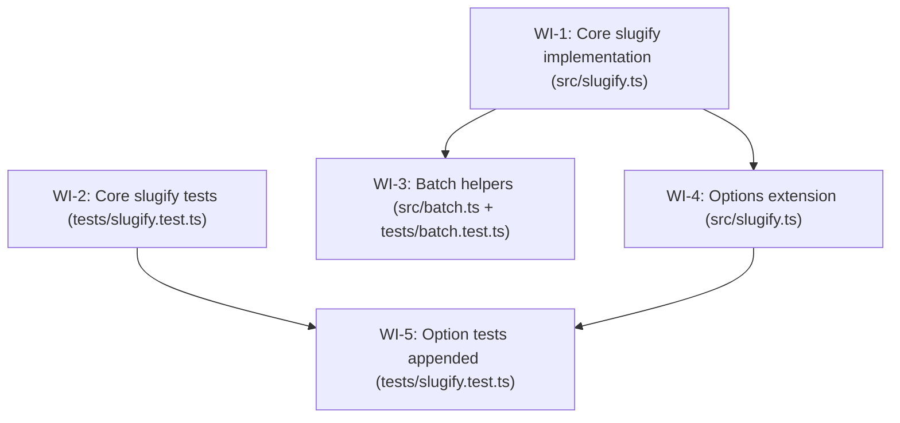

# Work-item dependency graph — INIT-2025-05-17-slugifier-package

## Parallelism summary

| WI | Feature | Depends on | Can start immediately? |
|----|---------|------------|----------------------|
| WI-1 | FEAT-1 | — | ✅ Yes |
| WI-2 | FEAT-1 | — | ✅ Yes |
| WI-3 | FEAT-2 | WI-1 | After WI-1 |
| WI-4 | FEAT-3 | WI-1 | After WI-1 |
| WI-5 | FEAT-3 | WI-2, WI-4 | After WI-2 and WI-4 |

**Independent at start:** WI-1, WI-2 (2/5 = 40% — above the 30% floor ✅)

**Feature parallelism inherited from manifest:** FEAT-2 and FEAT-3 both depend on FEAT-1 but not on each other. WI-3 (FEAT-2) and WI-4/WI-5 (FEAT-3) are independent of each other. ✅

## Hidden-coupling check

| Shared file | WIs | Serialised? |
|-------------|-----|-------------|
| `src/slugify.ts` | WI-1, WI-4 | ✅ WI-4 depends_on WI-1 |
| `tests/slugify.test.ts` | WI-2, WI-5 | ✅ WI-5 depends_on WI-2 |
| `src/batch.ts` | WI-3 only | n/a |
| `tests/batch.test.ts` | WI-3 only | n/a |
| `tests/placeholder.test.ts` | none (read-only reference) | n/a |
