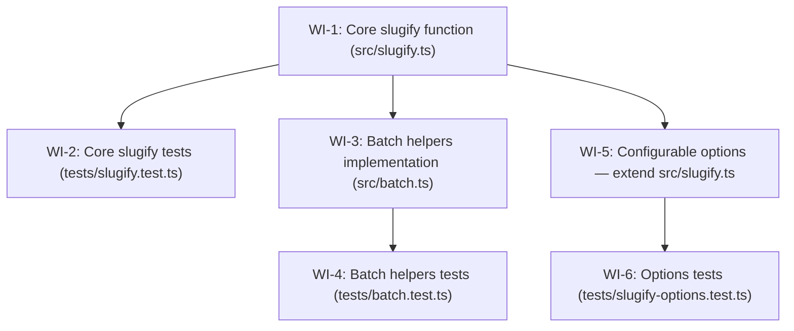

# Work-item dependency graph — INIT-2025-07-14-slugifier

## Parallelism summary

| Wave | Work items | Can run in parallel? |
|------|-----------|----------------------|
| 0 | WI-1 | Yes (no deps) |
| 1 | WI-2, WI-3, WI-5 | Yes (all depend only on WI-1; no shared files between them) |
| 2 | WI-4, WI-6 | Yes (WI-4 depends on WI-3; WI-6 depends on WI-5; no shared files) |

- **3 of 6 WIs (50%) can run with no predecessor** once WI-1 is merged (WI-2, WI-3, WI-5 are parallel) — exceeds the 30% floor.
- WI-3 and WI-5 are parallel (FEAT-2 and FEAT-3 have no dependency edge in the manifest; this graph honours that).
- WI-4 and WI-6 are parallel (different test files, no shared files).

## Hidden-coupling audit

| File | WIs touching it | Dependency edge? |
|------|----------------|-----------------|
| `src/slugify.ts` | WI-1 (create), WI-5 (extend) | WI-5 → WI-1 ✓ |
| `src/batch.ts` | WI-3 (create) | — (single WI, no conflict) |
| `tests/slugify.test.ts` | WI-2 (create) | — (single WI, no conflict) |
| `tests/batch.test.ts` | WI-4 (create) | — (single WI, no conflict) |
| `tests/slugify-options.test.ts` | WI-6 (create) | — (single WI, no conflict) |

No hidden coupling detected.
