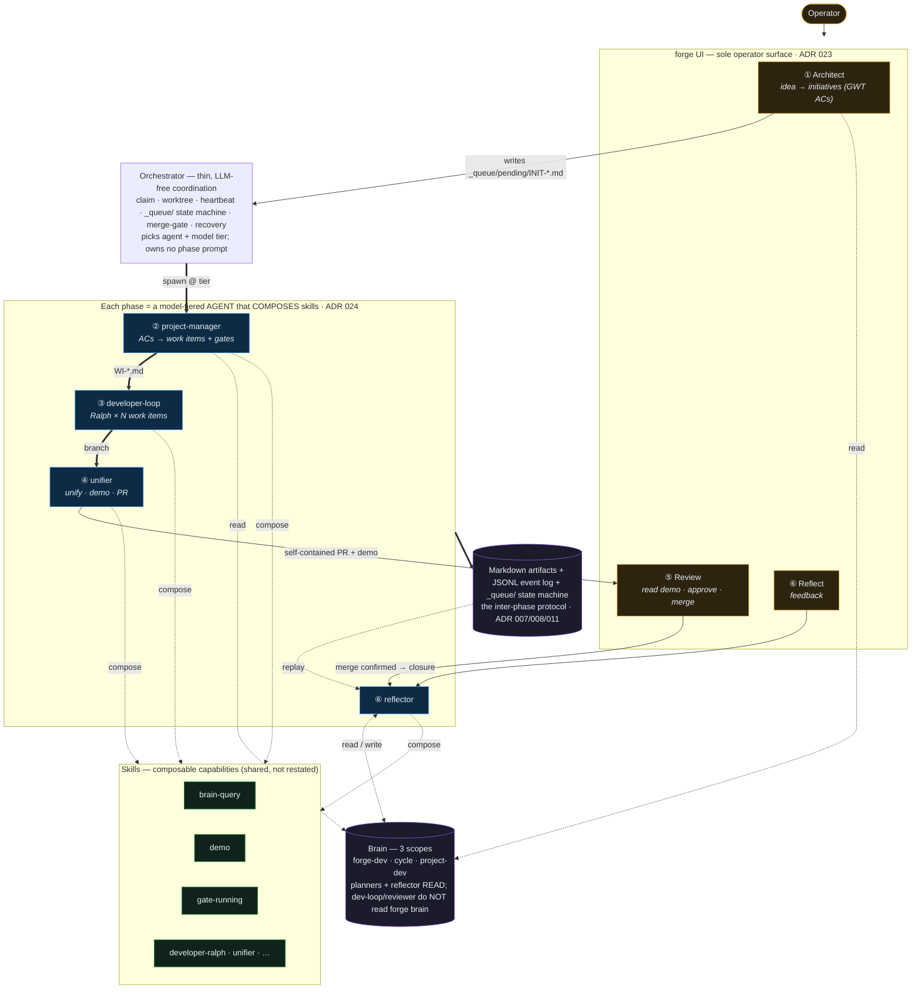
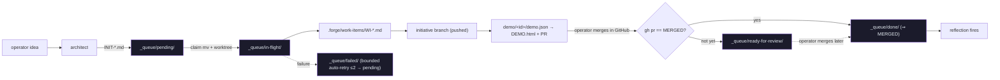
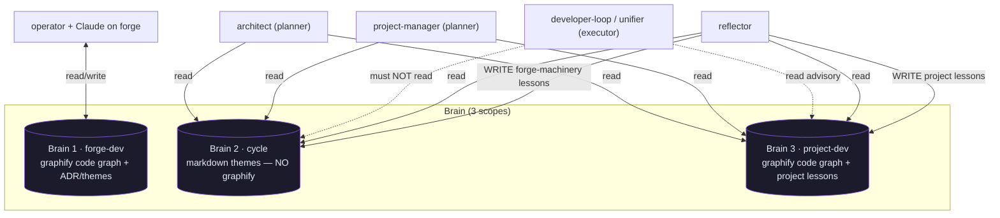
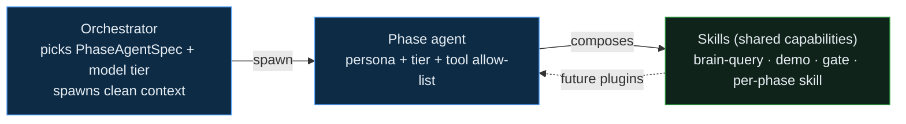

# Component Relationships

> How the [components](docs/architecture/refocus-architecture/README.md) connect: the control flow, the artifact +
> queue protocol, the brain read/write policy, the skill-composition seam, and the UI
> boundary. The governing rule is **one source of intent per edge** — each arrow carries a
> specific artifact or event, never free-form chat.

## 1. The spine, in one line

```
operator ─(UI only)─▶ ① ARCHITECT ──INIT-*.md (GWT ACs)──▶ [orchestrator: claim + worktree + spawn @ tier]
                                                                  │
        ┌─────────────────────────────────────────────────────────┘
        ▼
   ② project-manager ─WI-*.md─▶ ③ developer-loop ─branch─▶ ④ unifier ─demo+PR─▶ ⑤ REVIEW ─merge─▶ closure ─▶ ⑥ REFLECT
        └──────────────── each phase = an agent that composes skills ───────────────┘                                │
                                                                                                                      ▼
   planners (①②) + reflector (⑥) ◀── read ── BRAIN (3 scopes) ── write ──▶ reflector (⑥)
```

Architect → PM hand-off: the initiative manifest carries vision + GWT ACs in the body;
**no `features[]` list** — the PM decomposes ACs directly into WIs (3 levels: initiative → WI → file).

Uppercase = the three **human moments** on the UI; the rest run unattended in the
orchestrator. Every inter-phase hand-off is a **file** (markdown artifact) or a **JSONL
event**, never a conversation.

## 2. Control + data flow



## 3. The artifact + queue protocol (the filesystem IS the state)



**Invariant G1:** `done/` ⇒ a GitHub-confirmed merge. **G9:** forge never auto-merges.
**G10:** reflection fires only on a confirmed merge. The event log (`events.jsonl`) — not the
queue dir — is the closest thing to ground truth; `dev-loop.delivered` (git diff) is the
authoritative completion signal.

## 4. Brain read/write policy (one source of intent per phase)



- **Planners (architect/PM) + reflector** read Brain 2 + the project's Brain 3 (mandatory).
- **Executor (dev-loop/reviewer)** takes intent from the work item; may consult Brain 3
  (advisory); must **not** read the forge brain.
- **Reflector** is the only durable writer (Brain 2 + Brain 3), routed by the dual-scope
  litmus. **Brain 1** is forge's own engineering wiki, outside the cycle.

## 5. The skill-composition seam (ADR 024)



North star: the SKILL.md *is* the runnable source of intent, and new capabilities arrive as
**skills-as-plugins** for any phase agent. Today only the unifier crosses this seam.

## 6. Relationship matrix

| Component | Consumes (from) | Produces (to) | Reads brain | Writes brain |
|---|---|---|---|---|
| **Architect** | operator idea/verdict (UI); project + Brain 2/3 | `INIT-*.md` (vision + GWT ACs) → queue | 2, 3 | — |
| **Orchestrator** | `INIT-*.md`; `.forge/project.json`; git/gh | `_queue/` moves; worktrees; events; PRs (via closure) | — | — |
| **Project Manager** | `INIT-*.md` body (GWT ACs) | `WI-*.md` + DAG | 2, 3 | — |
| **Developer Loop** | `WI-*.md` + gates | commits on branch; `dev-loop.delivered` | 3 (advisory) | — |
| **Unifier** | branch + WIs | `demo.json` + PR description | 3 (advisory) | — |
| **Review/Closure** | branch + demo + operator verdict | GitHub PR; merge confirm; `done/` | — | — |
| **Reflection** | event log + merged tree + feedback | themes + cycle archive | 2, 3 (+1 read) | 2, 3 |
| **Forge UI** | events + queue + artifacts (via bridge) | handoff files (verdict/answers/feedback) | — | — |
| **Brains** | source (graphify); reflector lessons | query results; index | — | — |
| **Contract** | project tree + `.forge/project.json` | preflight verdict; loaded config | — | — |

## 7. The load-bearing seams (where failures cluster)

Both learnings syntheses + the comparable-systems research agree: phases are reliable; the
**seams** and the **merge boundary** are where forge breaks. The seams to keep honest:

1. **Architect → PM** — one decomposition (initiative ACs → WIs), not two. *(locked; no features[] intermediate layer)*
2. **PM → dev-loop** — the WI is the executor's single source of intent; no re-decomposition.
3. **dev-loop → unifier** — `dev-loop.delivered` (git diff) is completion truth; an empty
   branch must never open a PR.
4. **unifier → review** — one self-contained demo; the operator's verdict is a real gate.
5. **review → closure** — `done/` ⇒ MERGED; one terminal-move authority.
6. **closure → reflect** — fires only on confirmed merge; reflector is the only brain writer.
7. **scheduler ↔ cycle** — one owner of `_queue/` state transitions.

Every one of these is a place where "intent declared in prose but not enforced in the
runtime path" has bitten before — the refinement backlog moves each into enforced code.
