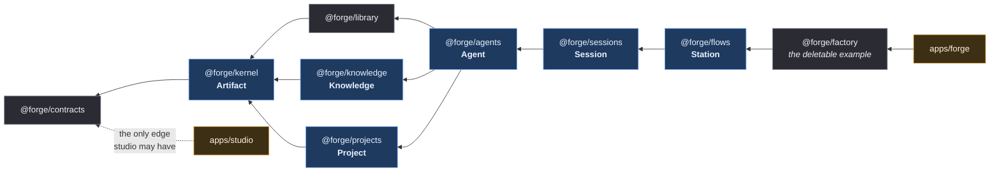

# ADR 046 — Package layout, the allow-graph boundary lint, and per-package caps

- **Status:** accepted (operator, 2026-08-31, at gate H5 — `docs/roadmaps/1.0.md` §5)
- **Amended:** 2026-08-31, same sitting — §1's tsconfig project-reference clause, in favour of the blueprint spec's [§3](../superpowers/specs/2026-08-28-forge-1-0-blueprint-design.md) "no build step" decision. The amendment and its evidence are in §1 below.
- **Amended:** 2026-08-31 (operator ruling, M3-A) — §1's `exports` clause, to permit an **additive** `"./*": "./*"` subpath alongside the single root entry. The amendment and its evidence are in §1 below.
- **Supersedes:** [ADR 042](./042-surface-cap-scope-and-testability.md) — the `orchestrator/` surface cap and its three boundary rulings are replaced by per-package caps. ADR 042's *context* (why a cap exists) stands; its *object* does not, because `orchestrator/` ceases to exist as a unit at M3.
- **Relates to:** [ADR 027](./027-studio-object-model.md) (definitions as data), [ADR 028](./028-flow-engine.md) (the flow engine that becomes `@forge/flows`), [ADR 043](./043-generic-interactive-surface.md) (the spine that becomes `@forge/sessions`), [ADR 045](./045-operator-workspace-and-promotion.md) (`_local/` resolution, which lands in `@forge/kernel`).
- **Implements:** `docs/roadmaps/1.0.md` §0 (the allow-graph and the 800-line file cap) and §4 M2.

## Context

Forge-studio is one Node process in one repository with no internal boundaries.
`orchestrator/` holds 136 production files and 56k lines; `cli/` holds 66 and
40k. Nothing in the tree says which of those files belong together, so every
change is a whole-repo change, and the only structural rule we had — CLAUDE.md's
ask-first cap on `orchestrator/` surface area — was a cap on the *symptom*.

[ADR 042](./042-surface-cap-scope-and-testability.md) fixed that cap's
boundaries after it was read three different ways at three call sites. It made
the cap mean one thing, but it could not make it mean the *right* thing: a cap
on one directory's export count does not stop the coupling it exists to prevent,
because the coupling is between concerns, not between symbols. Two measurements
say so directly. `forge-ui` — a separate workspace with a separate build —
reaches into `orchestrator/` and `cli/` in eight places, every one from a test
file, and nothing objected. And 115 code files are over the 800-line hard cap
that `1.0.md` §0 and the blueprint spec §8 both state, because both stated it
as prose.

Three things follow. A cap needs an object smaller than a directory of 136
files. A boundary needs a machine that fails a PR, not a sentence in CLAUDE.md.
And both need to exist **before** the code moves, or the move has nothing to
land against.

## Decision

### 1. Nine packages and two apps

The repository becomes one npm workspace root with `workspaces: ["packages/*",
"apps/*"]`. Each package declares `exports: {".": "./index.ts", "./*": "./*"}`,
its own `test` script, and its own `tsconfig.json` extending the root.

> **Amendment, 2026-08-31 (operator ruling, M3-A).** This clause originally read
> `exports: {".": "./index.ts"}` — a single root entry and nothing else. The M3
> big-bang move made that unworkable. The move relocates 475 files, and the
> roadmap's own M3 rule is that a cross-package import becomes the **subpath**
> form `@forge/<pkg>/<rest>.ts`; the move emitted **756** such specifiers. With a
> root entry alone, not one of them resolves.
>
> The alternative — routing all 756 through nine barrel `index.ts` files — was
> rejected on three grounds. It would force each package to re-export its whole
> surface, which is a content edit in a move PR that is required to make none. It
> would create cross-package cycles through the barrels, the precise failure the
> allow-graph exists to prevent. And it would cost `check-boundaries` its
> file-level resolution: an edge would resolve to `packages/<pkg>/index.ts` rather
> than to the module actually imported, collapsing a 551-row violation baseline
> into per-package noise and making the M4 backlog unreadable.
>
> **The subpath export is additive and changes nothing about the boundary.** The
> single root entry `"."` remains the anchor the allow-graph is drawn against;
> `"./*": "./*"` only lets a caller name a file inside a package it is already
> permitted to import. The allow-graph itself is unchanged, and
> `check-boundaries` still resolves and judges every edge at file granularity.
>
> `scripts/check-skeleton.test.ts` asserted the old shape with `deepEqual` on the
> whole `exports` object; it now asserts that the root entry is exactly
> `./index.ts` **and** that the subpath entry is present, which is the invariant
> this amendment actually intends.

> **Amendment, 2026-08-31 (operator ruling at H5).** This clause originally read
> "and is wired into the root `tsconfig` as a project reference". It cannot be
> honoured. TypeScript refuses a project reference to any project that disables
> emit —
>
> ```
> error TS6310: Referenced project '/tmp/tsprobe/pkg' may not disable emit.
> ```
>
> — and the root `tsconfig.json` is `noEmit`, because the blueprint spec
> [§3](../superpowers/specs/2026-08-28-forge-1-0-blueprint-design.md) decides
> "**no build step** (Node 22 strip-types resolves workspace packages through
> symlinks)". Real references would force every package to emit `.d.ts`/`.js`
> into a dist tree and turn `npm run build` into `tsc -b` — the build step §3
> ruled out. **The spec wins.** In its place:
>
> - each package has its own `tsconfig.json` extending the root, so it
>   typechecks standalone and its own `test` script means something;
> - the root `include` covers `packages/**/*.ts` and `apps/forge/**/*.ts`, so
>   `npm run build` — still plain `tsc --noEmit` — typechecks every package;
> - the allow-graph, which the references were there to encode, stays enforced
>   by `scripts/check-boundaries.mjs`. That is **strictly stronger** than tsc's
>   reference graph: it works at import level, it covers `orchestrator/ cli/
>   loops/` which are not packages at all, it resolves the `@/` alias and
>   `@forge/<pkg>` specifier shapes, and it ratchets.
>
> Confirmed empirically when the skeleton landed: `npm install` linked all ten
> units as symlinks under `node_modules/@forge/`, and both `tsc --noEmit` and
> the Next production build resolve across them with no build step.

| package | owns |
|---|---|
| `@forge/contracts` | browser-safe types and constants only — the one package `apps/studio` may import |
| `@forge/kernel` | logging and event types, the one cost rule, config and layout, path guards, the generic object-model loader, `_local/` resolution |
| `@forge/library` | skills, hooks, connections, templates, seeds, community: author → scan → approve → list |
| `@forge/knowledge` | `KbBackend`, brain paths, index, lint, fix, drain, consolidate, the theme frontmatter contract |
| `@forge/projects` | the project contract: config, preflight clauses, contract stages, create, repo transactions |
| `@forge/agents` | running ONE agent: dispatch, band guards, the Ralph loop and its stop conditions, the adapter registry, the failure classifier, the per-spawn runtime |
| `@forge/sessions` | the ADR 043 interactive spine: session kinds, `turnSpec`, transcript, lifecycle, finalizers |
| `@forge/flows` | the flow runner against a `PhaseExecutor` port, scheduler, daemon, queue state machine, manifest, triggers, run model, and the git/PR/work-item mechanics |
| `@forge/factory` | THE example: the develop flow's agents and their `SKILL.md`s, its artifact templates, its class→gate table |
| `apps/forge` | the CLI router and bridge host: origin/CSRF/JSON envelope, WS, health, daemon wiring; assembles each package's routes |
| `apps/studio` | the browser app (`forge-ui`, moved with its history) |

`@forge/factory` is deletable: removing it leaves `forge studio` bootable, and
CI proves that. That is the whole claim of the platform — the example is data on
the primitives, not the product.

### 2. The allow-graph, enforced



*A C4 container view of the workspace: each box is a deployable-in-principle unit
inside the one process, and each arrow is an allowed import direction. The six
bold labels are the seams of [`SPEC.md`](../../SPEC.md); the boxes without one
are supporting units, not seams.*

Four rules, stated as `1.0.md` §0 states them:

1. **A package never imports `orchestrator/`, `cli/` or `loops/`.**
2. **`apps/studio` imports `@forge/contracts` and nothing else.** It is an
   HTTP-only consumer; a type or constant it needs is a contract, and anything
   else it needs is a route.
3. **Legacy reaches a package only through `orchestrator/_pkg/<pkg>.ts`** — one
   greppable shim per package, deleted at cutover.
4. **A package imports strictly lower ranks of the chain**
   `contracts ← kernel ← {library, knowledge, projects} ← agents ← sessions ←
   flows ← factory ← apps/{forge, studio}`. Same-rank imports are forbidden too:
   `library`, `knowledge` and `projects` are siblings and must not know about
   each other.

`scripts/check-boundaries.mjs` enforces all four with dependency-cruiser, in CI.
Its baseline is the **set** of `<rule>|<from>|<to>` triples, not a count, so a
swapped violation cannot hide behind an unchanged total, and a violation that
disappears fails as a stale entry until the ratchet is tightened. There is no
`--write-baseline`.

### 3. Three caps replace one

**Per-package LOC caps** replace ADR 042's `orchestrator/` surface cap. Each
package's cap is recorded in [`QUARRY.md`](../../QUARRY.md) beside the files it
owns, seeded from that package's quarried total. A package that would exceed its
cap parks; the fix is a cull, a split, or an operator-ratified new cap — never a
silent raise.

**The 800-line file cap** is enforced by `scripts/check-file-size.mjs` against a
baseline that may only shrink. It fails three ways: a new file over the cap, a
baselined file that grew, and a stale entry for a file that no longer needs its
exemption.

**One owner per file** is enforced by `scripts/check-owner.mjs` against
`QUARRY.md`. It makes the spec's "one session = one package" checkable: a lane
may touch its own package, its routes and its tests, plus additive-only
`contracts`/`kernel` edits **named in the PR title**. Unowned files are
ratcheted to zero at the skeleton PR; a duplicate row, an orphan row, or an
owner or disposition outside the vocabulary has no baseline and always fails.

### 4. What happens to ADR 042's three rulings

ADR 042 ruled that (1) the cap governs `orchestrator/` only and `cli/` route
surface is disclose-not-park, (2) an additive optional field on an exported type
is disclose-not-park, and (3) export-for-testability is permitted for a pure
function with an explicit error contract.

Rulings 2 and 3 survive unchanged and are re-stated here as standing rules for
every package. Ruling 1 does not: `cli/` is not an uncapped edge any more,
because it is dissolved into the packages that own its routes and into
`apps/forge`, which carries a hard ≤800-line budget of its own as the router and
host. The distinction ruling 1 drew — capped core versus uncapped edge — was a
consequence of having exactly one capped directory. With per-package caps every
line has an owner and a budget, and the distinction has nothing left to mark.

## Consequences

- **The lints land before the layout.** `check-boundaries`, `check-owner` and
  `check-file-size` run against the legacy tree first, baselined at today's
  numbers, so the M3 move is measured against a gate that already exists rather
  than one written to fit the result. CI gate steps go from 18 to 21.
- **`forge-ui`'s eight edges into `orchestrator/` and `cli/` become visible
  debt.** All eight are test-only imports of enums the UI copies. They are the
  starting baseline of rule 2 and reach zero when those tests repoint to
  `@forge/contracts`.
- **115 files are over the 800-line cap on the day this lands**, and are
  baselined. The cap binds every file written from M2 onward, and the baseline
  can only shrink.
- **A cross-package breaking change parks.** So does a second new dependency:
  `dependency-cruiser` is the one this ADR authorises.
- **`QUARRY.md` becomes load-bearing.** It is not a planning note; a lint reads
  it, so a file that changes owner changes it in the same PR.
- **A wrong boundary is now cheap to find and expensive to cross**, which is the
  intent. If a rule proves wrong, the fix is to amend this ADR — not to add an
  exception to the baseline.
