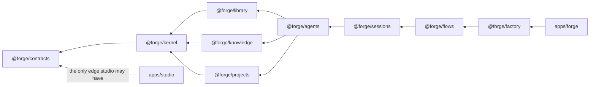

# Architecture

Forge-studio is one Node process, one npm workspace, no build step. This page
explains the shape that workspace takes today and why it takes that shape —
for the machinery itself (what each package exports), read the package's own
`README.md`; for the decision record, read [ADR 046](../decisions/046-package-layout-and-boundary-lint.md)
and the design spec's [§3 "Target structure"](../superpowers/specs/2026-08-28-forge-1-0-blueprint-design.md).

## Why this isn't "three scopes" any more

Earlier revisions of this page described the tree as three scopes —
framework, cycle content, managed projects — sharing one flat `orchestrator/`
(56k lines) and `cli/` (40k lines) with no enforced boundary between them.
That description is retired, not renamed: `orchestrator/` and `cli/` as
production trees are gone (M3, [ADR 046](../decisions/046-package-layout-and-boundary-lint.md)).
The three-scope *rule* — framework never special-cases a project, cycle
content never assumes one, projects never reach into the framework — is
still true, but it's no longer enforced by convention over a handful of flat
directories. It's enforced by a dependency graph with nine named packages,
checked on every run.

## Nine packages, two apps

The workspace is `packages/*` (nine packages) and `apps/*` (two apps), each
with its own `package.json`, its own `tsconfig.json`, and its own test tier.

| Package | Owns |
|---|---|
| `@forge/contracts` | Browser-safe types and constants only — the one package `apps/studio` may import |
| `@forge/kernel` | Logging, event-cost accounting, config and layout, path guards, the generic object-model loader, `_local/` resolution |
| `@forge/library` | Skills, hooks, connections, templates, seeds, the community registry — author → scan → approve → list |
| `@forge/knowledge` | `KbBackend`, brain paths/index/lint/fix/drain, the theme-frontmatter contract |
| `@forge/projects` | The forge↔project contract: config, preflight stages, create, repo transactions |
| `@forge/agents` | Running **one** agent: dispatch, band guards, the Ralph loop, the runtime-adapter registry |
| `@forge/sessions` | The [ADR 043](../decisions/043-generic-interactive-surface.md) interactive spine — session kinds, `turnSpec`, transcript, lifecycle |
| `@forge/flows` | Running **one** flow: the `FlowDef` walker, scheduler, queue state machine, manifest, git/PR/work-item mechanics |
| `@forge/factory` | The shipped develop factory, as data — see [`example-factory.md`](./example-factory.md). **Deletable**: removing it leaves `forge studio` bootable, proven by CI ([ADR 048](../decisions/048-deletable-example-factory.md)) |
| `apps/forge` | The assembly: the `forge` CLI, the UI bridge, and every binding that wires a package's routes into the running process |
| `apps/studio` | Forge Studio, the Next.js operator UI (`forge studio`) — an HTTP-only consumer of `apps/forge`'s bridge |

Cross-cutting, not packages: `skills/` (the agent surface every package's
agents compose), `studio/` (flow, agent and KB **definitions as data** —
[ADR 027](../decisions/027-studio-object-model.md)), `brain/` (the three
scoped knowledge graphs — [ADR 018](../decisions/018-three-brain-model.md)),
`projects/` (the managed projects forge develops, gitignored), and `docs/`
(this tree).

## The allow-graph, as a shrinking ratchet

A package may import only a **strictly lower rank** in this chain:

```
contracts ← kernel ← {library, knowledge, projects} ← agents ← sessions ← flows ← factory ← apps/{forge, studio}
```

`library`, `knowledge` and `projects` sit at the same rank and may not import
each other — they're siblings, not a chain. `apps/studio` may import
`@forge/contracts` and nothing else: it's an HTTP-only consumer, so anything
it needs beyond a shared type or constant is a route, not an import. No
package may import the legacy trees a handful of test fixtures still occupy
(`orchestrator/`) — a rule stated once and enforced the same way regardless
of which side of the boundary changes.

`scripts/check-boundaries.mjs` enforces all of this with `dependency-cruiser`,
in CI and locally. Its baseline is the **set** of `<rule>|<from>|<to>`
violation triples, not a count — a swapped violation can't hide behind an
unchanged total, and a violation that disappears fails as a stale baseline
entry until someone tightens the ratchet on purpose. There is no
`--write-baseline` flag: every baseline change is a reviewed diff.

### The diagram below is derived, not hand-drawn

The package ranks in the diagram are read directly from
`scripts/check-boundaries.mjs`'s exported `PACKAGE_RANK` table — the same
object the ratchet's `classify()` function checks every edge against — so
this picture cannot silently drift from what the ratchet actually enforces.
Regenerating it is one `import()` of that module plus a loop over the ranks;
there is no hand-maintained copy to fall out of sync. On this tree,
`node scripts/check-boundaries.mjs` reports:

```
check-boundaries: PASS — 7768 edges, 75 baselined allow-graph violation(s)
```



The 75 baselined violations are pre-existing edges (mostly test files reaching
a sibling package's internals, or into the `orchestrator/` test-fixture
residue) that predate the ratchet or a specific lane's cleanup — never a
license to add a new one. A new edge that isn't in the baseline fails the
build; the fix is to route the dependency through the package that's
supposed to own it, not to widen the baseline.

## Why a graph, not a directory cap

The rule this replaced — a line-count cap on `orchestrator/`'s surface area —
capped a symptom. It didn't stop the coupling it existed to prevent, because
the coupling was between concerns, not between file counts: a separate
workspace (what is now `apps/studio`) could still reach into `orchestrator/`
and `cli/` in eight places and nothing would object, because nothing checked
import direction. A boundary needs to be a machine that fails a PR on the
actual edge, not a sentence someone has to remember to enforce. That's what
`check-boundaries.mjs` is, and why the package split had to land with it
rather than after it — the move needed something to land against.

## Where to look next

- **The example factory** — what the shipped develop flow's stations do,
  and why `@forge/factory` is designed to be deletable:
  [`example-factory.md`](./example-factory.md).
- **The request-path security model** — the class of defect the allow-graph
  doesn't cover (a guarded path, not an import path):
  [`security-model.md`](./security-model.md).
- **The forge↔project contract** — what a managed project under `projects/`
  must satisfy: [`../reference/project-contract.md`](../reference/project-contract.md).
- **The narrative walkthrough** — [`../../ARCHITECTURE.md`](../../ARCHITECTURE.md)
  carries the fuller story of how a cycle moves through the two flows; parts
  of it predate this restructuring and are due a refresh, but the flow
  sequence it describes (architect → develop → reflect) still holds.
