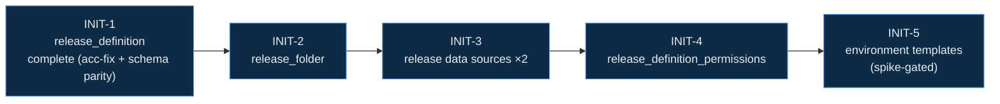

# Roadmap — betterado feature-complete **Release** component

> A sequenced set of forge initiatives that takes `terraform-provider-betterado` to a
> **feature-complete, declarative Azure DevOps Release** surface. This is the planning
> artifact (the architect's roadmap); when run, the architect promotes each initiative as a
> `_queue/pending/INIT-*.md` manifest, the PM sizes its work items, and the autonomous
> pipeline builds it. Grounded in a read-only survey of the provider's current state + the
> ADO Release REST API 7.2.

## Goal & scope (locked 2026-06-03)

A **declarative** Release component: every Release entity a Terraform user manages as
desired-state. Locked scope decisions:

- **Complete `betterado_release_definition`** — fix the stale acceptance tests + add API-7.2
  **schema parity** (deployment gates, definition triggers, parallel execution, agentless
  run-on-server input) **in the completion initiative**.
- **Add** `betterado_release_folder`, the two release **data sources**, and
  `betterado_release_definition_permissions`.
- **Environment templates** — **spike first**, build only if the vendored SDK / raw-HTTP
  path is viable.
- **Out of scope (declarative-only):** the imperative/runtime surface — creating releases,
  triggering deployments, approving/rejecting, gate-state, manual interventions. Terraform
  is declarative; these are runtime actions and stay out (matches betterado's own roadmap).

## Where betterado is today

- **Exists + solid:** `betterado_release_definition` (rich nested schema; **11 gomock unit
  tests green** from the 2026-05-31 cycle) and `betterado_task_group`. `ReleaseClient` is
  wired (`client.go`); `MockReleaseClient` already mocks `CreateFolder`/`GetReleaseDefinitions`/
  etc.; the `ReleaseManagement` + `ReleaseManagement2` security namespaces are registered.
- **Broken:** the 6 acceptance tests for `release_definition` fail against live ADO —
  `VS402982` (stage-level `retention_policy` now required) + `VS402877` (pre/post approvals
  now required).
- **Missing:** `release_folder`, release data sources, `release_definition_permissions`,
  environment templates, and `release_definition` schema parity (gates/triggers/parallel/agentless).
- **Conventions:** schema → expand/flatten → CRUD; gomock unit substrate (5 canonical +
  characterization) gated by `go test -tags all -count=1 -run TestXxx ./.../service/release/`;
  acceptance tests under `acceptancetests/` (`TF_ACC=1`, live ADO — betterado has creds);
  CI gate is `.forge/project.json` `ci_gate`. Disk-safe build: `go build -mod=vendor .` only.

## Ordering principle

The four new resources each add a line to the **`provider.go` resource/data-source registry**
— the canonical AI-agent **merge-conflict hotspot** (registries/configs/routes; ~28% of agent
PRs conflict there). Release entries sort adjacently, so parallel branches would collide at the
merge boundary — forge's #1 historical failure. So the roadmap is a **dependency chain**: each
initiative declares `depends_on_initiatives` on its predecessor and the scheduler holds it until
the predecessor is **merged** (`done/`), then branches fresh from post-merge `main`. Serial, but
merge-safe — which matches forge's proven capability (deps-gating is its highest-leverage fix).

INIT-1 touches only the existing `release_definition.go` (no registry line), so it is the clean
foundation; its acceptance-test fix is the prerequisite that makes every later initiative's
acceptance tests credible.

---

## INIT-1 — Complete `release_definition` (feature-complete + acceptance-green)

- **Goal:** `betterado_release_definition` is API-7.2 feature-complete and **all** its tests
  (unit + acceptance) pass against live ADO.
- **Coarse capability-features** (the PM sizes these into work items):
  1. **Acceptance-test refresh** — make the 6 acc tests green: add the now-required stage
     `retention_policy` (fixes `VS402982`) and the now-required pre/post approval structure
     (fixes `VS402877`).
  2. **Deployment gates** — `pre_deployment_gates` / `post_deployment_gates` blocks
     (gates + `gatesOptions`: isEnabled / timeout / samplingInterval / stabilizationTime /
     minimumSuccessDuration), each gate carrying workflow tasks.
  3. **Definition triggers** — `triggers` block: continuous-deployment (artifact) trigger +
     schedule trigger (the two common cases).
  4. **Parallel execution + agentless phase** — `deployment_input.parallel_execution`
     (none/multiConfiguration/multiMachine) and the `runOnServer` (agentless) deployment-input
     variant (distinct schema from agent-based).
- **Acceptance criteria (outcome):** the new schema round-trips (expand/flatten unit tests);
  a release definition with gates + a CD trigger + a parallel phase + an agentless phase
  applies, reads back, and destroys cleanly against live ADO; the full project CI gate
  (`ci_gate`) is green.
- **Tests:** gomock unit characterization for each new expand/flatten path; acceptance tests
  (live ADO) for the apply/destroy round-trips. **Live ADO required.**
- **Dependencies:** none (foundation). **Size:** **L** — likely several WIs (acc-fix · gates ·
  triggers · parallel+agentless); the PM decomposes. **Risk:** largest initiative; gates/triggers
  schemas are deep — keep each WI's `quality_gate_cmd` scoped to the release package.

## INIT-2 — `betterado_release_folder`

- **Goal:** manage Release folder hierarchy as desired-state.
- **Coarse features:** a CRUD resource over `/release/folders` (`CreateFolder`/`UpdateFolder`/
  `DeleteFolder`/`GetFolders` — already in `MockReleaseClient`); fields `project_id`, `path`,
  `description`; registered in `provider.go`; docs + example.
- **Acceptance criteria:** create a folder at a path, read it back, update its description,
  destroy it — against live ADO; unit mocks for the CRUD + error paths.
- **Tests:** 5 canonical gomock unit tests + acceptance test. **Live ADO** for acceptance.
- **Dependencies:** INIT-1 (acceptance-test pattern green). **Size:** **S.** **Note:** use the
  `CreateFolder` POST variant (the PUT `Create` is deprecated).

## INIT-3 — Release data sources (`data.release_definition` + `data.release_definitions`)

- **Goal:** look up release pipelines by id/name and list them, for cross-referencing.
- **Coarse features:** `data.betterado_release_definition` (by id or name, via
  `GetReleaseDefinition`) + `data.betterado_release_definitions` (list, via
  `GetReleaseDefinitions`); registered in the data-source map; docs + examples.
- **Acceptance criteria:** both data sources resolve a known definition's attributes against
  live ADO; unit tests cover the read + not-found paths.
- **Tests:** unit (read/error) + acceptance. **Live ADO** for acceptance.
- **Dependencies:** INIT-2 (shares the `provider.go` registry — serialize). **Size:** **S.**

## INIT-4 — `betterado_release_definition_permissions`

- **Goal:** assign permissions on release definitions as desired-state.
- **Coarse features:** a permissions resource mirroring the existing `*_permissions` resources
  (e.g. `resource_git_permissions.go`), using the already-registered `ReleaseManagement`
  (project-level) + `ReleaseManagement2` (definition-level) security namespaces and the
  in-provider permissions scaffolding; docs + example.
- **Acceptance criteria:** assign + read + remove a permission on a release definition against
  live ADO; unit tests for the token-derivation logic.
- **Tests:** unit (token logic) + acceptance. **Live ADO** for acceptance. **Risk:** the
  release permission **token format** needs confirming against the live org (the two namespaces
  have different token patterns) — surface as the first WI.
- **Dependencies:** INIT-3 (registry). **Size:** **M.**

## INIT-5 — Release **environment templates** (spike-gated)

- **Goal:** manage reusable stage/environment templates as desired-state — *if* the platform
  supports it through the provider's client.
- **Coarse features:**
  1. **Spike (gate):** confirm whether the vendored `microsoft/azure-devops-go-api` v7 exposes
     the `…/release/definitions/environmenttemplates` endpoint; if not, confirm the raw-HTTP
     path via the existing `azuredevops.Connection`. **If neither is viable, STOP** — record the
     finding and park the resource (do not vendor-patch in this initiative).
  2. **Build (only if the spike passes):** `betterado_release_definition_environment_template`
     (create / read / delete — templates are immutable, no update); docs + example.
- **Acceptance criteria:** (spike) a documented feasibility verdict + the chosen client path;
  (build) create a template, read it back, delete it against live ADO.
- **Tests:** unit for expand/flatten (if built) + acceptance. **Live ADO** + **SDK
  investigation**. **Dependencies:** INIT-4 (registry). **Size:** **L** (gated — may end at the
  spike). **Note:** this is the one genuine unknown; the spike de-risks it before any build cost.

---

## Out of scope (declarative-only decision) & deferred

- **Imperative/runtime surface — OUT:** creating releases (`CreateRelease`), triggering/redeploying
  stages (`UpdateReleaseEnvironment`), approvals (`UpdateReleaseApproval`), gate-state
  (`UpdateGates`), manual interventions. These are runtime actions, not desired-state; they need a
  separate design (an imperative escape-hatch) and are explicitly deferred.
- **`release_definition` long-tail (P2/P3):** the separate **tags** API endpoint, definition-level
  retention policy, deployment-group (`machineGroupBasedDeployment`) phase input, environment
  schedules/triggers, richer artifact version pinning, arbitrary `properties`. Fold into a later
  "release_definition polish" initiative once the core component is feature-complete.

## How this gets executed

1. Operator opens the **architect** (forge UI) with this roadmap as the idea; the architect grounds
   in the project + brain, emits these as **coarse-feature initiatives** (no per-feature gates —
   the PM owns sizing) with `depends_on_initiatives` set per the chain, runs the council once, and
   promotes the approved set to `_queue/pending/`.
2. The scheduler claims **INIT-1** first; the **PM** sizes its work items + per-WI `quality_gate_cmd`
   (scoped to the release package + the live-ADO acceptance gate); the **dev-loop** builds; the
   **unifier** proves the ACs + authors the rich demo (API before/after + the live ADO resource);
   the operator reviews + merges; **reflection** captures lessons to the project brain.
3. Each later initiative is held by the deps-gate until its predecessor is **merged**, then branches
   fresh from post-merge `main` — merge-safe through the `provider.go` registry.

**Definition of done for the component:** INIT-1–4 merged (release_definition feature-complete +
folder + data sources + permissions, all CI-green), and INIT-5 either merged or its spike has parked
environment templates with a documented reason. At that point betterado exposes a feature-complete
**declarative** Azure DevOps Release surface.
