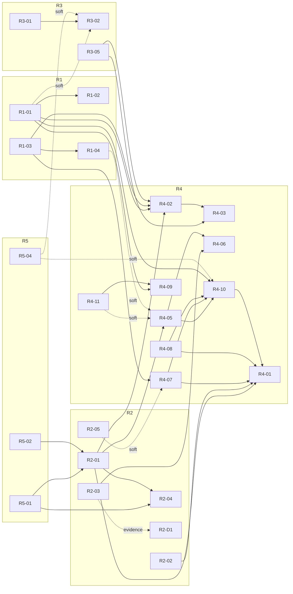

# Forge-dev roadmaps — index & maintenance contract

> Entry point for the forge-dev roadmap set. Five living roadmaps, one index (this
> file). Planned direction only — nothing in this set is an implementation record
> except the explicitly-marked as-built baseline sections inside each roadmap.

Created 2026-07-17 (initial forge-dev roadmap planning session). All initiative
statuses are `planned` or `deferred` as of that date.

---

## 1. Purpose

This directory is the **single source of truth for forge-dev direction**. Any
question of "what is forge building next, and why" resolves here; any agent
session picking up forge-dev work starts here.

**Relation to the three scopes** ([docs/repo-map.md](../repo-map.md)):

- **Scope 1 — framework / seams / orchestration**: fully covered. R1, R2, R3
  and R5 are Scope-1 componentry roadmaps.
- **Scope 2 — cycles / agents / flows**: covered only as **shipping of OOTB
  content** (R4). What forge *ships* out of the box is forge-dev work; what an
  operator *authors inside Studio at runtime* is not (see §7).
- **Scope 3 — projects forge develops**: **excluded**. Work on managed
  projects (betterado, gitpulse, mdtoc, …) is driven *through* forge as cycles,
  not planned here. The out-of-scope register (§7) names the known Scope-3
  streams so they aren't mistaken for gaps in this set.

> **2026-07-17 note:** the Scope 1 / Scope 2 split above is now forge's north
> star, not just a contributor map — [ADR 038](../decisions/038-north-star-platform-and-ootb.md)
> promotes it: Scope 1 is a modular platform for building the ideas machine or
> any other agentic flow (SWE-focused for now by explicit choice); Scope 2 OOTB
> is the ideas machine. See §8 decision 4.

**Relation to [docs/known-gaps.md](../known-gaps.md)**: known-gaps remains the
*defect and observation log* — the place raw findings land as they're noticed.
These roadmaps are the *planning SSOT*: known-gaps items feed into roadmap
initiatives (each initiative cites its § sources), and once an item is owned by
a roadmap ID, the roadmap entry is authoritative for how/when it gets done.
R5-05 and R5-07 exist specifically to keep the two documents reconciled.

---

## 2. Roadmap register

| ID | File | Mission | Initiatives | Status mix (2026-07-17) |
|----|------|---------|-------------|--------------------------|
| **R1** | [R1-contract-componentry.md](./R1-contract-componentry.md) | Make every forge boundary a typed, machine-checkable contract — KB contract type, KB seam completion, the project-contract process clauses (demo/test/instructions/release/build), and automated contract checks. | 5 + 1 deferred | 5 planned, 1 deferred (R1-D1) |
| **R2** | [R2-runnable-componentry.md](./R2-runnable-componentry.md) | Make "a runnable" a first-class primitive — agent-as-runnable, def-driven builder, fanout (research spike first), trigger expansion, dynamic artifact surfaces, runtime-adapter realization. | 6 + 1 deferred | 6 planned, 1 deferred (R2-D1) |
| **R3** | [R3-library-componentry.md](./R3-library-componentry.md) | First-class managed libraries of reusable capability: skills, skill-generator flow, hooks, tools/MCPs/CLIs, instructions. | 5 | 5 planned |
| **R4** | [R4-ootb-suite.md](./R4-ootb-suite.md) | The shipped out-of-the-box agent/flow suite: migrate platform surfaces to artifacts, the agent roster (onboarding, creation, architect, plan, develop, demo, adversarial review, reflect), the develop-cycle OOTB flow, and the roadmap & attention surface. | 11 + 1 deferred | 11 planned, 1 deferred (R4-D1) |
| **R5** | [R5-hardening-operability.md](./R5-hardening-operability.md) | Safety, integrity and doc hygiene: dry-bridge seam, G8 env-pin at the spawn seam, cost integrity, edit-lock fix, known-gaps residue cross-references, demo/harness backlog, SSOT reconciliation. | 7 | 7 planned |
| **R6** | [R6-operator-experience.md](./R6-operator-experience.md) | The Studio operator surface as a platform: run observability depth, human-readable operations, IA & DOM-convention stewardship. *(Minted by the 2026-07-17 coverage review; unwaved.)* | 3 + 1 deferred | 3 planned, 1 deferred (R6-D1) |
| **R7** | [R7-verification-infrastructure.md](./R7-verification-infrastructure.md) | The standing verification platform: corpus-anchored bench rebuild, journey-platform evolution (incl. the LLM-driven UI-test tier), verify-ground stewardship, CI/drift-guard growth. *(Minted 2026-07-17; unwaved.)* | 4 | 4 planned |
| **R8** | [R8-distribution-release.md](./R8-distribution-release.md) | Forge itself as a shippable product: packaging (the deferred S10), version/release policy, public docs & positioning upkeep. *(Minted 2026-07-17; deliberately thin, operator-paced.)* | 3 + 1 deferred | 3 planned, 1 deferred (R8-D1) |

Each roadmap file also carries an **as-built baseline** section (`R<N>-B*`
entries, status `implemented`) recording what already exists with real file
paths and ADR numbers — that is the only place `implemented` appears in this
set.

Canonical initiative skeleton (IDs are fixed and never reused):

- **R1**: R1-01 KB contract type · R1-02 KB seam completion · R1-03 Project contract: demo + test processes · R1-04 Project contract: instructions + release + build processes · R1-05 Contract machine-checks · R1-D1 *(deferred)* Holistic-metrics clause + exploration-initiative support
- **R2**: R2-01 Agent-as-runnable primitive · R2-02 Agent-def-driven builder · R2-03 Fanout capability (research spike first) · R2-04 Trigger expansion · R2-05 Dynamic artifact surfaces · R2-06 Runtime-adapter realization · R2-D1 *(deferred)* Parallel-work merge-resolution (gated on R2-03 evidence)
- **R3**: R3-01 Skills first-class management · R3-02 Skill-generator flow · R3-03 Hooks library · R3-04 Tools/MCPs/CLIs library · R3-05 Instructions library
- **R4**: R4-01 Platform→artifact migration · R4-02 Project onboarding agent · R4-03 Project creation agent · R4-04 Architect agent refinement · R4-05 Plan agent · R4-06 Develop agent refinement · R4-07 Demo agent · R4-08 Adversarial review agent · R4-09 Reflect agent · R4-10 Develop-cycle OOTB flow · R4-11 Roadmap & attention surface · R4-D1 *(deferred)* Architect-flow retirement
- **R5**: R5-01 Dry-bridge seam · R5-02 G8 env-pin at spawn seam · R5-03 Cost integrity · R5-04 Flow edit-lock verification · R5-05 Known-gaps residue · R5-06 Demo/harness backlog · R5-07 SSOT reconciliation
- **R6**: R6-01 Run-observability depth · R6-02 Human-readable operations · R6-03 IA & convention stewardship · R6-D1 *(deferred)* Notification transport beyond the blade
- **R7**: R7-01 Bench rebuild (corpus-anchored) · R7-02 Journey platform evolution · R7-03 verify-ground & corpus stewardship · R7-04 CI & drift-guard growth
- **R8**: R8-01 Packaging · R8-02 Version & release cadence · R8-03 Public docs & positioning upkeep · R8-D1 *(deferred)* Community & ecosystem enablement

### Coverage map — routing new forge work

Any new forge-dev work routes through this table; if it fits no row, that is
the signal to mint the next roadmap (§5 rule 5), never to wedge it somewhere
adjacent. **This directory is the design home for anything within forge.**

| Architecture pillar | Owning roadmap |
|---|---|
| Contracts & seams — project contract, KB contract, KbBackend, preflight (`cli/preflight.ts`, `orchestrator/kb-backend.ts`) | **R1** |
| Runnable engine — flow runner, agent primitive, triggers, fanout, artifact surfaces, runtime adapters (`orchestrator/`, `loops/`) | **R2** |
| Capability libraries — skills, hooks, tools/MCPs, instructions (`skills/`, `studio/catalog.yaml`) | **R3** |
| Shipped OOTB content — the agent suite + flows, roadmap/attention surface work this round (`studio/flows/`, agent SKILL.mds) | **R4** |
| Safety, integrity, doc hygiene — guards, env, cost integrity, known-gaps residue, SSOT | **R5** |
| Operator surface & observability platform (`forge-ui/` as a pillar, event/log presentation) | **R6** |
| Verification platform — journeys, deadpaths, verify:cycle, benches, CI/drift guards (`scripts/`, `.github/`) | **R7** |
| Distribution — packaging, forge versioning, OSS posture, positioning upkeep | **R8** |
| Managed projects & their brains' content | *Out of scope — §7* |

**Deliberately absent (not gaps — decided or future-gated):**

| Area | Status |
|---|---|
| Self-hosting (forge cycles against forge itself) | Not pursued; known-gaps header records forge is not self-hosted. Would mint a roadmap if ever pursued. |
| Multi-operator / collaboration | No signal; single-operator is the wedge (market doc). YAGNI. |
| Non-SWE connectors (any-agentic-flow beyond software engineering) | Future per the north-star reframe (R5-07-F8's ADR records it); SWE focus is an explicit current choice. Mints its own roadmap when the focus lifts. |
| Feature-owned UI changes | Never roadmap-routed as a pillar — they ride their owning initiative + the journey-sync contract (R6 owns only the platform/conventions). |

---

## 3. Cross-roadmap dependencies

Every edge below is recorded **on both sides** (in the depender's
"Depends on" field and the dependency's "Depended on by" field) — and the
table is **generated from the per-file fields**; when they disagree, the
files win and this table regenerates. "Soft" means sequencing preference,
not a hard blocker. (Regenerated 2026-07-17 after the adversarial review —
previously several file-recorded edges were missing here.)

| Depender | Depends on | Reason |
|----------|-----------|--------|
| R2-01 Agent-as-runnable | R5-01, R5-02 | Safety first (Q6-A): new spawn surfaces are born inside the dry-bridge seam with a pinned env. |
| R2-04 Trigger expansion | R5-01, R2-01 | Every trigger is an unattended-spawn surface; agent-complete events need runnable agents. |
| R4-01 Platform→artifact migration | R2-01, R2-02 | Platform surfaces migrate onto the runnable primitive and must round-trip through the def-driven builder. |
| R4-01-**F4** (unifier retirement) | R4-07, R4-08, R4-10-F2 | Retirement cannot start before the successor agents and the relocated, proven merge-boundary gate are live. |
| R4-02 Project onboarding agent | R3-05, R1-03/R1-04, R1-01, R2-01 | Instructions sourcing; contract clauses to tick; KB binding at onboarding; standalone runnable. |
| R4-03 Project creation agent | R3-05 (+R1 clauses), R4-02 | Same sourcing/validation pattern; hands off to the onboarding loop post-scaffold. |
| R4-05 Plan agent | R2-01 (hard, F4), R4-11 *(soft)*, R1-04 *(soft)* | Standalone dispatch = the runAgent primitive behind R5-01's guard (no bespoke runner); roadmap-screen states; planning inputs. |
| R4-06 Develop agent refinement | R2-03, R4-05 | Declared fanout; consumes the plan agent's spec-WIs (ADR-037 fold, Q2-B). |
| R4-07 Demo agent | R1-03, R2-05 *(soft)* | Executes the typed demo-process clause; richer surfaces build on the artifact contract. |
| R4-09 Reflect agent | R1-01, R4-11 | Writes into contract-typed KBs (Q5-B); triggered by R4-11-F1's merged state. |
| R4-10 Develop-cycle OOTB flow | R4-05, R4-07, R4-08 | The shipped flow chains plan → develop → demo → adversarial review. |
| R4-10-**F4** (succession) | R1-01 | Succession must rebind the cycles KB `binding.ref` or R1-01's dangling-ref lint goes red. |
| R3-02 Skill-generator flow | R3-01, R1-01 *(soft)*, R5-04 *(soft)* | Managed library landing place; flow-scoped KB binding; edit-lock verified before a second live flow. |
| R3-03 Hooks library | R3-01 *(soft)*, R5-01/R5-02 *(soft)* | Reuses the library pattern; leans on the safety rails. |
| R3-04 Tools/MCPs library | R3-01 *(soft)* | Same library surface pattern. |
| R1-02 KB seam completion | R1-01 | The seam completes against the contract shape, not the legacy descriptor. |
| R1-04 / R1-05 | R1-03 | Reuse the typed-process pattern; machine-checks verify the typed processes. |
| R4-10 / R3-02 | R5-04 *(soft)* | Both ship second live flows; the edit-lock verification precedes them. |
| R2-D1 Merge-resolution *(deferred)* | R2-03 evidence | Design gated on the fanout research spike (Q3-B). |



---

## 4. Recommended driving order (Q6-A: safety first)

This orders **planned** work for future operator-run agent sessions — nothing
below is implemented. Waves are a default sequence, not a lockstep gate;
initiatives inside a wave can run in parallel where dependencies allow.

| Wave | Initiatives | Rationale |
|------|-------------|-----------|
| **0** | R5-01 dry-bridge seam · R5-02 G8 env-pin at spawn seam · R5-07 SSOT reconciliation **incl. F8, the north-star reframe ADR** | Safety first: close the bridge-acts-with-operator-credentials class (2026-07-16 self-merge incident) and pin the env at the spawn seam before any new agent surfaces multiply the risk. R5-07 is near-free, stops doc drift compounding, and F8 fixes the instruction layer before wave-1 sessions design under the stale north star. |
| **1** | R2-01 agent-as-runnable · R2-02 agent-def-driven builder · R5-04 edit-lock verification (trivial rider) | The runnable primitive is the foundation everything in R4 migrates onto; land it before building agents that would otherwise hardcode around it. R5-04 verifies the edit-lock before any second live flow exists. |
| **2** | R4-05 plan agent · R4-11 roadmap & attention surface | The highest-leverage new capability (plan agent, absorbing ADR-037) plus the operator surface it enters from (soft dep, Q2-B two entry paths; R4-05-F4 dispatches through R2-01's primitive). |
| **3** | R1-01 KB contract type · R3-01 skills first-class management — interleaved at dependency points | Contract and library groundwork pulled in exactly when downstream R4 agents need them (R4-09 needs R1-01; R3-02 and the palette residue need R3-01). |
| **4** | **R4-01 first** (F1–F3), then R4-02/03/04/06/07/08/09 as their deps land, **R4-10 assembles last** (incl. its F5 harness migration + F6 resume re-home), **R4-01-F4 retirement after R4-10-F2 is live and green** | The OOTB suite completes bottom-up; the migration governs the agent initiatives, the flow chains R4-05/07/08, and unifier retirement is the final cutover. |
| **continuous** | R5-03 cost integrity · R5-05 known-gaps residue · R5-06 demo/harness backlog | Opportunistic — pick up alongside whatever wave is active when a session touches the relevant seam. |
| **unwaved** | All R6 / R7 / R8 initiatives | Minted by the coverage review without sequencing; the operator prioritizes them against this order (natural affinities noted in each file — e.g. R7-01 after the R4 suite stabilizes, R8-01 after wave 0's seams). |

---

## 5. Maintenance contract (living-roadmap mechanics)

These five files are **living documents**. The rules:

1. **Stable, never-reused IDs.** `R<N>-NN` (initiatives), `R<N>-NN-Fn`
   (features), `R<N>-B<n>` (baseline entries), `R<N>-D<n>` (deferred). Once
   minted, an ID is permanent — a dropped initiative keeps its ID with a
   terminal note; the number is never recycled.
2. **Append-only change logs.** Every roadmap ends with a `## Change log`;
   every edit appends a dated line. History is never rewritten.
3. **Status transitions happen in implementation sessions, not planning
   sessions.** Vocabulary: `planned → in-progress → implemented`. A `deferred`
   item must carry a recorded re-entry condition and re-enters as `planned`
   only when that condition is met (e.g. R2-D1 on R2-03 spike evidence,
   R4-D1 on the plan-agent path proving out).
4. **Change requests append.** New work under an existing focus area is added
   as a new initiative or feature under the existing roadmap with the next
   free ID — existing entries are amended only to add cross-references or
   status, never silently rewritten.
5. **New focus area ⇒ mint R6+** from the canonical template below. Never
   overload an existing roadmap with an unrelated mission.
6. **Baseline sections absorb landed work.** When an initiative reaches
   `implemented`, its as-built facts (paths, ADRs, journey names) move into or
   link from the roadmap's `## As-built baseline` section, and the initiative
   entry links there. The baseline is the roadmap↔functionality linkage that
   future agent sessions consult — keep paths real.

### Canonical roadmap file template

````markdown
# R<N> — <Name>

> Mission sentence. Scope-boundary sentence mapping to docs/repo-map.md scopes.

**Status vocabulary:** implemented | in-progress | planned | deferred. All
initiatives in this file are planned/deferred as of 2026-07-17.

## As-built baseline (implemented)

### R<N>-B1 <capability name>
What exists + WHERE (real file paths, ADR numbers, journey names). 3-8
baseline entries. This section is the roadmap↔functionality linkage — be
precise, these paths get consulted by future agent sessions.

## Planned initiatives

### R<N>-NN <Title>
- **Status:** planned  ·  **Wave:** <0-4 or opportunistic>
- **Depends on:** <IDs + one-word reason, or —>
- **Depended on by:** <reverse edges — maintained on both sides, or omit if none>
- **Context:** why this exists; sources (known-gaps §, ADR, operator diagram,
  Q-decision).
- **Features:** subsections R<N>-NN-F1..Fn — each a concrete spec:
  behavior/contract/schema, affected seams+files, explicit acceptance-criteria
  bullets. Specs must be executable by a future agent session WITHOUT
  re-deriving this session's research.
- **Session sizing:** ~N operator-run agent sessions + suggested split.
- **Out of scope:** what this initiative deliberately does NOT cover (point to
  the owning ID).

## Deferred

### R<N>-D1 <Title> — re-entry condition spelled out.

## Change log

- 2026-07-17 — Roadmap created (initial forge-dev roadmap planning session).
````

---

## 6. Reference artifacts

- **`mockups/studio-endstate/`** — the end-state reference: what Studio looks
  like when the R1–R5 set has landed. Work backwards from it; when a roadmap
  decision and a mockup disagree, the roadmap wins and the mockup gets updated.
- **[docs/roadmaps/overview.html](./overview.html)** — the planning snapshot
  rendered for operator review of this session's output. It is a point-in-time
  artifact of 2026-07-17; the markdown roadmaps are the living SSOT, the HTML
  is not maintained between planning sessions.

---

## 7. Out-of-scope register

Named so nobody mistakes their absence for an oversight:

| Item | Why out of scope | Where it lives |
|------|------------------|----------------|
| betterado framework-auth-parity + protocol-manifest release | Scope-3 project work, driven *through* forge as cycles — not forge-dev componentry. | [known-gaps §5](../known-gaps.md) |
| gitpulse idea corpus / follow-on features | Scope-3 managed-project roadmap; gitpulse is a verify-cycle ground, its product direction is its own. | `projects/gitpulse` (managed) |
| Anything authored **inside Studio by operators at runtime** (custom agents, flows, skills, KBs) | Scope-2 *authoring* is a product capability, not shippable content. The roadmaps cover the authoring *machinery* (R2/R3) and the **shipped OOTB content** (R4) — not what operators make with it. | Operator-owned |
| Managed-project brains' content (Brain 3 themes) | Produced by cycles per ADR-035; forge-dev owns the machinery, not the content. | `brain/projects/<name>/` |

---

## 8. Session decisions record (2026-07-17)

Locked operator-approved decisions from the initial roadmap planning session.
These are provenance — later sessions may supersede them only via a new dated
entry here plus corresponding roadmap change-log lines.

- **Scope**: this session produced roadmap documents only, zero
  implementation. Every new item is `planned` (or `deferred`); `implemented`
  appears only in as-built baseline sections. Coverage = forge-dev
  (repo-map.md Scope 1 componentry + shipping of Scope 2 OOTB content).
  Scope 3 (managed projects, e.g. betterado known-gaps §5) is out; this index
  carries the out-of-scope register (§7).
- **Q1 — five living roadmaps**: R1 contract componentry, R2 runnable
  componentry, R3 library componentry, R4 OOTB suite, R5 hardening &
  operability. Living docs: stable never-reused IDs, append-only change logs,
  new focus areas mint R6+.
- **Q2-B — plan agent alongside architect**: the new plan agent ships
  *alongside* the current architect flow with two entry paths (standalone
  per-initiative from the roadmap screen; auto-after-architect-accept).
  Architect-flow retirement is a deferred future initiative (R4-D1). The
  initiative lifecycle gains a **"merged"** state between in-progress and done
  (the reflect trigger point) — implemented against the real queue vocabulary
  as `ready-for-review → merged → done` (R4-11-F1; the "in-progress" phrasing
  here is the decision's original shorthand). ADR-037's wi-spec-compiler folds
  into the plan agent (ADR-037 is the only Proposed ADR).
- **Q3-B — unifier retired**: the unifier concept is retired. Post-develop =
  demo agent + adversarial review agent, both initiative-context. Fanout
  (R2-03) gets a research-first spike (survey parallel-agent/merge best
  practice *outside* forge) before any merge-resolution capability is designed
  — merge-resolution is a deferred placeholder (R2-D1) gated on fanout
  evidence. The unifier's dual-boundary full-suite gate (a known-gaps
  "strength worth preserving") relocates to orchestrator-owned gate execution
  per the ADR-036 pattern (agents judge, orchestrator executes) — flagged
  **for operator review** wherever it appears.
- **Q4 — attention strip**: slim cross-project aggregate strip / notifications
  blade, planned in R4-11. Serves "which projects need my attention" when
  multiple projects run concurrently (MVUS cross-cutting requirement; ADR-031
  retired the old pane).
- **Q5-B — KB scoping**: every *new* KB binds mandatorily at creation to a
  specific flow or project; forge-dev stays unique/unbound; the "cycles" brain
  rebinds as the develop-flow's KB (no dissolve/migration project). The
  asymmetric brain-read policy (planners mandatory; dev/review advisory
  Brain-3 only — ADR-010 as amended) is untouched: the rework changes scoping,
  not who-reads-what.
- **Q6-A — driving order, safety first**: wave 0 = R5-01 dry-bridge + R5-02 G8
  env-pin (+ R5-07 cheap doc hygiene); wave 1 = R2-01 + R2-02; wave 2 = R4-05
  plan agent + R4-11 roadmap surface; then R1-01/R3-01 interleaved at
  dependency points; then remaining R4 agents as deps land. R5-03..06
  opportunistic/continuous.

---

### Adversarial-review decisions (2026-07-17, same day — second session)

An adversarial review of the freshly-authored set (5 finder dimensions +
per-dimension refutation; 37 findings, 30 surviving) produced an amendment
pass across all five roadmaps plus four operator decisions:

1. **Dependents gate on `merged ∪ done`** — reflect completion is never a
   prerequisite for downstream initiatives. Accepted risk, recorded: brain
   lessons from a pending reflection may not land before a dependent cycle
   starts. (R4-11-F1, R4-09-F1.)
2. **No plan-output gate — simplification.** The R4-05-F6 completeness
   validator is non-blocking (log + surface on roadmap node/attention strip);
   no `workitems` gate ships, and the agent-as-sometimes-gate capability is
   deliberately not built (gates stay flow-node data; the `gate-emitting`
   capability bit was dropped from R2-02-F1). Rationale: shave away rather
   than add guardrails; plan is an interior node of the develop cycle in the
   target state.
3. **Security posture folded in as specified** — marketplace installs route
   through the draft→scan→operator-approve pipeline with frontmatter
   quarantine + content-hash pinning (R3-01-F4); external-event triggers get
   HMAC verification, source allowlists, typed-payload isolation, and an
   injection fixture (R2-04-F2/F3).
4. **North-star reframe approved** — Scope 1 = modular platform for building
   the ideas machine *or any other agentic flow* (SWE-focused for now by
   explicit choice); Scope 2 OOTB = the ideas machine (MVUS's re-scoped
   home). Lands wave 0 as a north-star ADR + orientation-doc strike-list
   (R5-07-F8). **Landed 2026-07-17 as [ADR 038](../decisions/038-north-star-platform-and-ootb.md)**
   — the ADR + the orientation-doc strike-list amendments close R5-07-F8.

---

## Change log

- 2026-07-17 — Index created (initial forge-dev roadmap planning session).
- 2026-07-17 — Adversarial-review amendment pass: §3 dependency table +
  mermaid regenerated from per-file edges (several file-recorded edges were
  missing); §4 wave table gains R4-01 ordering, R5-04 (wave 1) and R5-07-F8
  (wave 0); §8 gains the four review decisions; Q2-B record annotated with
  the real state vocabulary. Per-roadmap amendments in each file's change
  log.
- 2026-07-17 — Coverage review (operator request: make this directory the
  driving area for ALL forge work). Three pillar-owning roadmaps minted —
  **R6** operator experience & observability, **R7** verification & quality
  infrastructure (home of the promised corpus-anchored bench rebuild),
  **R8** distribution & release (home of the deferred S10 packaging) — all
  unwaved, seeded from recorded material only. §2 gains the **coverage map**
  (pillar → owning roadmap + the deliberately-absent register): new work
  that fits no row mints the next roadmap. Relocations: iteration-target
  logs/handles R5-06-F5 → R6-02; R4-11's notification-transport pointer →
  R6-D1.
- 2026-07-17 — R5-07-F8 implementation session: north-star reframe landed
  as [ADR 038](../decisions/038-north-star-platform-and-ootb.md). §1 gains
  the dated note promoting the Scope 1/2 split to the north star; §8
  decision 4 gains its "Landed as ADR 038" closer. The orientation-doc
  strike-list amendments live in their own files (CLAUDE.md, README.md,
  ARCHITECTURE.md, MVUS, market-and-differentiation, repo-map).
