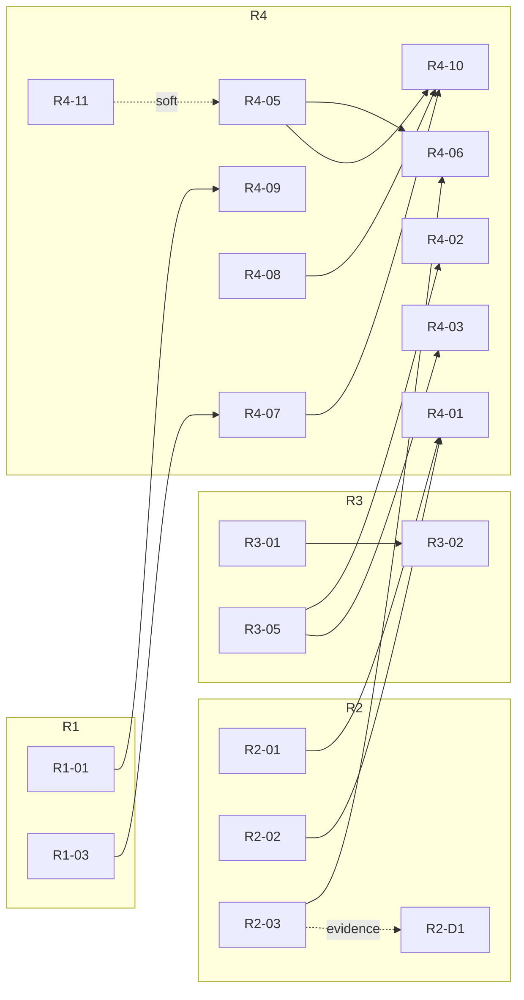

# Forge-dev roadmaps — index & maintenance contract

> Entry point for the forge-dev roadmap set. Five living roadmaps, one index (this
> file). Planned direction only — nothing in this set is an implementation record
> except the explicitly-marked as-built baseline sections inside each roadmap.

Created 2026-07-17 (initial forge-dev roadmap planning session). All initiative
statuses are `planned` or `deferred` as of that date.

---

## 1. Purpose

This directory is the **single source of truth for forge-dev direction**. Any
question of "what is forge building next, and why" resolves here; any agent
session picking up forge-dev work starts here.

**Relation to the three scopes** ([docs/repo-map.md](../repo-map.md)):

- **Scope 1 — framework / seams / orchestration**: fully covered. R1, R2, R3
  and R5 are Scope-1 componentry roadmaps.
- **Scope 2 — cycles / agents / flows**: covered only as **shipping of OOTB
  content** (R4). What forge *ships* out of the box is forge-dev work; what an
  operator *authors inside Studio at runtime* is not (see §7).
- **Scope 3 — projects forge develops**: **excluded**. Work on managed
  projects (betterado, gitpulse, mdtoc, …) is driven *through* forge as cycles,
  not planned here. The out-of-scope register (§7) names the known Scope-3
  streams so they aren't mistaken for gaps in this set.

**Relation to [docs/known-gaps.md](../known-gaps.md)**: known-gaps remains the
*defect and observation log* — the place raw findings land as they're noticed.
These roadmaps are the *planning SSOT*: known-gaps items feed into roadmap
initiatives (each initiative cites its § sources), and once an item is owned by
a roadmap ID, the roadmap entry is authoritative for how/when it gets done.
R5-05 and R5-07 exist specifically to keep the two documents reconciled.

---

## 2. Roadmap register

| ID | File | Mission | Initiatives | Status mix (2026-07-17) |
|----|------|---------|-------------|--------------------------|
| **R1** | [R1-contract-componentry.md](./R1-contract-componentry.md) | Make every forge boundary a typed, machine-checkable contract — KB contract type, KB seam completion, the project-contract process clauses (demo/test/instructions/release/build), and automated contract checks. | 5 + 1 deferred | 5 planned, 1 deferred (R1-D1) |
| **R2** | [R2-runnable-componentry.md](./R2-runnable-componentry.md) | Make "a runnable" a first-class primitive — agent-as-runnable, def-driven builder, fanout (research spike first), trigger expansion, dynamic artifact surfaces, runtime-adapter realization. | 6 + 1 deferred | 6 planned, 1 deferred (R2-D1) |
| **R3** | [R3-library-componentry.md](./R3-library-componentry.md) | First-class managed libraries of reusable capability: skills, skill-generator flow, hooks, tools/MCPs/CLIs, instructions. | 5 | 5 planned |
| **R4** | [R4-ootb-suite.md](./R4-ootb-suite.md) | The shipped out-of-the-box agent/flow suite: migrate platform surfaces to artifacts, the agent roster (onboarding, creation, architect, plan, develop, demo, adversarial review, reflect), the develop-cycle OOTB flow, and the roadmap & attention surface. | 11 + 1 deferred | 11 planned, 1 deferred (R4-D1) |
| **R5** | [R5-hardening-operability.md](./R5-hardening-operability.md) | Safety, integrity and doc hygiene: dry-bridge seam, G8 env-pin at the spawn seam, cost integrity, edit-lock fix, known-gaps residue cross-references, demo/harness backlog, SSOT reconciliation. | 7 | 7 planned |

Each roadmap file also carries an **as-built baseline** section (`R<N>-B*`
entries, status `implemented`) recording what already exists with real file
paths and ADR numbers — that is the only place `implemented` appears in this
set.

Canonical initiative skeleton (IDs are fixed and never reused):

- **R1**: R1-01 KB contract type · R1-02 KB seam completion · R1-03 Project contract: demo + test processes · R1-04 Project contract: instructions + release + build processes · R1-05 Contract machine-checks · R1-D1 *(deferred)* Holistic-metrics clause + exploration-initiative support
- **R2**: R2-01 Agent-as-runnable primitive · R2-02 Agent-def-driven builder · R2-03 Fanout capability (research spike first) · R2-04 Trigger expansion · R2-05 Dynamic artifact surfaces · R2-06 Runtime-adapter realization · R2-D1 *(deferred)* Parallel-work merge-resolution (gated on R2-03 evidence)
- **R3**: R3-01 Skills first-class management · R3-02 Skill-generator flow · R3-03 Hooks library · R3-04 Tools/MCPs/CLIs library · R3-05 Instructions library
- **R4**: R4-01 Platform→artifact migration · R4-02 Project onboarding agent · R4-03 Project creation agent · R4-04 Architect agent refinement · R4-05 Plan agent · R4-06 Develop agent refinement · R4-07 Demo agent · R4-08 Adversarial review agent · R4-09 Reflect agent · R4-10 Develop-cycle OOTB flow · R4-11 Roadmap & attention surface · R4-D1 *(deferred)* Architect-flow retirement
- **R5**: R5-01 Dry-bridge seam · R5-02 G8 env-pin at spawn seam · R5-03 Cost integrity · R5-04 Flow edit-lock fix · R5-05 Known-gaps residue · R5-06 Demo/harness backlog · R5-07 SSOT reconciliation

---

## 3. Cross-roadmap dependencies

Every edge below is recorded **on both sides** (in the depender's
"Depends on" field and flagged in the dependency's initiative). "Soft" means
sequencing preference, not a hard blocker.

| Depender | Depends on | Reason |
|----------|-----------|--------|
| R4-01 Platform→artifact migration | R2-01 Agent-as-runnable | Platform surfaces migrate onto the runnable primitive; can't migrate onto a seam that doesn't exist. |
| R4-01 Platform→artifact migration | R2-02 Agent-def-driven builder | Migrated OOTB agents must be round-trippable through the def-driven builder, or migration recreates hardcoding. |
| R4-05 Plan agent | R4-11 Roadmap & attention surface *(soft)* | The plan agent's standalone per-initiative entry point lives on the roadmap screen and needs its initiative states (incl. the new "merged" state). |
| R4-06 Develop agent refinement | R2-03 Fanout capability | Refined develop fans WIs out through the generic fanout primitive rather than bespoke worktree plumbing. |
| R4-06 Develop agent refinement | R4-05 Plan agent | Develop consumes the plan agent's WI specs (ADR-037 wi-spec-compiler folds into the plan agent — Q2-B). |
| R4-07 Demo agent | R1-03 Demo + test process clauses | The demo agent executes the project contract's demo-process clause; the clause must be typed first. |
| R4-09 Reflect agent | R1-01 KB contract type | Reflect writes into KBs scoped/typed by the KB contract (Q5-B binding rules). |
| R4-02 Project onboarding agent | R3-05 Instructions library (+R1 contract clauses) | Onboarding sources AGENTS.md/instructions material from the instructions library and validates against contract clauses. |
| R4-03 Project creation agent | R3-05 Instructions library (+R1 contract clauses) | Same sourcing/validation pattern as onboarding, for greenfield projects. |
| R4-10 Develop-cycle OOTB flow | R4-05, R4-07, R4-08 | The shipped flow chains plan → develop → demo → adversarial review; all three new agents must exist to assemble it. |
| R3-02 Skill-generator flow | R3-01 Skills first-class management | Generated skills need a managed library to land in. |
| R2-D1 Merge-resolution *(deferred)* | R2-03 evidence | Design is gated on the fanout research spike's survey of parallel-agent/merge practice outside forge (Q3-B). |



---

## 4. Recommended driving order (Q6-A: safety first)

This orders **planned** work for future operator-run agent sessions — nothing
below is implemented. Waves are a default sequence, not a lockstep gate;
initiatives inside a wave can run in parallel where dependencies allow.

| Wave | Initiatives | Rationale |
|------|-------------|-----------|
| **0** | R5-01 dry-bridge seam · R5-02 G8 env-pin at spawn seam (+ R5-07 SSOT reconciliation, cheap doc hygiene) | Safety first: close the bridge-acts-with-operator-credentials class (2026-07-16 self-merge incident) and pin the env at the spawn seam before any new agent surfaces multiply the risk. R5-07 is near-free and stops doc drift compounding under the new roadmap set. |
| **1** | R2-01 agent-as-runnable · R2-02 agent-def-driven builder | The runnable primitive is the foundation everything in R4 migrates onto; land it before building agents that would otherwise hardcode around it. |
| **2** | R4-05 plan agent · R4-11 roadmap & attention surface | The highest-leverage new capability (plan agent, absorbing ADR-037) plus the operator surface it enters from (soft dep, Q2-B two entry paths). |
| **3** | R1-01 KB contract type · R3-01 skills first-class management — interleaved at dependency points | Contract and library groundwork pulled in exactly when downstream R4 agents need them (R4-09 needs R1-01; R3-02 and the palette residue need R3-01). |
| **4** | Remaining R4 agents (R4-02/03/04/06/07/08/09) + R4-10 flow assembly, as their deps land | The OOTB suite completes bottom-up; R4-10 assembles last since it chains R4-05/07/08. |
| **continuous** | R5-03 cost integrity · R5-04 edit-lock fix · R5-05 known-gaps residue · R5-06 demo/harness backlog | Opportunistic — pick up alongside whatever wave is active when a session touches the relevant seam. |

---

## 5. Maintenance contract (living-roadmap mechanics)

These five files are **living documents**. The rules:

1. **Stable, never-reused IDs.** `R<N>-NN` (initiatives), `R<N>-NN-Fn`
   (features), `R<N>-B<n>` (baseline entries), `R<N>-D<n>` (deferred). Once
   minted, an ID is permanent — a dropped initiative keeps its ID with a
   terminal note; the number is never recycled.
2. **Append-only change logs.** Every roadmap ends with a `## Change log`;
   every edit appends a dated line. History is never rewritten.
3. **Status transitions happen in implementation sessions, not planning
   sessions.** Vocabulary: `planned → in-progress → implemented`. A `deferred`
   item must carry a recorded re-entry condition and re-enters as `planned`
   only when that condition is met (e.g. R2-D1 on R2-03 spike evidence,
   R4-D1 on the plan-agent path proving out).
4. **Change requests append.** New work under an existing focus area is added
   as a new initiative or feature under the existing roadmap with the next
   free ID — existing entries are amended only to add cross-references or
   status, never silently rewritten.
5. **New focus area ⇒ mint R6+** from the canonical template below. Never
   overload an existing roadmap with an unrelated mission.
6. **Baseline sections absorb landed work.** When an initiative reaches
   `implemented`, its as-built facts (paths, ADRs, journey names) move into or
   link from the roadmap's `## As-built baseline` section, and the initiative
   entry links there. The baseline is the roadmap↔functionality linkage that
   future agent sessions consult — keep paths real.

### Canonical roadmap file template

````markdown
# R<N> — <Name>

> Mission sentence. Scope-boundary sentence mapping to docs/repo-map.md scopes.

**Status vocabulary:** implemented | in-progress | planned | deferred. All
initiatives in this file are planned/deferred as of 2026-07-17.

## As-built baseline (implemented)

### R<N>-B1 <capability name>
What exists + WHERE (real file paths, ADR numbers, journey names). 3-8
baseline entries. This section is the roadmap↔functionality linkage — be
precise, these paths get consulted by future agent sessions.

## Planned initiatives

### R<N>-NN <Title>
- **Status:** planned  ·  **Wave:** <0-4 or opportunistic>
- **Depends on:** <IDs + one-word reason, or —>
- **Depended on by:** <reverse edges — maintained on both sides, or omit if none>
- **Context:** why this exists; sources (known-gaps §, ADR, operator diagram,
  Q-decision).
- **Features:** subsections R<N>-NN-F1..Fn — each a concrete spec:
  behavior/contract/schema, affected seams+files, explicit acceptance-criteria
  bullets. Specs must be executable by a future agent session WITHOUT
  re-deriving this session's research.
- **Session sizing:** ~N operator-run agent sessions + suggested split.
- **Out of scope:** what this initiative deliberately does NOT cover (point to
  the owning ID).

## Deferred

### R<N>-D1 <Title> — re-entry condition spelled out.

## Change log

- 2026-07-17 — Roadmap created (initial forge-dev roadmap planning session).
````

---

## 6. Reference artifacts

- **`mockups/studio-endstate/`** — the end-state reference: what Studio looks
  like when the R1–R5 set has landed. Work backwards from it; when a roadmap
  decision and a mockup disagree, the roadmap wins and the mockup gets updated.
- **[docs/roadmaps/overview.html](./overview.html)** — the planning snapshot
  rendered for operator review of this session's output. It is a point-in-time
  artifact of 2026-07-17; the markdown roadmaps are the living SSOT, the HTML
  is not maintained between planning sessions.

---

## 7. Out-of-scope register

Named so nobody mistakes their absence for an oversight:

| Item | Why out of scope | Where it lives |
|------|------------------|----------------|
| betterado framework-auth-parity + protocol-manifest release | Scope-3 project work, driven *through* forge as cycles — not forge-dev componentry. | [known-gaps §5](../known-gaps.md) |
| gitpulse idea corpus / follow-on features | Scope-3 managed-project roadmap; gitpulse is a verify-cycle ground, its product direction is its own. | `projects/gitpulse` (managed) |
| Anything authored **inside Studio by operators at runtime** (custom agents, flows, skills, KBs) | Scope-2 *authoring* is a product capability, not shippable content. The roadmaps cover the authoring *machinery* (R2/R3) and the **shipped OOTB content** (R4) — not what operators make with it. | Operator-owned |
| Managed-project brains' content (Brain 3 themes) | Produced by cycles per ADR-035; forge-dev owns the machinery, not the content. | `brain/projects/<name>/` |

---

## 8. Session decisions record (2026-07-17)

Locked operator-approved decisions from the initial roadmap planning session.
These are provenance — later sessions may supersede them only via a new dated
entry here plus corresponding roadmap change-log lines.

- **Scope**: this session produced roadmap documents only, zero
  implementation. Every new item is `planned` (or `deferred`); `implemented`
  appears only in as-built baseline sections. Coverage = forge-dev
  (repo-map.md Scope 1 componentry + shipping of Scope 2 OOTB content).
  Scope 3 (managed projects, e.g. betterado known-gaps §5) is out; this index
  carries the out-of-scope register (§7).
- **Q1 — five living roadmaps**: R1 contract componentry, R2 runnable
  componentry, R3 library componentry, R4 OOTB suite, R5 hardening &
  operability. Living docs: stable never-reused IDs, append-only change logs,
  new focus areas mint R6+.
- **Q2-B — plan agent alongside architect**: the new plan agent ships
  *alongside* the current architect flow with two entry paths (standalone
  per-initiative from the roadmap screen; auto-after-architect-accept).
  Architect-flow retirement is a deferred future initiative (R4-D1). The
  initiative lifecycle gains a **"merged"** state between in-progress and done
  (the reflect trigger point). ADR-037's wi-spec-compiler folds into the plan
  agent (ADR-037 is the only Proposed ADR).
- **Q3-B — unifier retired**: the unifier concept is retired. Post-develop =
  demo agent + adversarial review agent, both initiative-context. Fanout
  (R2-03) gets a research-first spike (survey parallel-agent/merge best
  practice *outside* forge) before any merge-resolution capability is designed
  — merge-resolution is a deferred placeholder (R2-D1) gated on fanout
  evidence. The unifier's dual-boundary full-suite gate (a known-gaps
  "strength worth preserving") relocates to orchestrator-owned gate execution
  per the ADR-036 pattern (agents judge, orchestrator executes) — flagged
  **for operator review** wherever it appears.
- **Q4 — attention strip**: slim cross-project aggregate strip / notifications
  blade, planned in R4-11. Serves "which projects need my attention" when
  multiple projects run concurrently (MVUS cross-cutting requirement; ADR-031
  retired the old pane).
- **Q5-B — KB scoping**: every *new* KB binds mandatorily at creation to a
  specific flow or project; forge-dev stays unique/unbound; the "cycles" brain
  rebinds as the develop-flow's KB (no dissolve/migration project). The
  asymmetric brain-read policy (planners mandatory; dev/review advisory
  Brain-3 only — ADR-010 as amended) is untouched: the rework changes scoping,
  not who-reads-what.
- **Q6-A — driving order, safety first**: wave 0 = R5-01 dry-bridge + R5-02 G8
  env-pin (+ R5-07 cheap doc hygiene); wave 1 = R2-01 + R2-02; wave 2 = R4-05
  plan agent + R4-11 roadmap surface; then R1-01/R3-01 interleaved at
  dependency points; then remaining R4 agents as deps land. R5-03..06
  opportunistic/continuous.

---

## Change log

- 2026-07-17 — Index created (initial forge-dev roadmap planning session).
