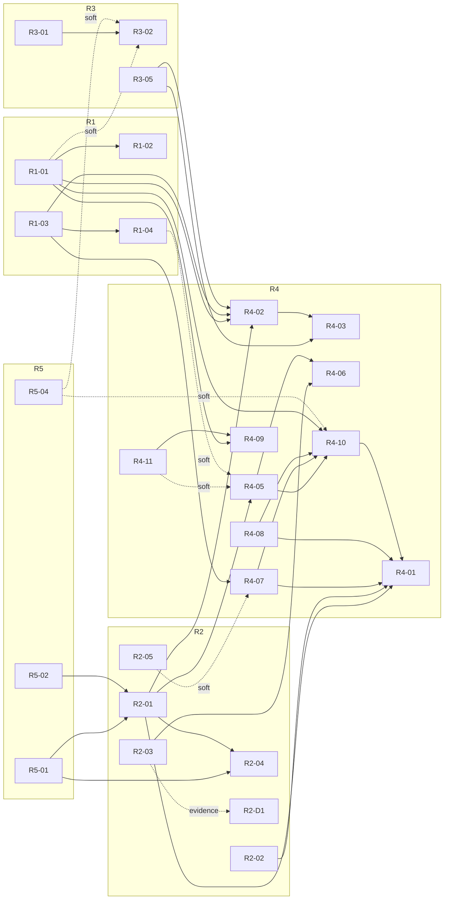

# Forge-dev roadmaps — index & maintenance contract

> Entry point for the forge-dev roadmap set. Five living roadmaps, one index (this
> file). Planned direction only — nothing in this set is an implementation record
> except the explicitly-marked as-built baseline sections inside each roadmap.

Created 2026-07-17 (initial forge-dev roadmap planning session). All initiative
statuses are `planned` or `deferred` as of that date.

---

## 1. Purpose

This directory is the **single source of truth for forge-dev direction**. Any
question of "what is forge building next, and why" resolves here; any agent
session picking up forge-dev work starts here.

**Relation to the three scopes** ([docs/repo-map.md](../repo-map.md)):

- **Scope 1 — framework / seams / orchestration**: fully covered. R1, R2, R3
  and R5 are Scope-1 componentry roadmaps.
- **Scope 2 — cycles / agents / flows**: covered only as **shipping of OOTB
  content** (R4). What forge *ships* out of the box is forge-dev work; what an
  operator *authors inside Studio at runtime* is not (see §7).
- **Scope 3 — projects forge develops**: **excluded**. Work on managed
  projects (betterado, gitpulse, mdtoc, …) is driven *through* forge as cycles,
  not planned here. The out-of-scope register (§7) names the known Scope-3
  streams so they aren't mistaken for gaps in this set.

> **2026-07-17 note:** the Scope 1 / Scope 2 split above is now forge's north
> star, not just a contributor map — [ADR 038](../decisions/038-north-star-platform-and-ootb.md)
> promotes it: Scope 1 is a modular platform for building the ideas machine or
> any other agentic flow (SWE-focused for now by explicit choice); Scope 2 OOTB
> is the ideas machine. See §8 decision 4.

**Relation to [docs/known-gaps.md](../known-gaps.md)**: known-gaps remains the
*defect and observation log* — the place raw findings land as they're noticed.
These roadmaps are the *planning SSOT*: known-gaps items feed into roadmap
initiatives (each initiative cites its § sources), and once an item is owned by
a roadmap ID, the roadmap entry is authoritative for how/when it gets done.
R5-05 and R5-07 exist specifically to keep the two documents reconciled.

---

## 2. Roadmap register

| ID | File | Mission | Initiatives | Status mix (2026-08-03, post-wave-5 cut) |
|----|------|---------|-------------|--------------------------|
| **R1** | [R1-contract-componentry.md](./R1-contract-componentry.md) | Make every forge boundary a typed, machine-checkable contract — KB contract type, KB seam completion, the project-contract process clauses (demo/test/instructions/release/build), automated contract checks, and (wave 5) KB create/maintain. | 6 + 1 deferred | 2 implemented, 1 in-progress (R1-03 ⚑F4 verdict), 3 planned, 1 deferred (R1-D1) |
| **R2** | [R2-runnable-componentry.md](./R2-runnable-componentry.md) | Make "a runnable" a first-class primitive — agent-as-runnable, def-driven builder, fanout (research spike first), trigger expansion, dynamic artifact surfaces, runtime-adapter realization; wave 5 adds triggers-runtime, builder parity, the sessions surface; R2-11 (minted mid-batch-C) owns legacy-path budget enforcement. | 11 + 2 deferred | 4 implemented, 7 planned, 2 deferred (R2-D1 closed-rejected, R2-D2 parked) |
| **R3** | [R3-library-componentry.md](./R3-library-componentry.md) | First-class managed libraries of reusable capability: skills, skill-generator flow, hooks (lifecycle customisations), connections, instructions, templates + the community browser. | 7 | 5 implemented (R3-01, R3-03, R3-04, R3-06, R3-07), 1 implemented-with-deferred-feature (R3-05 F1-F3; F4 deferred), 1 planned (R3-02) — corrected 2026-08-05 from a stale "2 implemented / 5 planned" filed by R3-06 (README §5.4); read from each initiative's own status line, not estimated |
| **R4** | [R4-ootb-suite.md](./R4-ootb-suite.md) | The shipped out-of-the-box agent/flow suite: migrate platform surfaces to artifacts, the agent roster (onboarding, creation, architect, plan, develop, demo, adversarial review, reflect), the develop-cycle OOTB flow, the roadmap & attention surface; wave 5 adds the project surfaces + per-OOTB session/flow alignment; R4-21 (minted at batch-C planning) owns the authoring-agent producer gap. | 23 + 1 deferred | 19 implemented, 3 planned, 1 resolved (R4-20, reasoned keep-as-is), 1 deferred (R4-D1) — recounted 2026-08-15 at the wave-5 final pass close (R4-19 planned→implemented on PR #132, R4-23 planned→implemented on PR #134), reading each initiative's own status line rather than estimating. Prior recount 2026-08-11 at batch-E close (R4-22 partial→implemented, its F4 re-homed; **R4-23 minted** planned, total 22→23). The prior "21 / 13 implemented / 8 planned" was stale on four axes accumulated since the 2026-08-07 recount: R4-22's mint (total 21→22), R4-17 + R4-18 landing, and R4-20 resolving to a state the row's vocabulary did not carry at all. Nothing in CI checks these counts — they go stale silently. |
| **R5** | [R5-hardening-operability.md](./R5-hardening-operability.md) | Safety, integrity and doc hygiene: dry-bridge seam, G8 env-pin at the spawn seam, cost integrity, edit-lock fix, known-gaps residue cross-references, demo/harness backlog, SSOT reconciliation; wave 5 adds the dead-code sweep + the three-scope docs ground-truth restructure. | 9 | 4 implemented (R5-01/02/04/07), 5 planned |
| **R6** | [R6-operator-experience.md](./R6-operator-experience.md) | The Studio operator surface as a platform: run observability depth, human-readable operations, IA & DOM-convention stewardship — the biggest wave-5 home (kickoff/monitors/home/KB-explore). | 8 + 1 deferred | 8 planned, 1 deferred (R6-D1) |
| **R7** | [R7-verification-infrastructure.md](./R7-verification-infrastructure.md) | The standing verification platform: corpus-anchored bench rebuild, journey-platform evolution (incl. the LLM-driven UI-test tier), verify-ground stewardship, CI/drift-guard growth. *(Minted 2026-07-17; unwaved.)* | 4 | 4 planned |
| **R8** | [R8-distribution-release.md](./R8-distribution-release.md) | Forge itself as a shippable product: packaging (the deferred S10), version/release policy, public docs & positioning upkeep. *(Minted 2026-07-17; deliberately thin, operator-paced.)* | 3 + 1 deferred | 3 planned, 1 deferred (R8-D1) |

Each roadmap file also carries an **as-built baseline** section (`R<N>-B*`
entries, status `implemented`) recording what already exists with real file
paths and ADR numbers — that is the only place `implemented` appears in this
set.

Canonical initiative skeleton (IDs are fixed and never reused):

- **R1**: R1-01 KB contract type · R1-02 KB seam completion · R1-03 Project contract: demo + test processes · R1-04 Project contract: instructions + release + build processes · R1-05 Contract machine-checks · R1-06 KB create & maintain *(wave 5)* · R1-D1 *(deferred)* Holistic-metrics clause + exploration-initiative support
- **R2**: R2-01 Agent-as-runnable primitive · R2-02 Agent-def-driven builder · R2-03 Fanout capability (research spike first) · R2-04 Trigger expansion · R2-05 Dynamic artifact surfaces · R2-06 Runtime-adapter realization · R2-07 Composition single-source · R2-08 Triggers runtime *(wave 5)* · R2-09 Agent-builder definition parity *(wave 5)* · R2-10 Interactive sessions surface *(wave 5)* · R2-11 Legacy invocation path budget-aware *(unwaved, minted mid-batch-C)* · R2-D1 *(deferred, closed-rejected)* Parallel-work merge-resolution · R2-D2 *(deferred/parked)* Plan-band read-only parallelism
- **R3**: R3-01 Skills first-class management · R3-02 Skill-generator flow · R3-03 Hooks library (lifecycle re-scope) · R3-04 Connections (tools/MCPs/CLIs) library · R3-05 Instructions library · R3-06 Templates library *(wave 5)* · R3-07 Community browser *(wave 5)*
- **R4**: R4-01 Platform→artifact migration · R4-02 Project onboarding agent · R4-03 Project creation agent · R4-04 Architect agent refinement · R4-05 Plan agent · R4-06 Develop agent refinement · R4-07 Demo agent · R4-08 Adversarial review agent · R4-09 Reflect agent · R4-10 Develop-cycle OOTB flow · R4-11 Roadmap & attention surface · R4-12 Project detail alignment *(wave 5)* · R4-13 Project roadmap tab *(wave 5)* · R4-14 Demo showcase page *(wave 5)* · R4-15 Architect/planning session ⚑ *(wave 5)* · R4-16 Demo-builder generation gallery *(wave 5)* · R4-17 Onboarding session staging *(wave 5)* · R4-18 Onboard-project OOTB flow *(wave 5)* · R4-19 Brain creation & maintenance agents *(wave 5)* · R4-20 Brain-tune OOTB flow *(wave 5)* · R4-21 OOTB authoring agent *(wave 5, batch D — minted at batch-C planning)* · R4-22 Generic interactive-surface primitive *(wave 5, batch E — ADR-043, minted 2026-08-10)* · R4-23 Runner prompt re-authoring onto SKILL.md *(minted 2026-08-11 at the R4-22-F4 slip)* · R4-D1 *(deferred)* Architect-flow retirement
- **R5**: R5-01 Dry-bridge seam · R5-02 G8 env-pin at spawn seam · R5-03 Cost integrity · R5-04 Flow edit-lock verification · R5-05 Known-gaps residue · R5-06 Demo/harness backlog · R5-07 SSOT reconciliation · R5-08 Dead-code & component minimisation *(wave 5)* · R5-09 Docs ground-truth restructure *(wave 5)*
- **R6**: R6-01 Run-observability depth · R6-02 Human-readable operations · R6-03 IA & convention stewardship · R6-04 Run kickoff & consolidation *(wave 5)* · R6-05 Flow monitor ledger *(wave 5)* · R6-06 Agent monitor linkage *(wave 5)* · R6-07 Home dashboard *(wave 5)* · R6-08 KB explore *(wave 5)* · R6-D1 *(deferred)* Notification transport beyond the blade
- **R7**: R7-01 Bench rebuild (corpus-anchored) · R7-02 Journey platform evolution · R7-03 verify-ground & corpus stewardship · R7-04 CI & drift-guard growth
- **R8**: R8-01 Packaging · R8-02 Version & release cadence · R8-03 Public docs & positioning upkeep · R8-D1 *(deferred)* Community & ecosystem enablement

### Coverage map — routing new forge work

Any new forge-dev work routes through this table; if it fits no row, that is
the signal to mint the next roadmap (§5 rule 5), never to wedge it somewhere
adjacent. **This directory is the design home for anything within forge.**

| Architecture pillar | Owning roadmap |
|---|---|
| Contracts & seams — project contract, KB contract, KbBackend, preflight (`cli/preflight.ts`, `orchestrator/kb-backend.ts`) | **R1** |
| Runnable engine — flow runner, agent primitive, triggers, fanout, artifact surfaces, runtime adapters (`orchestrator/`, `loops/`) | **R2** |
| Capability libraries — skills, hooks, tools/MCPs, instructions (`skills/`, `studio/catalog.yaml`) | **R3** |
| Shipped OOTB content — the agent suite + flows, roadmap/attention surface work this round (`studio/flows/`, agent SKILL.mds) | **R4** |
| Safety, integrity, doc hygiene — guards, env, cost integrity, known-gaps residue, SSOT | **R5** |
| Operator surface & observability platform (`forge-ui/` as a pillar, event/log presentation) | **R6** |
| Verification platform — journeys, deadpaths, verify:cycle, benches, CI/drift guards (`scripts/`, `.github/`) | **R7** |
| Distribution — packaging, forge versioning, OSS posture, positioning upkeep | **R8** |
| Managed projects & their brains' content | *Out of scope — §7* |

**Deliberately absent (not gaps — decided or future-gated):**

| Area | Status |
|---|---|
| Self-hosting (forge cycles against forge itself) | Not pursued; known-gaps header records forge is not self-hosted. Would mint a roadmap if ever pursued. |
| Multi-operator / collaboration | No signal; single-operator is the wedge (market doc). YAGNI. |
| Non-SWE connectors (any-agentic-flow beyond software engineering) | Future per the north-star reframe (R5-07-F8's ADR records it); SWE focus is an explicit current choice. Mints its own roadmap when the focus lifts. |
| Feature-owned UI changes | Never roadmap-routed as a pillar — they ride their owning initiative + the journey-sync contract (R6 owns only the platform/conventions). |

---

## 3. Cross-roadmap dependencies

Every edge below is recorded **on both sides** (in the depender's
"Depends on" field and the dependency's "Depended on by" field) — and the
table is **generated from the per-file fields**; when they disagree, the
files win and this table regenerates. "Soft" means sequencing preference,
not a hard blocker. (Regenerated 2026-07-17 after the adversarial review —
previously several file-recorded edges were missing here.)

| Depender | Depends on | Reason |
|----------|-----------|--------|
| R2-01 Agent-as-runnable | R5-01, R5-02 | Safety first (Q6-A): new spawn surfaces are born inside the dry-bridge seam with a pinned env. |
| R2-04 Trigger expansion | R5-01, R2-01 | Every trigger is an unattended-spawn surface; agent-complete events need runnable agents. |
| R4-01 Platform→artifact migration | R2-01, R2-02 | Platform surfaces migrate onto the runnable primitive and must round-trip through the def-driven builder. |
| R4-01-**F4** (unifier retirement) | R4-07, R4-08, R4-10-F2 | Retirement cannot start before the successor agents and the relocated, proven merge-boundary gate are live. |
| R4-02 Project onboarding agent | R3-05, R1-03/R1-04, R1-01, R2-01 | Instructions sourcing; contract clauses to tick; KB binding at onboarding; standalone runnable. |
| R4-03 Project creation agent | R3-05 (+R1 clauses), R4-02 | Same sourcing/validation pattern; hands off to the onboarding loop post-scaffold. |
| R4-05 Plan agent | R2-01 (hard, F4), R4-11 *(soft)*, R1-04 *(soft)* | Standalone dispatch = the runAgent primitive behind R5-01's guard (no bespoke runner); roadmap-screen states; planning inputs. |
| R4-06 Develop agent refinement | R2-03, R4-05 | Declared fanout; consumes the plan agent's spec-WIs (ADR-037 fold, Q2-B). |
| R4-07 Demo agent | R1-03, R2-05 *(soft)* | Executes the typed demo-process clause; richer surfaces build on the artifact contract. |
| R4-09 Reflect agent | R1-01, R4-11 | Writes into contract-typed KBs (Q5-B); triggered by R4-11-F1's merged state. |
| R4-10 Develop-cycle OOTB flow | R4-05, R4-07, R4-08 | The shipped flow chains plan → develop → demo → adversarial review. |
| R4-10-**F4** (succession) | R1-01 | Succession must rebind the cycles KB `binding.ref` or R1-01's dangling-ref lint goes red. |
| R3-02 Skill-generator flow | R3-01, R1-01 *(soft)*, R5-04 *(soft)* | Managed library landing place; flow-scoped KB binding; edit-lock verified before a second live flow. |
| R3-03 Hooks library | R3-01 *(soft)*, R5-01/R5-02 *(soft)* | Reuses the library pattern; leans on the safety rails. |
| R3-04 Tools/MCPs library | R3-01 *(soft)* | Same library surface pattern. |
| R1-02 KB seam completion | R1-01 | The seam completes against the contract shape, not the legacy descriptor. |
| R1-04 / R1-05 | R1-03 | Reuse the typed-process pattern; machine-checks verify the typed processes. |
| R4-10 / R3-02 | R5-04 *(soft)* | Both ship second live flows; the edit-lock verification precedes them. |
| R2-D1 Merge-resolution *(deferred)* | R2-03 evidence | Design gated on the fanout research spike (Q3-B). |

**Wave-5 edges (2026-08-03 cut — recorded on both sides in the files; soft
edges in italics):**

| Depender | Depends on | Reason |
|----------|-----------|--------|
| R3-07 Community browser | R3-01-F4, R3-03-F2, R3-04, *R3-06* | Install routes through the owning kind pipelines; browser owns zero trust decisions. |
| R3-06 Templates library | *R3-01*, *R2-05* | Library pattern; R2-05-F1's canonical artifact set is the managed substance (do the audit once). |
| R2-08 Triggers runtime | R2-04 | Extends the 7-kind registry + webhook machinery. |
| R2-09 Builder parity | R2-02 | `materials:` rides the capability descriptor. |
| R2-10 Sessions surface | R2-01-F3 | UI half of the runner convergence (deep half stays deferred). |
| R6-01-F4/F5 (amend) | *R2-05* | Typed-output rendering contract, pulled at need. |
| R6-04 Kickoff & consolidation | R2-01-F3, R2-02, R2-09-F1, *R2-08-F4* | Dispatch host; descriptor routing; materials enforcement point; trigger provenance read side. |
| R6-05 Flow monitor ledger | R6-01-F4 | Rows link into run detail. |
| R6-06 Agent monitor linkage | R6-05, R6-04-F3, R2-10 | Shared ledger; the three real link targets. |
| R6-07 Home dashboard | R6-03-F3, R4-11-F4 | Home pillar in nav; attention strip feed. |
| R1-06 KB create & maintain ⚑ | R1-01 | Extends the binding contract (band scope; ⚑ ADR-010 read-policy gate). |
| R4-12 Project detail | *R6-01-F4* | Cycle-ledger dig-in links. |
| R4-13 Roadmap tab | R4-12 | Lives on its page (DAG replaces serpentine — decision 4). |
| R4-14 Demo showcase | R4-12, R1-03 | Entry + demo-process artifacts. |
| R4-15/16/17 Session alignments | R2-10 (+R4-02 for R4-17) | Render through the shared session shell. |
| R4-18 Onboard-project flow | R4-17 | Wraps the staged session. |
| R4-19 Brain agents | R2-10, R1-06 | Session shell; band-scoped binding must exist. |
| R4-20 Brain-tune flow | R4-09, *R2-08-F2* | Reflect agent; on-completion chaining. |


```mermaid
graph LR
  subgraph R5
    R5-01; R5-02; R5-04
  end
  subgraph R2
    R2-01; R2-02; R2-03; R2-04; R2-05; R2-D1
  end
  subgraph R1
    R1-01; R1-02; R1-03; R1-04
  end
  subgraph R3
    R3-01; R3-02; R3-05
  end
  subgraph R4
    R4-01; R4-02; R4-03; R4-05; R4-06; R4-07; R4-08; R4-09; R4-10; R4-11
  end
  R5-01 --> R2-01
  R5-02 --> R2-01
  R5-01 --> R2-04
  R2-01 --> R2-04
  R2-01 --> R4-01
  R2-02 --> R4-01
  R2-01 --> R4-02
  R2-01 --> R4-05
  R4-11 -. soft .-> R4-05
  R1-04 -. soft .-> R4-05
  R2-03 --> R4-06
  R4-05 --> R4-06
  R1-03 --> R4-07
  R2-05 -. soft .-> R4-07
  R1-01 --> R4-09
  R4-11 --> R4-09
  R1-01 --> R4-02
  R1-03 --> R4-02
  R3-05 --> R4-02
  R3-05 --> R4-03
  R4-02 --> R4-03
  R4-05 --> R4-10
  R4-07 --> R4-10
  R4-08 --> R4-10
  R4-07 --> R4-01
  R4-08 --> R4-01
  R4-10 --> R4-01
  R1-01 --> R4-10
  R1-01 --> R1-02
  R1-03 --> R1-04
  R3-01 --> R3-02
  R1-01 -. soft .-> R3-02
  R5-04 -. soft .-> R3-02
  R5-04 -. soft .-> R4-10
  R2-03 -. evidence .-> R2-D1
```

---

## 4. Recommended driving order (Q6-A: safety first)

This orders **planned** work for future operator-run agent sessions — nothing
below is implemented. Waves are a default sequence, not a lockstep gate;
initiatives inside a wave can run in parallel where dependencies allow.

| Wave | Initiatives | Rationale |
|------|-------------|-----------|
| **0** | R5-01 dry-bridge seam · R5-02 G8 env-pin at spawn seam · R5-07 SSOT reconciliation **incl. F8, the north-star reframe ADR** | Safety first: close the bridge-acts-with-operator-credentials class (2026-07-16 self-merge incident) and pin the env at the spawn seam before any new agent surfaces multiply the risk. R5-07 is near-free, stops doc drift compounding, and F8 fixes the instruction layer before wave-1 sessions design under the stale north star. |
| **1** | R2-01 agent-as-runnable · R2-02 agent-def-driven builder · R5-04 edit-lock verification (trivial rider) | The runnable primitive is the foundation everything in R4 migrates onto; land it before building agents that would otherwise hardcode around it. R5-04 verifies the edit-lock before any second live flow exists. |
| **2** | R4-05 plan agent · R4-11 roadmap & attention surface | The highest-leverage new capability (plan agent, absorbing ADR-037) plus the operator surface it enters from (soft dep, Q2-B two entry paths; R4-05-F4 dispatches through R2-01's primitive). |
| **3** | R1-01 KB contract type · R3-01 skills first-class management — interleaved at dependency points | Contract and library groundwork pulled in exactly when downstream R4 agents need them (R4-09 needs R1-01; R3-02 and the palette residue need R3-01). |
| **4** | **R4-01 first** (F1–F3), then R4-02/03/04/06/07/08/09 as their deps land, **R4-10 assembles last** (incl. its F5 harness migration + F6 resume re-home), **R4-01-F4 retirement after R4-10-F2 is live and green** | The OOTB suite completes bottom-up; the migration governs the agent initiatives, the flow chains R4-05/07/08, and unifier retirement is the final cutover. |
| **continuous** | R5-03 cost integrity · R5-05 known-gaps residue · R5-06 demo/harness backlog | Opportunistic — pick up alongside whatever wave is active when a session touches the relevant seam. |
| **unwaved** | All R6 / R7 / R8 initiatives | Minted by the coverage review without sequencing; the operator prioritizes them against this order (natural affinities noted in each file — e.g. R7-01 after the R4 suite stabilizes, R8-01 after wave 0's seams). |

### Wave 5 — Studio end-state alignment (opened 2026-08-03; waves 0–4 are history)

Waves 0–4 delivered the platform + the OOTB suite. Wave 5 changes the unit of
work: **one module per initiative**, so a session can iterate on the skills
library, or the agent builder, or a single agent/flow, without holistic
cross-cutting changes. The north star for the module set is the operator's
end-state mockup: `mockups/studio-endstate-v2/` (20 surfaces, 27 scripted
journey videos as acceptance references, `as-built-inventory.md` as the
2026-08-03 baseline it is diffed against).

**5A — the cut: DONE 2026-08-03** (this session; operator decisions 1–6
recorded in §8). Every initiative below is scoped to exactly one module,
cites its mockup evidence (journey id + surface file) as the acceptance
reference and its as-built baseline from `as-built-inventory.md`; verified
already-aligned surfaces are baseline material (R4-B13), not initiatives.

#### Wave-5 cut summary

| Initiative | Module | Home | Size | Depends (hard; *italic = soft*) |
|---|---|---|---|---|
| R3-01-F3/F4 skills library view + marketplace (re-entered) | library-skills | R3 | M | — |
| R3-03 hooks library (lifecycle re-scope) | library-hooks | R3 | L | — |
| R3-04 connections library | library-connections | R3 | M | — |
| R3-06 templates library | library-templates | R3 | M | — |
| R3-07 community browser | community-browser | R3 | M | R3-01-F4 · R3-03-F2 · R3-04 |
| R2-08 triggers runtime | triggers-runtime | R2 | M | R2-04 |
| R2-09 agent-builder definition parity | agent-builder | R2 | M | R2-02 |
| R2-10 interactive sessions surface | sessions-surface | R2 | L | R2-01-F3 |
| R6-01-F1/F4/F5 run-detail depth (amend; F1 = F5's hard precursor) | flow-run-detail | R6 | M | *R2-05 (typed outputs, at need)* |
| R6-03-F3 six-pillar nav + page shell (amend) | IA stewardship | R6 | M | — (batch-E sequencing) |
| R6-04 run kickoff & consolidation | agent-kickoff+run | R6 | M | R2-01-F3 · R2-02 · R2-09-F1 |
| R6-05 flow monitor ledger | flows-home/monitor | R6 | S | R6-01-F4 |
| R6-06 agent monitor linkage | agents-home/monitor | R6 | S | R6-05 · R6-04-F3 · R2-10 |
| R6-07 home dashboard | home-dashboard | R6 | M | R6-03-F3 · R4-11-F4 |
| R6-08 KB explore (graph+reader) | kb-explore | R6 | M | — |
| R1-06 KB create & maintain ⚑ | kb-create/maintain | R1 | M | R1-01 |
| R4-12 project detail alignment | projects-list/detail | R4 | M | — |
| R4-13 project roadmap tab (DAG replaces serpentine) | project-roadmap-tab | R4 | M | R4-12 |
| R4-14 demo showcase page | demo-showcase | R4 | S | R4-12 · R1-03 |
| R4-15 architect/planning session ⚑ | per-OOTB-agent | R4 | M | R2-10 |
| R4-16 demo-builder generation gallery | per-OOTB-agent | R4 | S | R2-10 |
| R4-17 onboarding session staging | per-OOTB-agent | R4 | M | R2-10 · R4-02 |
| R4-18 onboard-project OOTB flow | per-OOTB-flow | R4 | M | R4-17 |
| R4-19 brain creation & maintenance agents | per-OOTB-agent | R4 | M | R2-10 · R1-06 |
| R4-20 brain-tune OOTB flow | per-OOTB-flow | R4 | S | R4-09 |
| R4-21 OOTB authoring agent (skill/hook producer — minted batch-C planning) | per-OOTB-agent | R4 | M | R2-10 · R3-01-F3/F4 |

Parked/rejected in the same cut: plan-band branching + demo-design/research
agents → **R2-D2** (decision 2); manual KB ingest → rejected, reflection-only
policy stands (decision 3, negative ACs on R6-08/R1-06); the mockup's
architect+PM merger stays behind **R4-D1** (R4-15-F2 ⚑ produces the decision
brief).

#### 5B — the batch plan: current state → mockup state (restructured 2026-08-03)

Operator directive (same day, post-cut): drive wave 5 as a **small number of
batches**, each a clean module-separated arc from as-built to mockup state.
Two ground truths only — the as-built assessment (`as-built-inventory.md` +
the roadmap baselines) and the mockup's flows/intent; prior wave structure is
history, not a constraint. The per-initiative specs in the R-files stay the
execution detail; THIS table is the driving view.

| Batch | Modules | Initiatives | Functional closure (journeys run against the REAL product) |
|---|---|---|---|
| **A — Library** | library-skills · library-hooks · library-connections · library-templates · community-browser | R3-01-F3/F4 · R3-06 · R3-03 · R3-04 · R3-07 | build-skill · build-hook · install-skills-hooks · install-connections |
| **B — Sessions & builder** | sessions-surface · agent-builder · per-OOTB sessions | R2-10 · R2-09 · R4-15 · R4-16 · R4-17 | create-agent · edit-agent · onboard-project · create-project · run-agent-{architect, demo-builder, onboarding} |
| **C — Runs, triggers & monitors** | triggers-runtime · agent-kickoff+run · flow-run-detail · flows-home/monitor · agents-home/monitor | R2-08 · R6-04 · R6-01-F1/F4/F5 (+the R2-05 slice typed outputs need) · R6-05 · R6-06 | run-agent · run-flow · run-agent-{developer, adversarial-review, demo-runner, reflector} — all three trigger framings |
| **D — Projects & knowledge** | projects-list/detail · project-roadmap-tab · demo-showcase · kb-create/maintain · kb-explore · per-OOTB flows · per-OOTB authoring | R4-12 · R4-13 · R4-14 · R1-06 · R6-08 · R4-19 · R4-18 · R4-20 · R4-21 | create-kb-project · create-kb-cycle · kb-maintain · run-agent-brain-creation · run-flow-onboard · run-flow-brain-tune · build-skill · build-hook |
| **E — Interactive runtime bridge** ✅ closed 2026-08-11 | interactive-runtime-primitive · authoring-agent · onboard-flow · ~~brain-maintenance~~ (slipped at open) | R4-22 · R4-21 · R4-18 · ~~R4-19-F2~~ | build-skill ✓ · build-hook ✓ (real, live — PR #118) · run-flow-onboard ✓ (PR #116) — the 4 legacy runners green + byte-identical behind the dispatch fork; migrations re-homed to R4-23 (operator ruling; `_wave5/batch-e-exit-disposition.md`) |
| **F — IA & Home** ✅ closed 2026-08-14 | nav/page-shell · home-dashboard | R6-03-F3 · R6-07 | six-pillar nav ✓ (PR #121) · Home dashboard live ✓ (PR #124) · +SEC-06/07 root-fold class closed mid-batch (PR #122/#123); `_wave5/batch-f-exit-disposition.md` |
| **G — Refinement & ground truth** ✅ closed 2026-08-14 | cross-cutting, terminal | R5-08 · R5-09 | dead-code sweep −201 LOC, no behaviour change ✓ (PR #126) · root-fold read-before-guard closed ✓ (PR #127) · three-scope ground-truth docs ✓ (PR #128); `_wave5/batch-g-exit-disposition.md` — **WAVE 5 COMPLETE** |

Batch rules: order **A→G** (batch E — interactive-runtime bridge — inserted
2026-08-10, shifting the former E/F to F/G; see the change log), dependencies
flow forward only; one batch = one
merged arc (sessions inside it can parallelize where deps allow); **every
batch PR deletes what it obsoletes** (R5-08-F1 — no zombie surfaces); a batch
closes when its journeys run against the real product via journey-sync, not
the mockup player.

**Story-beat parity (operator directive, 2026-08-03):** the mockup's 27
scripted journeys (`journeys-data.jsx` beats + captured videos) are the
**target inventory for forge-ui's test validation** — closing a batch means
porting its mockup stories' beats into real `scripts/journeys/` modules
(same story, same beat sequence, asserted via the `data-*` DOM contract), so
the real `ui:journey` gallery converges on the mockup story set. R7-02-F3
owns the story registry + parity tracking; each batch's port is its own
journey-sync duty. Beats invalidated by the cut decisions (branching ⑂,
ingest button, demo-design/research) are marked excluded in the registry,
never silently skipped.

**Real work does not wait for closure.** The platform is whole post-wave-4 —
`verify:cycle` and a real Scope-3 chunk (betterado roadmap continuation or a
gitpulse initiative) can and should run after ANY batch to capitalise on and
validate the refinement waves. The **wave-5 exit gate** is when EVERY mockup
flow is functionally possible with real functionality behind it: full journey
gallery green (the 27 minus parked branching + demo-design/research and
vision-only beats), one verify:cycle run, and one real Scope-3 chunk driven
through forge end-to-end.

**Explicitly outside wave-5 closure** (platform continuity, pulled only at a
dependency point): R3-02 · R2-05 (beyond C's slice) · R2-06 · R2-07 · R2-11
(minted at batch-C execution — legacy-path budget enforcement) · R1-02 ·
R1-05 · R7-01..04 (journeys serve as the gate; the bench rebuild remains
post-closure) · R8. Deferred items stay deferred (R1-D1 · R2-D1/D2 · R4-D1 ·
R6-D1 · R8-D1). R5-03/05/06 stay continuous as before.

### Wave 6 — Daily-Driver UI/UX overhaul (opened 2026-08-15; closed 2026-08-15)

**North star:** get forge to the point where it is the operator's MAIN
agentic interaction point, minimising Claude CLI use over time. Every
prioritisation call in this wave was judged against daily-driver readiness —
the surfaces the operator touches every day (kick off work, watch it run,
steer mid-flight, review results) had to be complete, intuitive and
trustworthy before nice-to-haves. Sequencing: **IA-first** — nav/routing
consolidation lands clean before everything else builds on it.

Execution: an explicit Workflow-script DAG (deterministic fan-out/joins)
driving tiered agents (`tiered-orchestration` skill), **34 PRs (#136–#170)**
across four streams plus a mockup gate and a contradiction sweep, each batch
gated by build+test+journey+reviewer before merge, plus a same-day hotfix
(#171 — see standing lessons, below).

#### Streams and batches

**Stream 1 — IA / navigation** (foundation): IA-1 projects index (#138) ·
IA-2 flows index (#139) · IA-3 agents index + runs ledger (#137) · IA-4
Library rebuilt as the object-type hub, Home the one dashboard (#148) · IA-5
nav repointed to the six-pillar IA (#151) · IA-6 single-tab navigation
policy + artifact page identity (#141) · IA-7 honest agent-action labels +
shared dispatch poll (#143) · IA-8 wired redirects, deleted the seven
legacy shims (#153).

**Stream 2 — Performance**: P0 perf-snapshot harness (#140) · P1
mtime/hash-keyed run-list memo (#145) · P2 full-tree brain-lint memoized
behind a repo fingerprint (#147; regression fix P2b, fingerprint walk
excluding `.claude/worktrees`/campaign dirs, #161) · P3 `forge studio`
serves a production build by default, `--dev` opt-out (#142) · P4 zero-RTT
bridge URL + Knowledge fetch fan-in (#160) · P5 events tail-reads —
**deferred** (run-detail-only path, not daily-driver-critical).

**Stream 3 — Generic session surface**: B1 thinking/reasoning forwarding +
unsampled interactive tool events (#146) · B2 one derived session tail for
every kind (#144) · B3 derived session affordances + `panel.phases` (#150)
· B4 generic session affordance write endpoint (#158) · B5 kickoff
model-tier selection within the SKILL-declared range (#152) · B6 generic
session panel + kickoff w/ tier picker (#162) · B7 shared ActivityLog — live
thinking/working drawer on every agent surface (#154) · B8 kb-cleanup +
authoring migrated onto the generic panel (#168, combined with B11) · B9
instructions migrated onto the generic panel — architect is now the only
bespoke panel left (#170) · B10 demo builder on the dedicated session
screen, R1-03-F2 reversed (#165) · B11 `/sessions` index + Home
active-sessions strip (#168) · B12 KB drain-to-green bridge job (#164; hotfix #171 — see standing lessons) ·
B13 one button — Drain to green — on KB health (#166) · B14 every operator
poll made server-owned + client-observed (#169).

**Stream 4 — Roadmap viz + community + contradiction sweep**: RV-1
InitiativeDetail extraction + collapsed roadmap cards (#149) · RV-2 the B′
roadmap — completion-time canvas + push drawer (#155) · CR-1 community
`registry.yaml`, declared-list source of truth (#159) · CR-2 community
sorts + freshness honesty (#163) · CR-3 community-refresh agent, a new
session kind authored as data, folds CR-4's entry button (#167) · SW-1/SW-2
contradiction-sweep fan-out (10 read-only clusters, 42 findings) → SW-3
bundle fix, 17 findings (#157).

Plus the opening ADR PR — ADR-043 third amendment + ADR-044 read-path
memoization (#136) — and a harness addition, the `--journey` filter for
scoped runs (#156).

#### Operator-locked decisions (2026-08-15 interview, 3 rounds)

- Six-pillar nav, Option A: Home · Projects · Flows · Agents · Library ·
  Knowledge (Home carries the active-sessions strip).
- `forge studio` serves a production build by default; `--dev` keeps the
  next-dev workflow.
- Model selection = tier **within** the SKILL-declared range, chosen at
  kickoff — never a free override outside it.
- Demo inline panel **deleted outright** — R1-03-F2 (fold the demo builder
  into the project page) is deliberately **reversed**; the demo builder is a
  dedicated session screen again.
- Roadmap viz = the **B′ canvas**: a completion-time layout with a push
  drawer (direction B's reactflow canvas, refined with a time axis and
  direction A's static drawer, after a 3-mock operator comment round).
- Community = a `registry.yaml` declared-list source of truth, extended by a
  draft-gated refresh agent (operator approves before a write lands); simple
  sorts only.
- Session activity = a full-width collapsible **bottom drawer**, not the
  mock's inline placement.
- Home ledger = one **merged** ledger (flow + agent runs, kind chip per
  row).

#### Measured perf delta (baseline → post-wave-6, prod serve)

`/api/runs` 848 → 15ms · `/api/studio/kbs` 102 → 53ms (a same-day P2
regression to 348ms, PR #161 — the fingerprint walk crossing 27
`.claude/worktrees` clones on the operator's real tree, caught and fixed
before wave close) · pages ~3× faster (prod build + fewer round-trips; e.g.
`/` 2552 → 882ms, `/library` 2866 → 878ms).

#### Standing lessons

- **Review-per-batch keeps earning its cost.** Every reviewed batch
  surfaced a live defect (P1 an incomplete rollout, P2 an
  ADR-044-rule-2 violation, B1 a sampler bug dropping all read-only events,
  B2 idle terminal-session pollers, B4 a real double-approve race) —
  consistent with the wave-5 measurement.
- **Declared-data-fails-open recurred three times, independently, and was
  fixed the same way each time** — moving a hardcoded set to a wire-derived
  one: `brainFixHref` (must thread the REAL bound KB; null → disabled-honest,
  #143), the approve-only kind set (`meta.verdicts` now derived from an
  authored phase-row field validated by the frozen vocab, not a hardcoded
  list, #162), and `isTerminalPhase` (checked panel tables generically
  instead of a name-matched special case that left `onboarding` silently
  always-non-terminal, #168).
- **Missing render/structural pins kept slipping past first-draft review** —
  an `ActivityLog` double-render in B8's first commit, caught by B11's
  gates; `KbDrainPanelView` needed 24 `renderToStaticMarkup` pins added at
  review (#166). A recurring reviewer finding, not a one-off.
- **The `check-raw-fs-guarded` allowlist's line-numbered format taxes every
  batch that touches `cli/ui-bridge.ts`** — P1, B1 and B3/B5 all had to
  serialize and remap around the same file. Bead `forge-mlk` tracks the
  structural fix (content-anchored keys, not line numbers).
- **Measure perf on the operator's REAL tree, not a clean checkout.** P2's
  regression (102 → 348ms) only existed because the live tree carries 27
  `.claude/worktrees` clones (22GB) a CI checkout never sees — the harness
  dirs are the operator's daily reality, and the fix (skip them in the
  fingerprint walk) shipped the same session it was found.
- **A waiver's own gate must be `e2e-journey.mjs --list` green, not just
  `node --check`.** B13's CR-2 beat had never been registered in
  `RUN_ORDER` — the harness's own drift check blocked `--list` and caught
  it before the waiver could paper over it.
- **Main went red for six PRs (#164–#169) and nobody noticed until #170's
  own gate caught it — root cause AND process, both fixed same-day (hotfix
  PR #171).** B12's review round moved its no-spawn gate to the fix-turn
  CALL SITE so it would "hold even for injected turns" — but CI's global
  `FORGE_ARCHITECT_NO_SPAWN=1` then suppressed every test's injected fake
  fix-turn too, failing the round-cap/cost-ceiling tests. The fix gates the
  DEFAULT selection instead (consolidate's own precedent): an injected
  `runFixTurn` is by definition not a spawn. The process half is the
  durable lesson: **a merge gate must assert PRESENCE of a green terminal
  conclusion for the exact head SHA, never absence of red** — the
  merge-train's flake-retry tooling (`gh pr checks --watch`-shaped) returns
  exit 0 on "no checks reported" exactly as readily as on "all green," so
  six red runs rode through undetected until a later PR's own gate
  happened to reproduce the failure locally.

#### Follow-up beads (not wave-6 blocking)

- `forge-4ei` — demo/instructions "revise verdict" / feedback-loop
  capability lost in the panel migration (P1).
- `forge-lzv` — instructions' rich per-question radio form, not yet
  reproduced on the generic panel.
- `forge-9bd` — `SLUG_RE` false-rejects camelCase/underscore project names
  (verified TRUE during B4's fix round).
- `forge-yuq` — the knowledge `kb-tabs` journey flake (a seeded
  `reflect.kb-ingest` event intermittently renders 0 in the ingest-activity
  panel).
- `forge-1im` — the AT-2 journey-flake class (per-PR auto flake-retry
  shipped as a stopgap, #150/#151).
- `forge-mlk` — the `check-raw-fs-guarded` allowlist line-drift tax (see
  lessons, above).
- `forge-87f` — the full-suite test count includes a LOCAL-only scanner
  that walks `.claude/worktrees` (5055/5056 under CI env vs the operator's
  real tree; surfaced by hotfix PR #171's verification run).

**WAVE 6 COMPLETE — 2026-08-15.**

---

## 5. Maintenance contract (living-roadmap mechanics)

These five files are **living documents**. The rules:

1. **Stable, never-reused IDs.** `R<N>-NN` (initiatives), `R<N>-NN-Fn`
   (features), `R<N>-B<n>` (baseline entries), `R<N>-D<n>` (deferred). Once
   minted, an ID is permanent — a dropped initiative keeps its ID with a
   terminal note; the number is never recycled.
2. **Append-only change logs.** Every roadmap ends with a `## Change log`;
   every edit appends a dated line. History is never rewritten.
3. **Status transitions happen in implementation sessions, not planning
   sessions.** Vocabulary: `planned → in-progress → implemented`. A `deferred`
   item must carry a recorded re-entry condition and re-enters as `planned`
   only when that condition is met (e.g. R2-D1 on R2-03 spike evidence,
   R4-D1 on the plan-agent path proving out).
4. **Change requests append.** New work under an existing focus area is added
   as a new initiative or feature under the existing roadmap with the next
   free ID — existing entries are amended only to add cross-references or
   status, never silently rewritten.
5. **New focus area ⇒ mint R6+** from the canonical template below. Never
   overload an existing roadmap with an unrelated mission.
6. **Baseline sections absorb landed work.** When an initiative reaches
   `implemented`, its as-built facts (paths, ADRs, journey names) move into or
   link from the roadmap's `## As-built baseline` section, and the initiative
   entry links there. The baseline is the roadmap↔functionality linkage that
   future agent sessions consult — keep paths real.

### Canonical roadmap file template

````markdown
# R<N> — <Name>

> Mission sentence. Scope-boundary sentence mapping to docs/repo-map.md scopes.

**Status vocabulary:** implemented | in-progress | planned | deferred. All
initiatives in this file are planned/deferred as of 2026-07-17.

## As-built baseline (implemented)

### R<N>-B1 <capability name>
What exists + WHERE (real file paths, ADR numbers, journey names). 3-8
baseline entries. This section is the roadmap↔functionality linkage — be
precise, these paths get consulted by future agent sessions.

## Planned initiatives

### R<N>-NN <Title>
- **Status:** planned  ·  **Wave:** <0-4 or opportunistic>
- **Depends on:** <IDs + one-word reason, or —>
- **Depended on by:** <reverse edges — maintained on both sides, or omit if none>
- **Context:** why this exists; sources (known-gaps §, ADR, operator diagram,
  Q-decision).
- **Features:** subsections R<N>-NN-F1..Fn — each a concrete spec:
  behavior/contract/schema, affected seams+files, explicit acceptance-criteria
  bullets. Specs must be executable by a future agent session WITHOUT
  re-deriving this session's research.
- **Session sizing:** ~N operator-run agent sessions + suggested split.
- **Out of scope:** what this initiative deliberately does NOT cover (point to
  the owning ID).

## Deferred

### R<N>-D1 <Title> — re-entry condition spelled out.

## Change log

- 2026-07-17 — Roadmap created (initial forge-dev roadmap planning session).
````

---

## 6. Reference artifacts

- **`mockups/studio-endstate/`** — the end-state reference: what Studio looks
  like when the R1–R5 set has landed. Work backwards from it; when a roadmap
  decision and a mockup disagree, the roadmap wins and the mockup gets updated.
- **[docs/roadmaps/overview.html](./overview.html)** — the planning snapshot
  rendered for operator review of this session's output. It is a point-in-time
  artifact of 2026-07-17; the markdown roadmaps are the living SSOT, the HTML
  is not maintained between planning sessions.

---

## 7. Out-of-scope register

Named so nobody mistakes their absence for an oversight:

| Item | Why out of scope | Where it lives |
|------|------------------|----------------|
| betterado framework-auth-parity + protocol-manifest release | Scope-3 project work, driven *through* forge as cycles — not forge-dev componentry. | [known-gaps §5](../known-gaps.md) |
| gitpulse idea corpus / follow-on features | Scope-3 managed-project roadmap; gitpulse is a verify-cycle ground, its product direction is its own. | `projects/gitpulse` (managed) |
| Anything authored **inside Studio by operators at runtime** (custom agents, flows, skills, KBs) | Scope-2 *authoring* is a product capability, not shippable content. The roadmaps cover the authoring *machinery* (R2/R3) and the **shipped OOTB content** (R4) — not what operators make with it. | Operator-owned |
| Managed-project brains' content (Brain 3 themes) | Produced by cycles per ADR-035; forge-dev owns the machinery, not the content. | `brain/projects/<name>/` |

---

## 8. Session decisions record (2026-07-17)

Locked operator-approved decisions from the initial roadmap planning session.
These are provenance — later sessions may supersede them only via a new dated
entry here plus corresponding roadmap change-log lines.

- **Scope**: this session produced roadmap documents only, zero
  implementation. Every new item is `planned` (or `deferred`); `implemented`
  appears only in as-built baseline sections. Coverage = forge-dev
  (repo-map.md Scope 1 componentry + shipping of Scope 2 OOTB content).
  Scope 3 (managed projects, e.g. betterado known-gaps §5) is out; this index
  carries the out-of-scope register (§7).
- **Q1 — five living roadmaps**: R1 contract componentry, R2 runnable
  componentry, R3 library componentry, R4 OOTB suite, R5 hardening &
  operability. Living docs: stable never-reused IDs, append-only change logs,
  new focus areas mint R6+.
- **Q2-B — plan agent alongside architect**: the new plan agent ships
  *alongside* the current architect flow with two entry paths (standalone
  per-initiative from the roadmap screen; auto-after-architect-accept).
  Architect-flow retirement is a deferred future initiative (R4-D1). The
  initiative lifecycle gains a **"merged"** state between in-progress and done
  (the reflect trigger point) — implemented against the real queue vocabulary
  as `ready-for-review → merged → done` (R4-11-F1; the "in-progress" phrasing
  here is the decision's original shorthand). ADR-037's wi-spec-compiler folds
  into the plan agent (ADR-037 is the only Proposed ADR).
- **Q3-B — unifier retired**: the unifier concept is retired. Post-develop =
  demo agent + adversarial review agent, both initiative-context. Fanout
  (R2-03) gets a research-first spike (survey parallel-agent/merge best
  practice *outside* forge) before any merge-resolution capability is designed
  — merge-resolution is a deferred placeholder (R2-D1) gated on fanout
  evidence. The unifier's dual-boundary full-suite gate (a known-gaps
  "strength worth preserving") relocates to orchestrator-owned gate execution
  per the ADR-036 pattern (agents judge, orchestrator executes) — flagged
  **for operator review** wherever it appears.
- **Q4 — attention strip**: slim cross-project aggregate strip / notifications
  blade, planned in R4-11. Serves "which projects need my attention" when
  multiple projects run concurrently (MVUS cross-cutting requirement; ADR-031
  retired the old pane).
- **Q5-B — KB scoping**: every *new* KB binds mandatorily at creation to a
  specific flow or project; forge-dev stays unique/unbound; the "cycles" brain
  rebinds as the develop-flow's KB (no dissolve/migration project). The
  asymmetric brain-read policy (planners mandatory; dev/review advisory
  Brain-3 only — ADR-010 as amended) is untouched: the rework changes scoping,
  not who-reads-what.
- **Q6-A — driving order, safety first**: wave 0 = R5-01 dry-bridge + R5-02 G8
  env-pin (+ R5-07 cheap doc hygiene); wave 1 = R2-01 + R2-02; wave 2 = R4-05
  plan agent + R4-11 roadmap surface; then R1-01/R3-01 interleaved at
  dependency points; then remaining R4 agents as deps land. R5-03..06
  opportunistic/continuous.

---

### Adversarial-review decisions (2026-07-17, same day — second session)

An adversarial review of the freshly-authored set (5 finder dimensions +
per-dimension refutation; 37 findings, 30 surviving) produced an amendment
pass across all five roadmaps plus four operator decisions:

1. **Dependents gate on `merged ∪ done`** — reflect completion is never a
   prerequisite for downstream initiatives. Accepted risk, recorded: brain
   lessons from a pending reflection may not land before a dependent cycle
   starts. (R4-11-F1, R4-09-F1.)
2. **No plan-output gate — simplification.** The R4-05-F6 completeness
   validator is non-blocking (log + surface on roadmap node/attention strip);
   no `workitems` gate ships, and the agent-as-sometimes-gate capability is
   deliberately not built (gates stay flow-node data; the `gate-emitting`
   capability bit was dropped from R2-02-F1). Rationale: shave away rather
   than add guardrails; plan is an interior node of the develop cycle in the
   target state.
3. **Security posture folded in as specified** — marketplace installs route
   through the draft→scan→operator-approve pipeline with frontmatter
   quarantine + content-hash pinning (R3-01-F4); external-event triggers get
   HMAC verification, source allowlists, typed-payload isolation, and an
   injection fixture (R2-04-F2/F3).
4. **North-star reframe approved** — Scope 1 = modular platform for building
   the ideas machine *or any other agentic flow* (SWE-focused for now by
   explicit choice); Scope 2 OOTB = the ideas machine (MVUS's re-scoped
   home). Lands wave 0 as a north-star ADR + orientation-doc strike-list
   (R5-07-F8). **Landed 2026-07-17 as [ADR 038](../decisions/038-north-star-platform-and-ootb.md)**
   — the ADR + the orientation-doc strike-list amendments close R5-07-F8.

---

### Wave-5A cut decisions (2026-08-03)

Locked operator answers from the BACKLOG-CUT-PROMPT AskUserQuestion round
(one round, six decisions), governing the wave-5 cut:

1. **Hooks vocabulary — mockup adopted.** Library hooks = agent-lifecycle
   customisations (event + matcher + guard, host-agnostic, Agent-Builder-only
   binding); forge-infra catalog entries reclassify as locked orchestrator
   "guards". (R3-03 re-scope.)
2. **Plan-band parallelism — PARKED.** No branching initiative; forge-develop
   stays linear; demo-design/research example agents stay vision-badged.
   Recorded as **R2-D2** with a re-entry condition; R2-D1 stays
   closed-rejected and is unrelated.
3. **KB ingest — reflection-only stands.** No manual ingest button; the
   mockup is corrected (README §6 rule: roadmap wins). Negative ACs pinned on
   R6-08 + R1-06.
4. **Roadmap viz — dependency DAG replaces SerpentineTimeline** on a
   full-page project Roadmap tab; Overview keeps the compact table; the
   serpentine component retires in R4-13-F1.
5. **Triggers — one runtime initiative.** Per-project scoping +
   `agent-complete` + project-event kinds land together as **R2-08**, not
   per-kind slices.
6. **Logistics — one combined PR** from `docs/studio-endstate-mockups-v2`
   (mockup prototype + wave-5 README section + this cut), operator-merged.

**Restructure directive (2026-08-03, same day — post-cut):** simplify the
driving view: batch the wave-5 work along clean module-separation lines as a
plain **current-state → mockup-state** diff (the two ground truths: the
as-built assessment + the mockup's flows/intent — prior wave structure is
history, not a constraint). **Closure** = every mockup flow functionally
possible with real functionality behind it. **Real Scope-3 work through forge
is the priority** — verify:cycle + a real chunk run after any batch, not only
at the end; the exit gate includes one real chunk end-to-end. Plus a
refinement pass (dead code, component minimisation — R5-08) and a docs
ground-truth restructure into three scopes: operate / develop / plan
(R5-09). Lands as the §4 batch plan A–F. **Addendum (same day): story-beat
alignment** — the mockup's 27 journey stories/videos are the target
inventory for forge-ui UI-test validation; batches close by porting their
stories' beats into real `scripts/journeys/` modules (R7-02-F3 owns the
registry + parity view; §4 story-beat parity rule).

---

## Change log

> **Convention note (2026-08-14):** paths under `_wave5/` cited in this file
> (goal packs, retros, exit dispositions, parks) are **operator-local campaign
> state** — the directory is gitignored and those files are not in the repo.
> The citations are kept as pointers for the operator's own records; every
> load-bearing outcome they support is also stated inline in the entry that
> cites them.

- 2026-07-17 — Index created (initial forge-dev roadmap planning session).
- 2026-07-17 — Adversarial-review amendment pass: §3 dependency table +
  mermaid regenerated from per-file edges (several file-recorded edges were
  missing); §4 wave table gains R4-01 ordering, R5-04 (wave 1) and R5-07-F8
  (wave 0); §8 gains the four review decisions; Q2-B record annotated with
  the real state vocabulary. Per-roadmap amendments in each file's change
  log.
- 2026-07-17 — Coverage review (operator request: make this directory the
  driving area for ALL forge work). Three pillar-owning roadmaps minted —
  **R6** operator experience & observability, **R7** verification & quality
  infrastructure (home of the promised corpus-anchored bench rebuild),
  **R8** distribution & release (home of the deferred S10 packaging) — all
  unwaved, seeded from recorded material only. §2 gains the **coverage map**
  (pillar → owning roadmap + the deliberately-absent register): new work
  that fits no row mints the next roadmap. Relocations: iteration-target
  logs/handles R5-06-F5 → R6-02; R4-11's notification-transport pointer →
  R6-D1.
- 2026-07-17 — R5-07-F8 implementation session: north-star reframe landed
  as [ADR 038](../decisions/038-north-star-platform-and-ootb.md). §1 gains
  the dated note promoting the Scope 1/2 split to the north star; §8
  decision 4 gains its "Landed as ADR 038" closer. The orientation-doc
  strike-list amendments live in their own files (CLAUDE.md, README.md,
  ARCHITECTURE.md, MVUS, market-and-differentiation, repo-map).
- 2026-07-18 — Wave-1 execution: R5-04 (#31) + R2-01 (#32) implemented +
  merged (R2 gains baseline R2-B8). **R2-02 re-scoped + R2-07 minted**
  (`R2-runnable-componentry.md`): the R2-02 understand pass found
  `composition.tools` and `allowed-tools` are disjoint vocabularies, so
  R2-02-F2 (composition-single-source) splits out to **R2-07** with an
  ADR-027 amendment as its first step; wave-1 R2-02 is F1+F3+F4. R2-07 is
  post-wave-1 (unwaved), sequenced after R2-02 lands.
- 2026-07-18 — **R2-02 implemented** (branch `feat/r2-02-def-driven-builder`;
  R2 gains baseline R2-B9): the agent-def-driven builder shipped — F1
  server-computed `{interactive, runtimeSdks}` capability descriptor on the
  agents/starters wire, F3 BUILD-tab interactive-placement gating, F4
  descriptor-sourced readiness. F2 remains split to R2-07. **Wave 1 (R5-04 +
  R2-01 + R2-02) complete.**
- 2026-07-18 — **Wave 2 opened: R4-05 implemented** (branch `feat/r4-05-plan-agent`; R4 gains baseline **R4-B10** —
  see `R4-ootb-suite.md`). The plan agent = the evolved `project-manager` in place; F1/F2 `specs:` back-refs, F3
  ADR-037 accepted (**item-3 sonnet-assist DEFERRED**), F7 `domain`, F4/F5 one shared `execPm`→`runProjectManager`
  pipeline, F6 non-blocking `plan.completeness`. **Two operator-reviewed scope decisions (2026-07-18):** the F3
  sonnet-assist deferral (re-entry condition recorded) and — resolving an F4 spec-vs-repo mismatch — **F4 built as
  a flow-path manifest-move (Option A), NOT the runAgent primitive** (the plan agent is still the specialized PM
  phase runner runAgent can't drive without degradation; literal runAgent-consumption deferred to R4-01-F2, wave
  4). R4-11 is wave-2's other half.
- 2026-07-19 — **R4-11 implemented → WAVE 2 COMPLETE** (branch `feat/r4-11-roadmap-attention`; R4 gains baseline
  **R4-B11**). The roadmap/attention surface: F1 `merged` transient queue state (`_queue/merged/`, single
  move-authority, dep gate `merged ∪ done`, ~17 sites) + F2 plan trigger + blocked-until-planned lock (wires R4-05's
  plan endpoint) + F3 recovery folded onto the roadmap card + F4 cross-project attention strip + F5 architect
  re-run. Deferred to known-gaps §9: a server-side `planned` gate on `/api/develop/start` (UI-only lock; ADR-031
  makes the UI the sole surface) + the orphan-in-merged SIGKILL edge (R4-09). **Waves 0+1+2 all complete;** next per
  the wave plan (§4) = wave 3 (R1-01 + R3-01 interleaved) or the operator's pick.
- 2026-07-19 — **Wave 3 opened: R1-01 implemented** (PR-A; R1 gains baseline **R1-B9**). KB descriptor →
  contract type: `binding` replaces the `scope` enum (killed, no back-compat), an optional four-obligation
  `processes` block, `serializeKbDescriptor` as the one `kb.yaml` writer, a `kb-descriptor.ts`/`yaml-fields.ts`
  extraction (registry under the 800-cap), the 6-descriptor migration, an ADR-027 §4 amendment, studio-lint
  binding/dangling-ref/`unique` checks, the F4 read-policy guard + F5 conformance suite, and the forge-ui
  `scope`→`binding` sweep + `/knowledge/new` binding picker + `knowledge` journey. Opus whole-branch + security
  reviews both clean; minors → known-gaps §10. **R3-01 (F1+F2) is wave-3's other half.**
- 2026-07-19 — **R3-01 F1+F2 implemented → WAVE 3 COMPLETE** (PR-B; R3 gains baseline **R3-B7**). F1: the shared
  `orchestrator/skill-path.ts` resolver + the ~40-site sweep (the known-gaps §6 physical-`skills/`-move precondition
  now met, move untaken). F2: the unified palette library (`listPlainSkills` ∪ catalog community-skills — a
  `/skills/new`-authored skill is palette-visible with no restart, §4.11 closed), `library` explicit on all 24 +
  `validateLibraryFlag` lint, journey de-substitution. **F3 (`/skills` view) + F4 (marketplace) deferred** to the
  operator's §4b.1 design session (known-gaps §11). Opus whole-branch + security reviews clean. A mid-wave chore
  (PR #37) also slimmed the always-injected `CLAUDE.md` ~56% (DOM/harness reference → `docs/forge-ui-dom-and-harness.md`)
  to restore subagent fanout. **Wave 3 (R1-01 + R3-01) complete.**
- 2026-07-24 → 2026-08-03 — **Wave 4 (the OOTB suite) COMPLETE.** The six-phase
  ideas-machine cycle now ships out of the box on the generic runnable primitive.
  Built bottom-up across the wave-4 campaign (PRs #39–#69):
  - **R4-01 platform→artifact migration** F1–F3 (#39) then **F4 unifier retirement**
    (#69, main `cb8fff91`): declared dispatch (ADR-039) retired `pm`/`dev`/`reflect`
    onto loopStrategy + band guards; F4 removed the last legacy phase executor, the
    `unifier` (−4486 lines: `unifier-invocation.ts`/`unifier-items.ts`/
    `developer-unifier`, `execUnifier`, `runUnifierPhase`, the UWI machinery,
    `WorkItem.kind`). `PHASE_EXECUTOR_KINDS` is now empty — every phase is a generic
    agent or a band hook.
  - **The agent initiatives** — R4-04 architect refinement (#41), R4-07 demo agent
    (#44), R4-08 adversarial-review F1–F3 (#45/#47), R4-09 reflect agent, R4-06
    develop refinement (#54), plus the contract/library deps R1-03, R2-04, R2-03,
    R3-05 (#55), R1-04 (#56), R2-01-F3 generic run host (#57), R4-02 onboarding
    agent (#58/#59), R4-03 creation agent (#60).
  - **R4-10 develop-cycle assembly** — the in-place topology cutover
    `dev→unifier→review` ⇒ `dev→demo→adversarial-review→verdict`: F1 (#61), F2
    merge-boundary gate (#62), F3 standalone band-agent isolation + F4 succession
    (#63), F5 verify-harness migration + F6 resume re-home `resume_from:'unifier'`→
    `'demo'` (#64).
  - **Tail-of-wave `verify:cycle`** (operator-approved real run, gitpulse `coupling`
    ground): 3 runs surfaced three real defects in the new demo-agent path — the
    `undefined.toFixed()` demo-render crash (#65), the `(WI-N)`-label AC-coverage
    mismatch (#67), and — per the operator steer *don't gate on brittle plumbing* —
    the AC-coverage gate now matches on tolerant token-similarity, not verbatim
    (#68), proven on the run's real captured output (dev-loop ran 4/4 green all
    three runs). A concurrent-mockups boundary noise fix (#66) rounded it out.
  - Every wave-4 roadmap Status is now `implemented`. **Waves 0–4 all complete.**
- 2026-08-03 — **Wave 5 opened: Studio end-state alignment.** The operator-led
  mockup campaign (7 review rounds, this branch) produced the end-state
  prototype `mockups/studio-endstate-v2/` — 20 surfaces, 27 scripted journey
  videos, `as-built-inventory.md` (the as-built diff baseline) and
  `BACKLOG-CUT-PROMPT.md` (the ready-to-run 5A planning-session prompt).
  §4 gains the Wave-5 subsection: module-scoped initiatives only, mockup
  journeys as acceptance references; default 5B order starts at the R3
  library slices, then R6-01/R6-03, with R2-05 pulled at need. Already
  verified as ALIGNED with as-built (baseline material, not initiatives):
  develop topology, hex canvas + typed artifact edges, 4-kind triggers, KB
  force-graph, skills builder + community catalog, architect interview →
  unified gate.
- 2026-08-03 — **5A backlog cut EXECUTED** (same day, follow-on session; six
  operator decisions in §8). 20 new initiatives minted *(count corrected from
  16 by the same-day adversarial review)* + 5 amended across
  R1/R2/R3/R4/R6, every one scoped to a single module with mockup journey ids
  as acceptance references and `as-built-inventory.md` baselines: R3 (R3-01
  F3/F4 re-entry, R3-03 lifecycle re-scope, R3-04 connections, R3-06
  templates, R3-07 community browser), R2 (R2-08 triggers runtime, R2-09
  builder parity, R2-10 sessions surface, R2-D2 park), R6 (R6-01/R6-03
  amendments, R6-04..R6-08), R1 (R1-06 ⚑), R4 (R4-B13 alignment register,
  R4-12..R4-20). §2 register + skeleton updated; §3 gains the wave-5 edge
  table; §4's wave-5 subsection now carries the cut-summary table + the 5B
  execution order (smallest modularity-proving slice first: R3-01-F3/F4).
- 2026-08-03 — **Wave-5 restructure (operator directive, post-cut).** §4's 5B
  becomes the **batch plan A–F** — current-state → mockup-state arcs along
  clean module lines (A library · B sessions/builder · C runs/triggers/
  monitors · D projects/knowledge · E IA/home · F refinement/ground-truth),
  delete-as-you-go rule, closure = every mockup flow functionally backed,
  real Scope-3 work through forge after any batch + one real chunk in the
  exit gate. **R5-08 + R5-09 minted** (dead-code/component sweep; three-scope
  docs ground-truth restructure). §8 gains the restructure directive; R5
  register/skeleton rows updated. **Story-beat alignment addendum:** the
  mockup's 27 journey stories become the target inventory for forge-ui
  UI-test validation — §4 gains the story-beat parity rule; **R7-02-F3
  added** (story registry + script-derived parity; exit gate's "full
  gallery" defined by it). *(This also closes the cut's open R7 disposition:
  the 5A cut deliberately left R7 unamended — per-initiative journey-sync
  owns feature journeys — and the restructure landed the platform half as
  R7-02-F3.)*
- 2026-08-03 — **Adversarial-review pass over the 5A cut** (fresh-context
  reviewer on PR #71; 5 majors + 6 minors + 5 notes, all accepted after
  verification). Corrections: **R2-08's as-built baseline rewritten** (4
  trigger kinds live, `manual`/`agent-complete`/`feed` reserved;
  agent-TARGET dispatch already live via `startAgentRun` — only the stale
  code comment retires; phantom "R2-B4 as amended" citation dropped) and
  **F4 shrunk to provenance recording only** (render sites stay with
  R6-01/04/05/06 — one-module rule). **R2-10/R4-16 demo-builder premise
  corrected**: three bespoke session pages, not four — the demo-builder is
  the inline R1-03-F2 panel and is NOT re-detached (no silent reversal).
  *(Superseded 2026-08-15, wave-6 W6-B10: R1-03-F2 is deliberately REVERSED —
  the demo-builder is now the dedicated `/sessions/demo/<sid>` session
  screen, not an inline panel; see `docs/roadmaps/R1-contract-componentry.md`
  R1-03-F2's "F2 REVERSED" note for the full rationale.)*
  **R3-03 gains the guards-migration clause** (the 9 catalog hook ids are
  dispatch-load-bearing: `composition.hooks` sweep, ADR-027 authoring-field
  amendment, band-dispatch vocabulary, spawn-capture parity — boundary move
  recorded). **Both-sides edge sweep** (R1-01, R1-03, R2-01/02/04/05/08/10,
  R4-02/09/11, R6-01/03/05/08 depended-on-by fields now carry the wave-5
  reverse edges). Minors: initiative count 16→20; R6-08 mockup lint-check
  names marked illustrative (real `brain-lint.ts` list wins); R4-13
  status-colors claim + retirement collateral corrected; R6-01-F1 pulled
  into batch C as F5's hard precursor; R6-01/R6-03 headers annotated;
  R2-D1 marked closed-rejected; R1-06-F3 Health-tab entry timed on R6-08;
  R3-06-F3 scaffold vision-promotion recorded; R3 acceptance-refs folded
  per-initiative; cut-table dep column normalized.

### Batch-B disposition — conversational agent drafting (2026-08-06, T1 ruling; operator-ratified 2026-08-08)

**Decision: `create-agent` mockup steps 3-4 (`draft-prompt` → `draft-btn`, "a new
agent starts as a description of the job… and the creation agent assembles a
draft from the library") are EXCLUDED — a deliberate divergence from the mockup,
not an unbuilt gap.**

**Ratified + mockup corrected 2026-08-08 (batch-D open).** The §6 "mockup gets
updated" clause is now discharged: `mockups/studio-endstate-v2/views-agents.jsx`
renders the StarterPicker panel (`data-j=starter-issue-triage` / `starter-blank`)
and `journeys-data.jsx` create-agent steps 3-4 pick a starter instead of typing
into a draft prompt. Mockup, roadmap and the parity registry now agree.

Grounds. R2-09 rejected conversational new-agent drafting (its D10 reject #4) but
deferred the disposition with two named owners: R4-15 and R4-17. **Both assessed
and neither owns it** — R4-15 re-surfaces the ARCHITECT session, whose entry is
an idea box rather than an agent-drafting chat; R4-17 lands a staged session for
PROJECT onboarding and creation, while these steps need an agent that authors
*agents*, and no such agent exists (16 runtime-bearing skills, none of them). So
after both named owners assessed, no wave-5 initiative builds it. The shipped
alternative is the curated **StarterPicker**. Under §6's standing rule — when the
roadmap and the mockup disagree, the roadmap wins and the mockup is updated —
that makes this a deliberate product-shape choice.

Why it could not stay `pending`: **`pending` must mean "planned but not yet
built".** An unowned permanent `pending` corrodes the parity registry's meaning,
which is exactly the honesty the parity gate exists to protect.

Recording constraint, stated rather than worked around: `scripts/journeys/story-registry.mjs`
can express exclusion at two levels only — a whole STORY (`excluded`, which also
requires `batch: null`) or a single BEAT (`{excluded, decision}` inside a complete
`port.beats` array, one entry per mockup step). Marking the whole `create-agent`
story excluded would misrepresent its 9 genuinely-real steps as deliberately not
built, so this decision is recorded here and cited from the registry's note; it
becomes a per-beat `{excluded, decision}` ref the moment that story's `port`
object is written. The story itself stays `pending` for an honest reason — the
remaining blocker is beat granularity (splitting the composite
`agents-scratch-build` beat), which is planned surgery on a passing beat, i.e.
genuinely "planned but not yet built".

- 2026-08-07 — **Batch-C planning: R4-21 minted and scheduled into batch D**
  (cut count 20→21; §4 cut table + batch-D row updated; full spec in
  `R4-ootb-suite.md`). Grounds: the batch-B exit measurement — the
  `build-skill` / `build-hook` parity stories (and `create-agent`'s
  non-excluded remainder) share ONE blocker: forge has no producer, i.e. no
  agent that authors an artifact package (16 `runtime:` roster agents, none
  authors one), so `file-package` stays a RESERVED row. One OOTB authoring
  agent plus its save path is an initiative, not a rider — minted per §5
  rule 4, deps R2-10 + R3-01-F3/F4 (both implemented). Batch C itself
  proceeds per the batch plan unchanged, piloting two parallel lanes
  (R2-08 ∥ R6-04) per the batch-B efficiency report's untried largest
  saving.

- 2026-08-07 — **R2-11 minted mid-batch-C** (T1 ruling on a lane-β R6-04
  park-point; full spec + grounds in `R2-runnable-componentry.md`). The
  per-kickoff cost ceiling is SDK-enforceable only for one-shot agents (4 of
  19 dispatchable); the legacy invocation path has no budget concept, so
  R6-04 ships a fail-closed refusal for unenforceable ceilings and R2-11 owns
  making the legacy path enforce (refusal relaxes per-agent as it lands).
  Added to the outside-wave-5-closure list (platform continuity, pulled at
  need).

- 2026-08-08 — **Batch-C exit: gate-green, closure criteria UNMET and converted
  to named batch-D WI rows.** Batch C merged five initiatives (#93–#97) plus
  two kickoff mints (#91, #92) and its exit gate block is fully green on
  `e9598e76` (build · 4077/4077 node under CI env *and* plain · 718/718 UI ·
  841/841 journey checks over 117 beats · 28 routes · sinks ratchet 421,
  **down** from 422 because a containment fix removed a sink · parity
  27/4/20/3 · every lint and docs check clean). Its **functional-closure
  criteria are not met and are recorded as such**: of six required closure
  journeys exactly one flipped honestly (`run-agent`, 5/15 ported with 10
  decision-cited exclusions); `run-flow`, `run-agent-developer`,
  `run-agent-adversarial-review`, `run-agent-demo-runner` and
  `run-agent-reflector` stand at **zero ported beats**, and none of the three
  trigger framings is demonstrated as its own acceptance reference
  (`R2-runnable-componentry.md` §R2-08) defines demonstration. Root cause is
  **ownership, not capability** — R7-02-F3 built the parity registry and
  disclaimed the ports as "each batch's journey-sync duty", so every closure
  criterion had a duty but no WI, no initiative and no actor. Each is now a
  named batch-D WI row in beads. Three defects that no initiative owned were
  filed at the same time: the trigger-kind UI mirror omits three **shipped**
  kinds (`agent-complete`, `pr-merged`, `issue-raised` — authorable nowhere,
  and the direct reason two framings cannot be demonstrated), R6-04-F2's
  flow-kickoff half is neither built nor excluded on an initiative marked
  `implemented`, and the standalone agent run view attaches no trigger
  provenance. Batch D therefore opens with a **filled exit table** — one row
  per criterion naming its producing WI — per the batch-C retro's first
  recommendation; a criterion with no named producer is deleted, not carried
  as aspiration.

- 2026-08-10 — **Batch D CLOSED (close SHA `e6304039`).** 18 of 21 exit rows
  closed and merge-ancestry-verified; 3 open items carry to the D→E bridge.
  Rows closed: KB create/maintain (R1-06 #107) + itemized Health tab (R6-08
  #112); brain-creation agent (R4-19-F1 #109); brain-tune reasoned keep-as-is
  (R4-20 #113); projects detail/roadmap/demo-showcase (R4-12/13/14
  #102/#104/#108); all six journey-port debts (#110/#111); trigger plumbing
  (debt-T #106); SEC-05 (#101/#103/#105). **BATCH-D-EXIT gate green** on the
  close SHA (build · npm test dual-env · test:ui · raw-fs/request-path · parity
  27/15 · deadpaths · lint/docs-claims/adr-index · studio/brain lint · ui:journey
  963/963); the only failure was the KB-ingest ratchet double-counting the two
  parked lane worktrees — fixed by excluding `.claude/worktrees` from its scan.
  **Ratification:** zero new `orchestrator/` files; every landed export is
  disclose-not-park (additive-optional field, pure-fn-for-tests) or a
  net-negative security ratchet (`_wave5/batch-d-ratification-record.md`) — three
  items (`persistManifestCostCeiling`, `checkProjectBrainSeedContainment`, the
  SEC-04 guarded-session family) were T1-ruled in-campaign and await operator
  ratification sign-off. **Honesty caveat:** row 15 (run-agent-demo-runner) is
  REFRAMED, and the three trigger-framings are carried RECORD-ONLY (met by
  exclusion/emulation, not real-product demonstration — the parked live runners
  are the blocker) — see `_wave5/batch-d-exit-disposition.md`. **3 open items →
  the D→E bridge:** R4-18 (onboard-flow gate executor, genuine ADR-042 park),
  R4-21 (authoring agent — infra built + green on `feat/r4-21-authoring-agent`;
  its live runner folds into the generic interactive-surface work), and R4-19-F2
  (re-classified: a deferred **large** initiative — generic dispatch, no new
  runner — not an ADR-042 park). **D→E BRIDGE (tightly scoped, operator-directed
  2026-08-10):** generalise the interactive-session surface into a generic,
  operator-authorable primitive (input/output-artifact-like, multi-instance) that
  the four bespoke `*-runner.ts` refactor onto and creation-agent adopts as
  consumer #1 — the principled generalisation dissolving the recurring
  per-agent-runner ADR-042 cap pressure. Retro: `_wave5/batch-d-retro.md`.

- 2026-08-10 — **Batch E minted: the interactive-runtime bridge (operator
  directive).** The batch-D closeout's D→E bridge is formalised into the batch
  plan as its own batch, per clean-module-separation. **New batch E —
  Interactive runtime bridge** (R4-22 generic interactive-surface primitive +
  R4-21 as consumer #1 + R4-18 + R4-19-F2 as consumers on the primitive);
  the former **E (IA & Home) → F**, **F (Refinement & ground truth) → G**
  (neither started; forward order A→G preserved). **R4-22 minted**
  (`R4-ootb-suite.md`, ADR 043) — one `turnSpec` descriptor field + one generic
  `orchestrator/interactive-runner.ts` + a dispatch fork; the one-time ratified
  ADR-042 generalisation dissolving the per-agent-runner park that recurred 3×
  in batch D. Exit: creation-agent drafts live end-to-end on the shared spine,
  the 4 legacy runners stay green behind the fork; the 4-runner refactor +
  operator-authorable UI + multi-instance are staged (R4-22-F4 / batch-E-proper).
  Goal pack `_wave5/goal-packs/batch-E.md`; WI plan
  `_wave5/plans/generic-interactive-surface-plan.md`. ADR-043 accept (PR #115)
  gates the start.

- 2026-08-11 — **Batch E CLOSED** (opened 2026-08-10; PRs #115–#119, final main
  `99170104`). Exit record: `_wave5/batch-e-exit-disposition.md`. Rows 1–4
  closed — the primitive (PR #117, 4 legacy runners byte-identical behind the
  fork), **build-skill/build-hook LIVE** (PR #118 — real spawns drafted a real
  skill + hook through `copyStagingToLibrary`, draft→approve→palette), and
  run-flow-onboard (PR #116, gate node executes real `runPreflight`). Row 5
  deleted (R4-19-F2 slipped at batch open, deferred-LARGE). Row 6 **re-scoped
  by operator ruling**: the 4-runner refactor is **not expressible on the
  primitive** (measured against the WI-0 golden scenarios — the runners are
  per-kind prompt/state composition, not plumbing); the step-handler registry
  ask was refused and the migrations re-homed as **R4-23** (SKILL.md
  re-authoring, live-gated, bead `forge-lt4`). PR #119 shipped the one
  reproduced spine defect (log-dir identity split). ADR-043's net
  surface-decrease claim is amended to "owed via R4-23" (net deletion in
  batch E: zero). Retro: `_wave5/batch-e-retro.md`.

- 2026-08-14 — **Batch F CLOSED** (opened 2026-08-11; PRs #121–#124; interrupted
  ~2 days by a weekly API limit). Exit record: `_wave5/batch-f-exit-disposition.md`.
  All four rows closed: six-pillar nav + one shared shell proven-by-deletion +
  redirects RED-pinned (PR #121, R6-03-F3), and the Home dashboard at `/` with
  live status **derived** from the monitors' run-model (no new polling path),
  ruling-49 real-data acceptance verified against a ≥2-project fixture (PR #124,
  R6-07). Mid-batch, on operator fix-now/terse rulings, the **untrusted-`--project`
  root-fold class was closed**: SEC-06 (legacy `cmdAgentRun`, PR #122) then SEC-07
  (`cmdAgentDispatch` + demo-capture + bridge realpath-identity + a mutation-tested
  ratchet extension that catches re-introduction, PR #123). The weekly-limit kill
  cost zero work (file-durable substrate); T1 finished the parked SEC-07 merge via
  git/gh and respawned R6-07 from its intact commits. Durable operator lesson:
  **`free -h` before any `ui:journey`/`ui:deadpaths` run** — a foreign OOM produced
  `Target crashed` failures that read exactly like journey-beat defects. Retro:
  `_wave5/batch-f-retro.md`. Remaining: batch G (R5-08 · R5-09) — the last.

- 2026-08-14 — **Batch G CLOSED — WAVE 5 COMPLETE** (opened + closed 2026-08-14;
  PRs #126–#128). Exit record: `_wave5/batch-g-exit-disposition.md`. The terminal
  batch: R5-08 ran knip/ts-prune/depcheck across the tree and removed ~201 LOC
  (an orphaned CLI module, the retired unifier type cluster, an unused dep) with a
  zero-reference proof per deletion and **no behaviour change** — every gate and
  journey count unchanged (PR #126); a separate terse PR closed the last
  read-before-guard security finding (`forge-osz`, PR #127); and R5-09 restructured
  `docs/` into a three-scope ground truth — `docs/README.md` is the operate/develop/
  plan index, the one tracked pure-history file git-history-deleted, ADRs/known-gaps/
  CHANGELOG/brain left as the history/decision/defect records (PR #128, operator-
  approved disposition map). **Wave 5 is complete: seven batches A–G, PRs #73–#128.**
  What slipped (deliberately, with successors filed): R4-19-F2 brain-maintenance,
  R4-23 runner prompt re-authoring (the ADR-043 migrations that measurement showed
  aren't expressible on the primitive), and the architect-runner migration (kept
  as a named step-handler variant). Campaign retro: `_wave5/wave-5-capstone-retro.md`.
- 2026-08-15 — **Wave-5 FINAL PASS (batch H) CLOSED** (opened 2026-08-14; PRs
  #130–#134). The slipped work and the closeout-flagged backlog are done: **R4-19-F2**
  brain-maintenance shipped (PR #132 — brain-lint duplicate-theme/dangling-edge
  checks, kb-cleanup as turnSpec data, zero new orchestrator runner, LIVE-proven;
  found 2 real dangling edges in forge's own brain); **R4-23** runner prompt
  re-authoring shipped (PR #134 — all four runners' prompts single-sourced into
  SKILL.md behind one shared fail-loud loader, LIVE-proven per kind incl.
  architect, whose park was not needed; `resolveInteractiveAgent` deleted;
  ADR-043 amended: architect is never migrated onto the primitive and the
  implied net orchestrator decrease is **not collectable** — measured +110, the
  honest payment is intent single-sourcing per ADR-024); the **SEC hardening
  trio** landed as one terse PR (#131 — the raw-fs ratchet allowlist re-keyed
  from line pins to **audited-expression pins** after a same-count-swap escape,
  mutation-proven; non-string request segments structurally rejected;
  demo-builder/start guard-before-read); the **UI honesty trio** landed as one
  PR (#133 — list-level KB lint summary + Home KB-skew attention with no new
  polling path, FlowCard status derived through the monitors' own derivation,
  server-side per-type provenance with honest `unknown`, journey-scratch test
  isolation). Register recounts: R4 = 19 implemented / 3 planned. Exit gate
  T1-executed on merged main `fdce7724`: 4732/4732 dual-env, test:ui 956, both
  tscs 0, both ratchets, all lints/docs checks, parity 27/18/6/3; ui:journey +
  deadpaths waived on identical-tree proof against PR #134's fully-gated
  candidate (1061 checks / 142 beats / 29 routes). Remaining open backlog is
  general residue in beads (nothing wave-5-flagged remains open).
