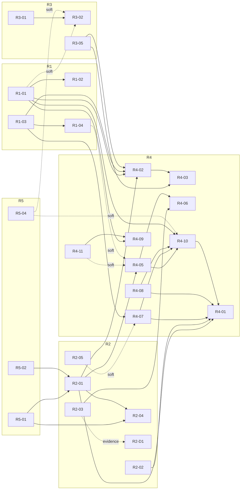

# Forge-dev roadmaps — index & maintenance contract

> **Active plan (2026-08-28 →): [`1.0.md`](./1.0.md) is the single roadmap for all forge work until the 1.0 tag.**
> R1–R8 and the wave sections below are the record of what was built; they are archived in M6 of that plan.
> Design record: [`docs/superpowers/specs/2026-08-28-forge-1-0-blueprint-design.md`](../superpowers/specs/2026-08-28-forge-1-0-blueprint-design.md).

> Entry point for the forge-dev roadmap set. Five living roadmaps, one index (this
> file). Planned direction only — nothing in this set is an implementation record
> except the explicitly-marked as-built baseline sections inside each roadmap.

Created 2026-07-17 (initial forge-dev roadmap planning session). All initiative
statuses are `planned` or `deferred` as of that date.

---

## 1. Purpose

This directory is the **single source of truth for forge-dev direction**. Any
question of "what is forge building next, and why" resolves here; any agent
session picking up forge-dev work starts here.

**Relation to the three scopes** ([docs/repo-map.md](../repo-map.md)):

- **Scope 1 — framework / seams / orchestration**: fully covered. R1, R2, R3
  and R5 are Scope-1 componentry roadmaps.
- **Scope 2 — cycles / agents / flows**: covered only as **shipping of OOTB
  content** (R4). What forge *ships* out of the box is forge-dev work; what an
  operator *authors inside Studio at runtime* is not (see §7).
- **Scope 3 — projects forge develops**: **excluded**. Work on managed
  projects (betterado, gitpulse, mdtoc, …) is driven *through* forge as cycles,
  not planned here. The out-of-scope register (§7) names the known Scope-3
  streams so they aren't mistaken for gaps in this set.

> **2026-07-17 note:** the Scope 1 / Scope 2 split above is now forge's north
> star, not just a contributor map — [ADR 038](../decisions/038-north-star-platform-and-ootb.md)
> promotes it: Scope 1 is a modular platform for building the ideas machine or
> any other agentic flow (SWE-focused for now by explicit choice); Scope 2 OOTB
> is the ideas machine. See §8 decision 4.

**Relation to [docs/known-gaps.md](../known-gaps.md)**: known-gaps remains the
*defect and observation log* — the place raw findings land as they're noticed.
These roadmaps are the *planning SSOT*: known-gaps items feed into roadmap
initiatives (each initiative cites its § sources), and once an item is owned by
a roadmap ID, the roadmap entry is authoritative for how/when it gets done.
R5-05 and R5-07 exist specifically to keep the two documents reconciled.

---

## 2. Roadmap register

| ID | File | Mission | Initiatives | Status mix (2026-08-03, post-wave-5 cut) |
|----|------|---------|-------------|--------------------------|
| **R1** | [R1-contract-componentry.md](./R1-contract-componentry.md) | Make every forge boundary a typed, machine-checkable contract — KB contract type, KB seam completion, the project-contract process clauses (demo/test/instructions/release/build), automated contract checks, and (wave 5) KB create/maintain. | 6 + 1 deferred | 2 implemented, 1 in-progress (R1-03 ⚑F4 verdict), 3 planned, 1 deferred (R1-D1) |
| **R2** | [R2-runnable-componentry.md](./R2-runnable-componentry.md) | Make "a runnable" a first-class primitive — agent-as-runnable, def-driven builder, fanout (research spike first), trigger expansion, dynamic artifact surfaces, runtime-adapter realization; wave 5 adds triggers-runtime, builder parity, the sessions surface; R2-11 (minted mid-batch-C) owns legacy-path budget enforcement. | 11 + 2 deferred | 4 implemented, 7 planned, 2 deferred (R2-D1 closed-rejected, R2-D2 parked) |
| **R3** | [R3-library-componentry.md](./R3-library-componentry.md) | First-class managed libraries of reusable capability: skills, skill-generator flow, hooks (lifecycle customisations), connections, instructions, templates + the community browser. | 9 | 5 implemented (R3-01, R3-03, R3-04, R3-06, R3-07), 1 implemented-with-deferred-feature (R3-05 F1-F3; F4 deferred), 3 planned (R3-02, R3-08, R3-09) — R3-08 + R3-09 minted 2026-08-23 from [ADR 045](../decisions/045-operator-workspace-and-promotion.md) (total 7→9). Earlier correction 2026-08-05 from a stale "2 implemented / 5 planned" filed by R3-06 (README §5.4); read from each initiative's own status line, not estimated |
| **R4** | [R4-ootb-suite.md](./R4-ootb-suite.md) | The shipped out-of-the-box agent/flow suite: migrate platform surfaces to artifacts, the agent roster (onboarding, creation, architect, plan, develop, demo, adversarial review, reflect), the develop-cycle OOTB flow, the roadmap & attention surface; wave 5 adds the project surfaces + per-OOTB session/flow alignment; R4-21 (minted at batch-C planning) owns the authoring-agent producer gap. | 23 + 1 deferred | 19 implemented, 3 planned, 1 resolved (R4-20, reasoned keep-as-is), 1 deferred (R4-D1) — recounted 2026-08-15 at the wave-5 final pass close (R4-19 planned→implemented on PR #132, R4-23 planned→implemented on PR #134), reading each initiative's own status line rather than estimating. Prior recount 2026-08-11 at batch-E close (R4-22 partial→implemented, its F4 re-homed; **R4-23 minted** planned, total 22→23). The prior "21 / 13 implemented / 8 planned" was stale on four axes accumulated since the 2026-08-07 recount: R4-22's mint (total 21→22), R4-17 + R4-18 landing, and R4-20 resolving to a state the row's vocabulary did not carry at all. Nothing in CI checks these counts — they go stale silently. |
| **R5** | [R5-hardening-operability.md](./R5-hardening-operability.md) | Safety, integrity and doc hygiene: dry-bridge seam, G8 env-pin at the spawn seam, cost integrity, edit-lock fix, known-gaps residue cross-references, demo/harness backlog, SSOT reconciliation; wave 5 adds the dead-code sweep + the three-scope docs ground-truth restructure. | 9 | 4 implemented (R5-01/02/04/07), 5 planned |
| **R6** | [R6-operator-experience.md](./R6-operator-experience.md) | The Studio operator surface as a platform: run observability depth, human-readable operations, IA & DOM-convention stewardship — the biggest wave-5 home (kickoff/monitors/home/KB-explore). | 10 + 1 deferred | 5 implemented (R6-03, R6-04, R6-05, R6-06, R6-07), 2 implemented-with-unbuilt-features (R6-01 F1+F4+F5 done / F2+F3 planned; R6-09 P0-P4 done / P5 deferred), 3 planned (R6-02, R6-08, R6-10), 1 deferred (R6-D1) — recounted 2026-08-23 while minting R6-10 from [ADR 045](../decisions/045-operator-workspace-and-promotion.md). The prior "8 + 1 deferred / 8 planned" was stale on two axes: R6-09 (Performance, minted wave-6 2026-08-15) was never added, and six initiatives had reached implemented without the row moving. Read from each initiative's own status line, not estimated |
| **R7** | [R7-verification-infrastructure.md](./R7-verification-infrastructure.md) | The standing verification platform: corpus-anchored bench rebuild, journey-platform evolution (incl. the LLM-driven UI-test tier), verify-ground stewardship, CI/drift-guard growth. *(Minted 2026-07-17; unwaved.)* | 4 | 4 planned |
| **R8** | [R8-distribution-release.md](./R8-distribution-release.md) | Forge itself as a shippable product: packaging (the deferred S10), version/release policy, public docs & positioning upkeep. *(Minted 2026-07-17; deliberately thin, operator-paced.)* | 3 + 1 deferred | 3 planned, 1 deferred (R8-D1) |

Each roadmap file also carries an **as-built baseline** section (`R<N>-B*`
entries, status `implemented`) recording what already exists with real file
paths and ADR numbers — that is the only place `implemented` appears in this
set.

Canonical initiative skeleton (IDs are fixed and never reused):

- **R1**: R1-01 KB contract type · R1-02 KB seam completion · R1-03 Project contract: demo + test processes · R1-04 Project contract: instructions + release + build processes · R1-05 Contract machine-checks · R1-06 KB create & maintain *(wave 5)* · R1-D1 *(deferred)* Holistic-metrics clause + exploration-initiative support
- **R2**: R2-01 Agent-as-runnable primitive · R2-02 Agent-def-driven builder · R2-03 Fanout capability (research spike first) · R2-04 Trigger expansion · R2-05 Dynamic artifact surfaces · R2-06 Runtime-adapter realization · R2-07 Composition single-source · R2-08 Triggers runtime *(wave 5)* · R2-09 Agent-builder definition parity *(wave 5)* · R2-10 Interactive sessions surface *(wave 5)* · R2-11 Legacy invocation path budget-aware *(unwaved, minted mid-batch-C)* · R2-D1 *(deferred, closed-rejected)* Parallel-work merge-resolution · R2-D2 *(deferred/parked)* Plan-band read-only parallelism
- **R3**: R3-01 Skills first-class management · R3-02 Skill-generator flow · R3-03 Hooks library (lifecycle re-scope) · R3-04 Connections (tools/MCPs/CLIs) library · R3-05 Instructions library · R3-06 Templates library *(wave 5)* · R3-07 Community browser *(wave 5)* · R3-08 Operator workspace (`_local/` root + provenance by root) · R3-09 Promotion into forge core (branch + PR)
- **R4**: R4-01 Platform→artifact migration · R4-02 Project onboarding agent · R4-03 Project creation agent · R4-04 Architect agent refinement · R4-05 Plan agent · R4-06 Develop agent refinement · R4-07 Demo agent · R4-08 Adversarial review agent · R4-09 Reflect agent · R4-10 Develop-cycle OOTB flow · R4-11 Roadmap & attention surface · R4-12 Project detail alignment *(wave 5)* · R4-13 Project roadmap tab *(wave 5)* · R4-14 Demo showcase page *(wave 5)* · R4-15 Architect/planning session ⚑ *(wave 5)* · R4-16 Demo-builder generation gallery *(wave 5)* · R4-17 Onboarding session staging *(wave 5)* · R4-18 Onboard-project OOTB flow *(wave 5)* · R4-19 Brain creation & maintenance agents *(wave 5)* · R4-20 Brain-tune OOTB flow *(wave 5)* · R4-21 OOTB authoring agent *(wave 5, batch D — minted at batch-C planning)* · R4-22 Generic interactive-surface primitive *(wave 5, batch E — ADR-043, minted 2026-08-10)* · R4-23 Runner prompt re-authoring onto SKILL.md *(minted 2026-08-11 at the R4-22-F4 slip)* · R4-D1 *(deferred)* Architect-flow retirement
- **R5**: R5-01 Dry-bridge seam · R5-02 G8 env-pin at spawn seam · R5-03 Cost integrity · R5-04 Flow edit-lock verification · R5-05 Known-gaps residue · R5-06 Demo/harness backlog · R5-07 SSOT reconciliation · R5-08 Dead-code & component minimisation *(wave 5)* · R5-09 Docs ground-truth restructure *(wave 5)*
- **R6**: R6-01 Run-observability depth · R6-02 Human-readable operations · R6-03 IA & convention stewardship · R6-04 Run kickoff & consolidation *(wave 5)* · R6-05 Flow monitor ledger *(wave 5)* · R6-06 Agent monitor linkage *(wave 5)* · R6-07 Home dashboard *(wave 5)* · R6-08 KB explore *(wave 5)* · R6-09 Performance *(wave 6)* · R6-10 Pending platform changes · R6-D1 *(deferred)* Notification transport beyond the blade
- **R7**: R7-01 Bench rebuild (corpus-anchored) · R7-02 Journey platform evolution · R7-03 verify-ground & corpus stewardship · R7-04 CI & drift-guard growth
- **R8**: R8-01 Packaging · R8-02 Version & release cadence · R8-03 Public docs & positioning upkeep · R8-D1 *(deferred)* Community & ecosystem enablement

### Coverage map — routing new forge work

Any new forge-dev work routes through this table; if it fits no row, that is
the signal to mint the next roadmap (§5 rule 5), never to wedge it somewhere
adjacent. **This directory is the design home for anything within forge.**

| Architecture pillar | Owning roadmap |
|---|---|
| Contracts & seams — project contract, KB contract, KbBackend, preflight (`cli/preflight.ts`, `orchestrator/kb-backend.ts`) | **R1** |
| Runnable engine — flow runner, agent primitive, triggers, fanout, artifact surfaces, runtime adapters (`orchestrator/`, `loops/`) | **R2** |
| Capability libraries — skills, hooks, tools/MCPs, instructions (`skills/`, `studio/catalog.yaml`) | **R3** |
| Shipped OOTB content — the agent suite + flows, roadmap/attention surface work this round (`studio/flows/`, agent SKILL.mds) | **R4** |
| Safety, integrity, doc hygiene — guards, env, cost integrity, known-gaps residue, SSOT | **R5** |
| Operator surface & observability platform (`forge-ui/` as a pillar, event/log presentation) | **R6** |
| Verification platform — journeys, deadpaths, verify:cycle, benches, CI/drift guards (`scripts/`, `.github/`) | **R7** |
| Distribution — packaging, forge versioning, OSS posture, positioning upkeep | **R8** |
| Managed projects & their brains' content | *Out of scope — §7* |

**Deliberately absent (not gaps — decided or future-gated):**

| Area | Status |
|---|---|
| Self-hosting (forge cycles against forge itself) | Not pursued; known-gaps header records forge is not self-hosted. Would mint a roadmap if ever pursued. |
| Multi-operator / collaboration | No signal; single-operator is the wedge (market doc). YAGNI. |
| Non-SWE connectors (any-agentic-flow beyond software engineering) | Future per the north-star reframe (R5-07-F8's ADR records it); SWE focus is an explicit current choice. Mints its own roadmap when the focus lifts. |
| Feature-owned UI changes | Never roadmap-routed as a pillar — they ride their owning initiative + the journey-sync contract (R6 owns only the platform/conventions). |

---

## 3. Cross-roadmap dependencies

Every edge below is recorded **on both sides** (in the depender's
"Depends on" field and the dependency's "Depended on by" field) — and the
table is **generated from the per-file fields**; when they disagree, the
files win and this table regenerates. "Soft" means sequencing preference,
not a hard blocker. (Regenerated 2026-07-17 after the adversarial review —
previously several file-recorded edges were missing here.)

| Depender | Depends on | Reason |
|----------|-----------|--------|
| R2-01 Agent-as-runnable | R5-01, R5-02 | Safety first (Q6-A): new spawn surfaces are born inside the dry-bridge seam with a pinned env. |
| R2-04 Trigger expansion | R5-01, R2-01 | Every trigger is an unattended-spawn surface; agent-complete events need runnable agents. |
| R4-01 Platform→artifact migration | R2-01, R2-02 | Platform surfaces migrate onto the runnable primitive and must round-trip through the def-driven builder. |
| R4-01-**F4** (unifier retirement) | R4-07, R4-08, R4-10-F2 | Retirement cannot start before the successor agents and the relocated, proven merge-boundary gate are live. |
| R4-02 Project onboarding agent | R3-05, R1-03/R1-04, R1-01, R2-01 | Instructions sourcing; contract clauses to tick; KB binding at onboarding; standalone runnable. |
| R4-03 Project creation agent | R3-05 (+R1 clauses), R4-02 | Same sourcing/validation pattern; hands off to the onboarding loop post-scaffold. |
| R4-05 Plan agent | R2-01 (hard, F4), R4-11 *(soft)*, R1-04 *(soft)* | Standalone dispatch = the runAgent primitive behind R5-01's guard (no bespoke runner); roadmap-screen states; planning inputs. |
| R4-06 Develop agent refinement | R2-03, R4-05 | Declared fanout; consumes the plan agent's spec-WIs (ADR-037 fold, Q2-B). |
| R4-07 Demo agent | R1-03, R2-05 *(soft)* | Executes the typed demo-process clause; richer surfaces build on the artifact contract. |
| R4-09 Reflect agent | R1-01, R4-11 | Writes into contract-typed KBs (Q5-B); triggered by R4-11-F1's merged state. |
| R4-10 Develop-cycle OOTB flow | R4-05, R4-07, R4-08 | The shipped flow chains plan → develop → demo → adversarial review. |
| R4-10-**F4** (succession) | R1-01 | Succession must rebind the cycles KB `binding.ref` or R1-01's dangling-ref lint goes red. |
| R3-02 Skill-generator flow | R3-01, R1-01 *(soft)*, R5-04 *(soft)* | Managed library landing place; flow-scoped KB binding; edit-lock verified before a second live flow. |
| R3-03 Hooks library | R3-01 *(soft)*, R5-01/R5-02 *(soft)* | Reuses the library pattern; leans on the safety rails. |
| R3-04 Tools/MCPs library | R3-01 *(soft)* | Same library surface pattern. |
| R1-02 KB seam completion | R1-01 | The seam completes against the contract shape, not the legacy descriptor. |
| R1-04 / R1-05 | R1-03 | Reuse the typed-process pattern; machine-checks verify the typed processes. |
| R4-10 / R3-02 | R5-04 *(soft)* | Both ship second live flows; the edit-lock verification precedes them. |
| R2-D1 Merge-resolution *(deferred)* | R2-03 evidence | Design gated on the fanout research spike (Q3-B). |

**Wave-5 edges (2026-08-03 cut — recorded on both sides in the files; soft
edges in italics):**

| Depender | Depends on | Reason |
|----------|-----------|--------|
| R3-07 Community browser | R3-01-F4, R3-03-F2, R3-04, *R3-06* | Install routes through the owning kind pipelines; browser owns zero trust decisions. |
| R3-06 Templates library | *R3-01*, *R2-05* | Library pattern; R2-05-F1's canonical artifact set is the managed substance (do the audit once). |
| R2-08 Triggers runtime | R2-04 | Extends the 7-kind registry + webhook machinery. |
| R2-09 Builder parity | R2-02 | `materials:` rides the capability descriptor. |
| R2-10 Sessions surface | R2-01-F3 | UI half of the runner convergence (deep half stays deferred). |
| R6-01-F4/F5 (amend) | *R2-05* | Typed-output rendering contract, pulled at need. |
| R6-04 Kickoff & consolidation | R2-01-F3, R2-02, R2-09-F1, *R2-08-F4* | Dispatch host; descriptor routing; materials enforcement point; trigger provenance read side. |
| R6-05 Flow monitor ledger | R6-01-F4 | Rows link into run detail. |
| R6-06 Agent monitor linkage | R6-05, R6-04-F3, R2-10 | Shared ledger; the three real link targets. |
| R6-07 Home dashboard | R6-03-F3, R4-11-F4 | Home pillar in nav; attention strip feed. |
| R1-06 KB create & maintain ⚑ | R1-01 | Extends the binding contract (band scope; ⚑ ADR-010 read-policy gate). |
| R4-12 Project detail | *R6-01-F4* | Cycle-ledger dig-in links. |
| R4-13 Roadmap tab | R4-12 | Lives on its page (DAG replaces serpentine — decision 4). |
| R4-14 Demo showcase | R4-12, R1-03 | Entry + demo-process artifacts. |
| R4-15/16/17 Session alignments | R2-10 (+R4-02 for R4-17) | Render through the shared session shell. |
| R4-18 Onboard-project flow | R4-17 | Wraps the staged session. |
| R4-19 Brain agents | R2-10, R1-06 | Session shell; band-scoped binding must exist. |

**Wave-8 edges (2026-08-23 — minted from [ADR 045](../decisions/045-operator-workspace-and-promotion.md);
recorded on both sides in the files; soft edges in italics):**

| Depender | Depends on | Reason |
|----------|-----------|--------|
| R3-08 Operator workspace | R3-01 | The shared skill resolver + unified registry is what gains a second, operator-owned root. R3-01/03/07 are all implemented, so nothing blocks R3-08. |
| R3-09 Promotion into forge core | R3-08, *R5-01* | Promotion needs a workspace to promote *from*, and a provenance signal to know what is promotable; the route registers in `BRIDGE_ROUTE_CLASSIFICATION` as `git-remote`/`refuse`. |
| R6-10 Pending platform changes | *R3-08*, *R3-09* | Both soft only — R3-08 shrinks what the surface has to show, R3-09 gives its rows somewhere to go. Neither blocks it; R6-10 is landable first. |
| R8-01 Packaging | *R3-08* | An installable forge must survive an upgrade without clobbering the operator's own Studio-authored objects. |
| R4-20 Brain-tune flow | R4-09, *R2-08-F2* | Reflect agent; on-completion chaining. |


```mermaid
graph LR
  subgraph R5
    R5-01; R5-02; R5-04
  end
  subgraph R2
    R2-01; R2-02; R2-03; R2-04; R2-05; R2-D1
  end
  subgraph R1
    R1-01; R1-02; R1-03; R1-04
  end
  subgraph R3
    R3-01; R3-02; R3-05
  end
  subgraph R4
    R4-01; R4-02; R4-03; R4-05; R4-06; R4-07; R4-08; R4-09; R4-10; R4-11
  end
  R5-01 --> R2-01
  R5-02 --> R2-01
  R5-01 --> R2-04
  R2-01 --> R2-04
  R2-01 --> R4-01
  R2-02 --> R4-01
  R2-01 --> R4-02
  R2-01 --> R4-05
  R4-11 -. soft .-> R4-05
  R1-04 -. soft .-> R4-05
  R2-03 --> R4-06
  R4-05 --> R4-06
  R1-03 --> R4-07
  R2-05 -. soft .-> R4-07
  R1-01 --> R4-09
  R4-11 --> R4-09
  R1-01 --> R4-02
  R1-03 --> R4-02
  R3-05 --> R4-02
  R3-05 --> R4-03
  R4-02 --> R4-03
  R4-05 --> R4-10
  R4-07 --> R4-10
  R4-08 --> R4-10
  R4-07 --> R4-01
  R4-08 --> R4-01
  R4-10 --> R4-01
  R1-01 --> R4-10
  R1-01 --> R1-02
  R1-03 --> R1-04
  R3-01 --> R3-02
  R1-01 -. soft .-> R3-02
  R5-04 -. soft .-> R3-02
  R5-04 -. soft .-> R4-10
  R2-03 -. evidence .-> R2-D1
```

---

## 4. Recommended driving order (Q6-A: safety first)

This orders **planned** work for future operator-run agent sessions — nothing
below is implemented. Waves are a default sequence, not a lockstep gate;
initiatives inside a wave can run in parallel where dependencies allow.

| Wave | Initiatives | Rationale |
|------|-------------|-----------|
| **0** | R5-01 dry-bridge seam · R5-02 G8 env-pin at spawn seam · R5-07 SSOT reconciliation **incl. F8, the north-star reframe ADR** | Safety first: close the bridge-acts-with-operator-credentials class (2026-07-16 self-merge incident) and pin the env at the spawn seam before any new agent surfaces multiply the risk. R5-07 is near-free, stops doc drift compounding, and F8 fixes the instruction layer before wave-1 sessions design under the stale north star. |
| **1** | R2-01 agent-as-runnable · R2-02 agent-def-driven builder · R5-04 edit-lock verification (trivial rider) | The runnable primitive is the foundation everything in R4 migrates onto; land it before building agents that would otherwise hardcode around it. R5-04 verifies the edit-lock before any second live flow exists. |
| **2** | R4-05 plan agent · R4-11 roadmap & attention surface | The highest-leverage new capability (plan agent, absorbing ADR-037) plus the operator surface it enters from (soft dep, Q2-B two entry paths; R4-05-F4 dispatches through R2-01's primitive). |
| **3** | R1-01 KB contract type · R3-01 skills first-class management — interleaved at dependency points | Contract and library groundwork pulled in exactly when downstream R4 agents need them (R4-09 needs R1-01; R3-02 and the palette residue need R3-01). |
| **4** | **R4-01 first** (F1–F3), then R4-02/03/04/06/07/08/09 as their deps land, **R4-10 assembles last** (incl. its F5 harness migration + F6 resume re-home), **R4-01-F4 retirement after R4-10-F2 is live and green** | The OOTB suite completes bottom-up; the migration governs the agent initiatives, the flow chains R4-05/07/08, and unifier retirement is the final cutover. |
| **continuous** | R5-03 cost integrity · R5-05 known-gaps residue · R5-06 demo/harness backlog | Opportunistic — pick up alongside whatever wave is active when a session touches the relevant seam. |
| **unwaved** | All R6 / R7 / R8 initiatives | Minted by the coverage review without sequencing; the operator prioritizes them against this order (natural affinities noted in each file — e.g. R7-01 after the R4 suite stabilizes, R8-01 after wave 0's seams). |

### Wave 5 — Studio end-state alignment (opened 2026-08-03; waves 0–4 are history)

Waves 0–4 delivered the platform + the OOTB suite. Wave 5 changes the unit of
work: **one module per initiative**, so a session can iterate on the skills
library, or the agent builder, or a single agent/flow, without holistic
cross-cutting changes. The north star for the module set is the operator's
end-state mockup: `mockups/studio-endstate-v2/` (20 surfaces, 27 scripted
journey videos as acceptance references, `as-built-inventory.md` as the
2026-08-03 baseline it is diffed against).

**5A — the cut: DONE 2026-08-03** (this session; operator decisions 1–6
recorded in §8). Every initiative below is scoped to exactly one module,
cites its mockup evidence (journey id + surface file) as the acceptance
reference and its as-built baseline from `as-built-inventory.md`; verified
already-aligned surfaces are baseline material (R4-B13), not initiatives.

#### Wave-5 cut summary

| Initiative | Module | Home | Size | Depends (hard; *italic = soft*) |
|---|---|---|---|---|
| R3-01-F3/F4 skills library view + marketplace (re-entered) | library-skills | R3 | M | — |
| R3-03 hooks library (lifecycle re-scope) | library-hooks | R3 | L | — |
| R3-04 connections library | library-connections | R3 | M | — |
| R3-06 templates library | library-templates | R3 | M | — |
| R3-07 community browser | community-browser | R3 | M | R3-01-F4 · R3-03-F2 · R3-04 |
| R2-08 triggers runtime | triggers-runtime | R2 | M | R2-04 |
| R2-09 agent-builder definition parity | agent-builder | R2 | M | R2-02 |
| R2-10 interactive sessions surface | sessions-surface | R2 | L | R2-01-F3 |
| R6-01-F1/F4/F5 run-detail depth (amend; F1 = F5's hard precursor) | flow-run-detail | R6 | M | *R2-05 (typed outputs, at need)* |
| R6-03-F3 six-pillar nav + page shell (amend) | IA stewardship | R6 | M | — (batch-E sequencing) |
| R6-04 run kickoff & consolidation | agent-kickoff+run | R6 | M | R2-01-F3 · R2-02 · R2-09-F1 |
| R6-05 flow monitor ledger | flows-home/monitor | R6 | S | R6-01-F4 |
| R6-06 agent monitor linkage | agents-home/monitor | R6 | S | R6-05 · R6-04-F3 · R2-10 |
| R6-07 home dashboard | home-dashboard | R6 | M | R6-03-F3 · R4-11-F4 |
| R6-08 KB explore (graph+reader) | kb-explore | R6 | M | — |
| R1-06 KB create & maintain ⚑ | kb-create/maintain | R1 | M | R1-01 |
| R4-12 project detail alignment | projects-list/detail | R4 | M | — |
| R4-13 project roadmap tab (DAG replaces serpentine) | project-roadmap-tab | R4 | M | R4-12 |
| R4-14 demo showcase page | demo-showcase | R4 | S | R4-12 · R1-03 |
| R4-15 architect/planning session ⚑ | per-OOTB-agent | R4 | M | R2-10 |
| R4-16 demo-builder generation gallery | per-OOTB-agent | R4 | S | R2-10 |
| R4-17 onboarding session staging | per-OOTB-agent | R4 | M | R2-10 · R4-02 |
| R4-18 onboard-project OOTB flow | per-OOTB-flow | R4 | M | R4-17 |
| R4-19 brain creation & maintenance agents | per-OOTB-agent | R4 | M | R2-10 · R1-06 |
| R4-20 brain-tune OOTB flow | per-OOTB-flow | R4 | S | R4-09 |
| R4-21 OOTB authoring agent (skill/hook producer — minted batch-C planning) | per-OOTB-agent | R4 | M | R2-10 · R3-01-F3/F4 |

Parked/rejected in the same cut: plan-band branching + demo-design/research
agents → **R2-D2** (decision 2); manual KB ingest → rejected, reflection-only
policy stands (decision 3, negative ACs on R6-08/R1-06); the mockup's
architect+PM merger stays behind **R4-D1** (R4-15-F2 ⚑ produces the decision
brief).

#### 5B — the batch plan: current state → mockup state (restructured 2026-08-03)

Operator directive (same day, post-cut): drive wave 5 as a **small number of
batches**, each a clean module-separated arc from as-built to mockup state.
Two ground truths only — the as-built assessment (`as-built-inventory.md` +
the roadmap baselines) and the mockup's flows/intent; prior wave structure is
history, not a constraint. The per-initiative specs in the R-files stay the
execution detail; THIS table is the driving view.

| Batch | Modules | Initiatives | Functional closure (journeys run against the REAL product) |
|---|---|---|---|
| **A — Library** | library-skills · library-hooks · library-connections · library-templates · community-browser | R3-01-F3/F4 · R3-06 · R3-03 · R3-04 · R3-07 | build-skill · build-hook · install-skills-hooks · install-connections |
| **B — Sessions & builder** | sessions-surface · agent-builder · per-OOTB sessions | R2-10 · R2-09 · R4-15 · R4-16 · R4-17 | create-agent · edit-agent · onboard-project · create-project · run-agent-{architect, demo-builder, onboarding} |
| **C — Runs, triggers & monitors** | triggers-runtime · agent-kickoff+run · flow-run-detail · flows-home/monitor · agents-home/monitor | R2-08 · R6-04 · R6-01-F1/F4/F5 (+the R2-05 slice typed outputs need) · R6-05 · R6-06 | run-agent · run-flow · run-agent-{developer, adversarial-review, demo-runner, reflector} — all three trigger framings |
| **D — Projects & knowledge** | projects-list/detail · project-roadmap-tab · demo-showcase · kb-create/maintain · kb-explore · per-OOTB flows · per-OOTB authoring | R4-12 · R4-13 · R4-14 · R1-06 · R6-08 · R4-19 · R4-18 · R4-20 · R4-21 | create-kb-project · create-kb-cycle · kb-maintain · run-agent-brain-creation · run-flow-onboard · run-flow-brain-tune · build-skill · build-hook |
| **E — Interactive runtime bridge** ✅ closed 2026-08-11 | interactive-runtime-primitive · authoring-agent · onboard-flow · ~~brain-maintenance~~ (slipped at open) | R4-22 · R4-21 · R4-18 · ~~R4-19-F2~~ | build-skill ✓ · build-hook ✓ (real, live — PR #118) · run-flow-onboard ✓ (PR #116) — the 4 legacy runners green + byte-identical behind the dispatch fork; migrations re-homed to R4-23 (operator ruling; `_wave5/batch-e-exit-disposition.md`) |
| **F — IA & Home** ✅ closed 2026-08-14 | nav/page-shell · home-dashboard | R6-03-F3 · R6-07 | six-pillar nav ✓ (PR #121) · Home dashboard live ✓ (PR #124) · +SEC-06/07 root-fold class closed mid-batch (PR #122/#123); `_wave5/batch-f-exit-disposition.md` |
| **G — Refinement & ground truth** ✅ closed 2026-08-14 | cross-cutting, terminal | R5-08 · R5-09 | dead-code sweep −201 LOC, no behaviour change ✓ (PR #126) · root-fold read-before-guard closed ✓ (PR #127) · three-scope ground-truth docs ✓ (PR #128); `_wave5/batch-g-exit-disposition.md` — **WAVE 5 COMPLETE** |

Batch rules: order **A→G** (batch E — interactive-runtime bridge — inserted
2026-08-10, shifting the former E/F to F/G; see the change log), dependencies
flow forward only; one batch = one
merged arc (sessions inside it can parallelize where deps allow); **every
batch PR deletes what it obsoletes** (R5-08-F1 — no zombie surfaces); a batch
closes when its journeys run against the real product via journey-sync, not
the mockup player.

**Story-beat parity (operator directive, 2026-08-03):** the mockup's 27
scripted journeys (`journeys-data.jsx` beats + captured videos) are the
**target inventory for forge-ui's test validation** — closing a batch means
porting its mockup stories' beats into real `scripts/journeys/` modules
(same story, same beat sequence, asserted via the `data-*` DOM contract), so
the real `ui:journey` gallery converges on the mockup story set. R7-02-F3
owns the story registry + parity tracking; each batch's port is its own
journey-sync duty. Beats invalidated by the cut decisions (branching ⑂,
ingest button, demo-design/research) are marked excluded in the registry,
never silently skipped.

**Real work does not wait for closure.** The platform is whole post-wave-4 —
`verify:cycle` and a real Scope-3 chunk (betterado roadmap continuation or a
gitpulse initiative) can and should run after ANY batch to capitalise on and
validate the refinement waves. The **wave-5 exit gate** is when EVERY mockup
flow is functionally possible with real functionality behind it: full journey
gallery green (the 27 minus parked branching + demo-design/research and
vision-only beats), one verify:cycle run, and one real Scope-3 chunk driven
through forge end-to-end.

**Explicitly outside wave-5 closure** (platform continuity, pulled only at a
dependency point): R3-02 · R2-05 (beyond C's slice) · R2-06 · R2-07 · R2-11
(minted at batch-C execution — legacy-path budget enforcement) · R1-02 ·
R1-05 · R7-01..04 (journeys serve as the gate; the bench rebuild remains
post-closure) · R8. Deferred items stay deferred (R1-D1 · R2-D1/D2 · R4-D1 ·
R6-D1 · R8-D1). R5-03/05/06 stay continuous as before.

### Wave 6 — Daily-Driver UI/UX overhaul (opened 2026-08-15; closed 2026-08-15)

**North star:** get forge to the point where it is the operator's MAIN
agentic interaction point, minimising Claude CLI use over time. Every
prioritisation call in this wave was judged against daily-driver readiness —
the surfaces the operator touches every day (kick off work, watch it run,
steer mid-flight, review results) had to be complete, intuitive and
trustworthy before nice-to-haves. Sequencing: **IA-first** — nav/routing
consolidation lands clean before everything else builds on it.

Execution: an explicit Workflow-script DAG (deterministic fan-out/joins)
driving tiered agents (`tiered-orchestration` skill), **34 PRs (#136–#170)**
across four streams plus a mockup gate and a contradiction sweep, each batch
gated by build+test+journey+reviewer before merge, plus a same-day hotfix
(#171 — see standing lessons, below).

#### Streams and batches

**Stream 1 — IA / navigation** (foundation): IA-1 projects index (#138) ·
IA-2 flows index (#139) · IA-3 agents index + runs ledger (#137) · IA-4
Library rebuilt as the object-type hub, Home the one dashboard (#148) · IA-5
nav repointed to the six-pillar IA (#151) · IA-6 single-tab navigation
policy + artifact page identity (#141) · IA-7 honest agent-action labels +
shared dispatch poll (#143) · IA-8 wired redirects, deleted the seven
legacy shims (#153).

**Stream 2 — Performance**: P0 perf-snapshot harness (#140) · P1
mtime/hash-keyed run-list memo (#145) · P2 full-tree brain-lint memoized
behind a repo fingerprint (#147; regression fix P2b, fingerprint walk
excluding `.claude/worktrees`/campaign dirs, #161) · P3 `forge studio`
serves a production build by default, `--dev` opt-out (#142) · P4 zero-RTT
bridge URL + Knowledge fetch fan-in (#160) · P5 events tail-reads —
**deferred** (run-detail-only path, not daily-driver-critical).

**Stream 3 — Generic session surface**: B1 thinking/reasoning forwarding +
unsampled interactive tool events (#146) · B2 one derived session tail for
every kind (#144) · B3 derived session affordances + `panel.phases` (#150)
· B4 generic session affordance write endpoint (#158) · B5 kickoff
model-tier selection within the SKILL-declared range (#152) · B6 generic
session panel + kickoff w/ tier picker (#162) · B7 shared ActivityLog — live
thinking/working drawer on every agent surface (#154) · B8 kb-cleanup +
authoring migrated onto the generic panel (#168, combined with B11) · B9
instructions migrated onto the generic panel — architect is now the only
bespoke panel left (#170) · B10 demo builder on the dedicated session
screen, R1-03-F2 reversed (#165) · B11 `/sessions` index + Home
active-sessions strip (#168) · B12 KB drain-to-green bridge job (#164; hotfix #171 — see standing lessons) ·
B13 one button — Drain to green — on KB health (#166) · B14 every operator
poll made server-owned + client-observed (#169).

**Stream 4 — Roadmap viz + community + contradiction sweep**: RV-1
InitiativeDetail extraction + collapsed roadmap cards (#149) · RV-2 the B′
roadmap — completion-time canvas + push drawer (#155) · CR-1 community
`registry.yaml`, declared-list source of truth (#159) · CR-2 community
sorts + freshness honesty (#163) · CR-3 community-refresh agent, a new
session kind authored as data, folds CR-4's entry button (#167) · SW-1/SW-2
contradiction-sweep fan-out (10 read-only clusters, 42 findings) → SW-3
bundle fix, 17 findings (#157).

Plus the opening ADR PR — ADR-043 third amendment + ADR-044 read-path
memoization (#136) — and a harness addition, the `--journey` filter for
scoped runs (#156).

#### Operator-locked decisions (2026-08-15 interview, 3 rounds)

- Six-pillar nav, Option A: Home · Projects · Flows · Agents · Library ·
  Knowledge (Home carries the active-sessions strip).
- `forge studio` serves a production build by default; `--dev` keeps the
  next-dev workflow.
- Model selection = tier **within** the SKILL-declared range, chosen at
  kickoff — never a free override outside it.
- Demo inline panel **deleted outright** — R1-03-F2 (fold the demo builder
  into the project page) is deliberately **reversed**; the demo builder is a
  dedicated session screen again.
- Roadmap viz = the **B′ canvas**: a completion-time layout with a push
  drawer (direction B's reactflow canvas, refined with a time axis and
  direction A's static drawer, after a 3-mock operator comment round).
- Community = a `registry.yaml` declared-list source of truth, extended by a
  draft-gated refresh agent (operator approves before a write lands); simple
  sorts only.
- Session activity = a full-width collapsible **bottom drawer**, not the
  mock's inline placement.
- Home ledger = one **merged** ledger (flow + agent runs, kind chip per
  row).

#### Measured perf delta (baseline → post-wave-6, prod serve)

`/api/runs` 848 → 15ms · `/api/studio/kbs` 102 → 53ms (a same-day P2
regression to 348ms, PR #161 — the fingerprint walk crossing 27
`.claude/worktrees` clones on the operator's real tree, caught and fixed
before wave close) · pages ~3× faster (prod build + fewer round-trips; e.g.
`/` 2552 → 882ms, `/library` 2866 → 878ms).

#### Standing lessons

- **Review-per-batch keeps earning its cost.** Every reviewed batch
  surfaced a live defect (P1 an incomplete rollout, P2 an
  ADR-044-rule-2 violation, B1 a sampler bug dropping all read-only events,
  B2 idle terminal-session pollers, B4 a real double-approve race) —
  consistent with the wave-5 measurement.
- **Declared-data-fails-open recurred three times, independently, and was
  fixed the same way each time** — moving a hardcoded set to a wire-derived
  one: `brainFixHref` (must thread the REAL bound KB; null → disabled-honest,
  #143), the approve-only kind set (`meta.verdicts` now derived from an
  authored phase-row field validated by the frozen vocab, not a hardcoded
  list, #162), and `isTerminalPhase` (checked panel tables generically
  instead of a name-matched special case that left `onboarding` silently
  always-non-terminal, #168).
- **Missing render/structural pins kept slipping past first-draft review** —
  an `ActivityLog` double-render in B8's first commit, caught by B11's
  gates; `KbDrainPanelView` needed 24 `renderToStaticMarkup` pins added at
  review (#166). A recurring reviewer finding, not a one-off.
- **The `check-raw-fs-guarded` allowlist's line-numbered format taxes every
  batch that touches `cli/ui-bridge.ts`** — P1, B1 and B3/B5 all had to
  serialize and remap around the same file. Bead `forge-mlk` tracks the
  structural fix (content-anchored keys, not line numbers).
- **Measure perf on the operator's REAL tree, not a clean checkout.** P2's
  regression (102 → 348ms) only existed because the live tree carries 27
  `.claude/worktrees` clones (22GB) a CI checkout never sees — the harness
  dirs are the operator's daily reality, and the fix (skip them in the
  fingerprint walk) shipped the same session it was found.
- **A waiver's own gate must be `e2e-journey.mjs --list` green, not just
  `node --check`.** B13's CR-2 beat had never been registered in
  `RUN_ORDER` — the harness's own drift check blocked `--list` and caught
  it before the waiver could paper over it.
- **Main went red for six PRs (#164–#169) and nobody noticed until #170's
  own gate caught it — root cause AND process, both fixed same-day (hotfix
  PR #171).** B12's review round moved its no-spawn gate to the fix-turn
  CALL SITE so it would "hold even for injected turns" — but CI's global
  `FORGE_ARCHITECT_NO_SPAWN=1` then suppressed every test's injected fake
  fix-turn too, failing the round-cap/cost-ceiling tests. The fix gates the
  DEFAULT selection instead (consolidate's own precedent): an injected
  `runFixTurn` is by definition not a spawn. The process half is the
  durable lesson: **a merge gate must assert PRESENCE of a green terminal
  conclusion for the exact head SHA, never absence of red** — the
  merge-train's flake-retry tooling (`gh pr checks --watch`-shaped) returns
  exit 0 on "no checks reported" exactly as readily as on "all green," so
  six red runs rode through undetected until a later PR's own gate
  happened to reproduce the failure locally.

- **The full journey gate is the wave's real exit criterion — per-batch
  waivers only defer it.** The closing `ui:journey` run (17 journeys, 150
  beats) found FIVE regressions that 35 reviewed PRs, ~5,000 unit tests and
  per-PR gates did not, all in the closeout PR: the fixed bottom ActivityLog
  drawer overlaid the agent builder's Save button (layout overlap — no unit
  pin can see it); IA-8's `/architect/:sessionId` wire redirect swallowed the
  LIVE `/architect/new` kickoff (a cross-batch route-param collision); B9's
  transcript `[data-question-index]` collided with the architect form's own
  `[data-question-index][data-question-resolved]` (querySelector picked the
  wrong element); the kickoff model-tier picker was DEAD for every kind
  (all five kickoff agents are `library:false`, so the roster route never
  returned their capability — new unfiltered
  `GET /api/studio/agents/:slug/capability`); and two cross-execution fixture
  leaks (a stale `_kb-drain-*` run satisfied the drain beat's terminal wait
  instantly; a stale `_demo/<sid>` made the roadmap's demo link honestly
  RESUME instead of kick off). Six gate runs to green. Every future wave's
  exit gate is the full run, and each beat owns ALL of its state including
  server-side run dirs (fixture rule 3).

#### Follow-up beads (not wave-6 blocking)

- `forge-4ei` — demo/instructions "revise verdict" / feedback-loop
  capability lost in the panel migration (P1).
- `forge-lzv` — instructions' rich per-question radio form, not yet
  reproduced on the generic panel.
- `forge-9bd` — `SLUG_RE` false-rejects camelCase/underscore project names
  (verified TRUE during B4's fix round).
- `forge-yuq` — the knowledge `kb-tabs` journey flake (a seeded
  `reflect.kb-ingest` event intermittently renders 0 in the ingest-activity
  panel).
- `forge-1im` — the AT-2 journey-flake class (per-PR auto flake-retry
  shipped as a stopgap, #150/#151).
- `forge-mlk` — the `check-raw-fs-guarded` allowlist line-drift tax (see
  lessons, above).
- `forge-87f` — the full-suite test count includes a LOCAL-only scanner
  that walks `.claude/worktrees` (5055/5056 under CI env vs the operator's
  real tree; surfaced by hotfix PR #171's verification run).

**WAVE 6 COMPLETE — 2026-08-15.**

### Wave 7 — Close the loops (opened 2026-08-19)

**North star:** every loop an operator can start in Studio must be **finishable
in Studio, visible while it runs, and cancellable when it goes wrong.** Wave 6
made the surfaces reachable; the operator's first week of daily-driving found
that the pieces do not yet snap back together — a plan that cannot be approved,
an initiative that cannot be started, sessions that cannot be cancelled, a
drain that says nothing while it works, a refresh agent that writes to the
wrong place and dies unseen. Wave 7 is judged against one question per
initiative: *does the operator get from "start" to "done" without a terminal?*

**How the backlog was found — the wave-7 walkthrough instrument.** Instead of
the operator finding one issue at a time, the orchestrator drove Studio the way
a human operator does: a baseline crawl of all 160 reachable routes
(`crawl.mjs`), then ten explorer agents — one per UI cluster (home+sessions ·
projects · flows · agents · library · community · knowledge · session kinds ·
artifact/plan · cross-cutting) — each clicking every control, submitting every
form, and spending real tokens where a path could only be validated by running
it (sessions of every kickoff kind, standalone agent runs, two live
drain-to-green runs, one live community refresh); each explorer followed by an
adversarial verifier. Result: **336 findings (S1 78 · S2 157 · S3 101), 276
S1/S2 verdicts confirmed**, every one assigned to exactly one initiative below —
the wave-7 walkthrough findings record (retired 2026-08-29 in M1-A; in git history). The
operator's own ten notes were all reproduced with root causes — including the
one that looked like "does nothing" (note 5: the refresh agent writes its draft
outside its session dir, exhausts its 16-turn budget, then crashes; the UI has
no verdict panel for its kind — so it can neither finish nor be seen failing). The
instrument is promoted into the repo as `scripts/ui-walkthrough/` (W7-A0) and
becomes a standing wave gate alongside `ui:journey`.

**Execution:** Workflow-script DAG driving tiered agents
(`tiered-orchestration`), one T2 per initiative in its own worktree, gates
executed by the T2 (file-scoped red→green, full suite once, `journey-sync`
per UI PR), reviewer per initiative, T1 serialises `ui:journey` /
`ui:deadpaths` / `ui:walkthrough` at wave boundaries. Merge gate = presence of
a green terminal conclusion for the exact head SHA. Standing authority:
"orchestrate PRs, do not escalate."

#### Operator-locked decisions (from the 2026-08-18 notes)

- **Plan approval lives in ONE place with ONE control** — the architect
  session's plan gate (`PlanGate`, `/api/plan-verdict`); the generic
  `GateBar` never renders on an architect plan. Approving shows the approved
  plan and the initiative it produced, with its next step.
- **The scheduler is a first-class Studio object again** (status + start /
  pause / stop) — visible on Home and on the Flows pillar; every "start
  development / plan" control tells the truth about whether anything will
  pick the work up, and offers to start the daemon.
- **Every session kind gets cancel/abandon**, and a session whose runner
  crashed or stalled reads as such (with the error) — never as a calm
  "nothing to do."
- **Home names its strips**: "Active sessions" (W7-B1 shipped this as
  "Sessions needing you"; W8-F4 renamed the heading because the strip lists
  every live session and only the chip beside it counts the ones waiting on
  you) and "Knowledge bases needing attention" are two visibly different
  components.
- **Drain-to-green is observable and structural-only.** It streams what it
  is doing (per-finding status, live activity, elapsed, cancel); it may
  auto-apply structural fixes (frontmatter, links, index) but any prose
  rewrite lands as a kb-cleanup **draft the operator approves with a diff**
  (the walkthrough's real drain silently condensed a forge-dev theme by 26
  lines — reverted). The KB health tab collapses its five mutating buttons
  into one gated action group; the two mis-shaped flow buttons are fixed;
  a recent-runs widget (the agents-page component, reused) sits beneath.
- **Community grows into its declared capability**: the refresh agent
  actually works end-to-end (correct write root, adequate turn budget,
  verdict panel, freshness), takes a **targeted brief** ("find me skills for
  X") as well as a full refresh, the registry is editable in Studio, and
  every browsable item has an honest install path or an honest "not
  installable" state.
- **Library objects are authorable in Studio** — skills, hooks, templates
  and connection config get create/edit/delete (file packages, one
  authoring entry point); the Knowledge-bases card leaves the Library page.
- **The Reflect flow is retired**; the reflector runs as an agent run
  triggered post-merge (and on demand from the agent page).
- **The project page's kick-off control moves above the fold** (operator
  note 11, added 2026-08-19 mid-Wave-A): the "run a flow / start work"
  control currently sits at the very bottom of a long page and is inert;
  W7-B6 promotes a Start-work action group (plan · start development · run
  flow · architect) into the project header / top of the Roadmap tab, wired
  to real starts, with a journey assertion that it is inside the first
  viewport.
- **Real tokens are authorised** for the walkthrough gate and for
  validating fixed loops on the cheap test vehicles (`demo-project`'s
  `INIT-2026-08-18-add-version-flag`, `gitpulse`).
- **Autonomous execution** (operator, 2026-08-19): all waves run without
  further operator input; T1 decides park-points itself and records the
  rationale in the campaign ledger + these docs; stops only for genuinely
  destructive or irreversible actions outside the plan.

#### Waves and streams (parallel lanes = file-disjoint route families)

**Wave A — foundations (5 lanes, all independent; everything in B builds on
them):**

- **W7-A0 walkthrough harness** — promote `crawl.mjs`, `lib.mjs`, the
  explorer brief and the fan-out workflow into `scripts/ui-walkthrough/`;
  `npm run ui:walkthrough` = crawl + console/4xx/page-ready assertions
  (deterministic, CI-able); the explorer fan-out is the wave gate (manual,
  token-spending). Docs pointer in `forge-ui-dom-and-harness.md`.
- **W7-A1 honest bridge reads** — `studioGet` (behind ~26 client calls)
  stops turning every failure into an empty fallback; one shared
  bridge-status banner (down / reconnecting / recovered) on every pillar;
  pages recover when the bridge returns; 4xx bodies with actionable text
  (gitpulse's 409 config-migration message) reach the operator.
- **W7-A2 session lifecycle** — a generic `cancel`/`abandon` for every
  session kind (bridge endpoint + panel + `/sessions` row + Home card);
  runner crash → session `crashed` with `stderr.log` surfaced; stall
  detection (agent silent past a ceiling → flagged, not "working");
  `needsYou` derived from the phase-row `awaits` truthfully in both
  directions; kickoff warns about existing sessions on the same target;
  deep links resolve without `?project=`; the write-root fence is proven
  end-to-end (`permissionMode` vs `canUseTool` — walkthrough evidence shows
  a Write landing outside every declared root).
- **W7-A3 loop closure** — scheduler status/start/pause/stop re-homed
  (Home card + Flows pillar); "Start development / Plan" reports queue
  reality and offers daemon start; plan gate: `_architect-` run ids resolve
  through the session route, GateBar suppressed, approve → approved plan +
  initiative link + next step, send-back → the interview it reopened;
  committed architect session links initiative → queue state → run;
  flow-monitor "Start Run" fixed and kept after the first run; run detail
  pages set `data-page-ready`, stop 404-ing `review-findings.json`, and link
  back to flow / artifacts / project.
- **W7-A4 identity + not-found hygiene** — one case-preserving id rule for
  KBs and projects (`trafficGame` reachable; `forge-9bd`), `new` reserved on
  every dynamic route, one shared honest NotFound for unknown ids (today:
  seven different treatments, three of which show a *different* object),
  initiative titles from manifest metadata not the first heading, retired
  flow ids in ledgers resolve to an honest page.

**Wave B — pillar surfaces (7 lanes, route-family-disjoint; each depends on
Wave A):**

- **W7-B1 Home + /sessions IA** (n2, n3) · **W7-B2 Knowledge + drain** (n6,
  n7) · **W7-B3 Community** (n5) · **W7-B4 Library authoring** (n8, n9; also
  the agent builder's edit/delete/collision/`phase` and the flow builder's
  starter/validation/delete/kickoff-loss) · **W7-B5 Agents + runs** (live
  run page, error text, cost-ceiling gate for all twelve agents, outputs
  wired or removed, ledger usability, onboarding run panel) · **W7-B6
  Projects** (greenfield create **data-loss** + no `git init` — the S1s land
  first; config-migration for gitpulse; architect kickoff tier + ceiling +
  validated project; showcase / cycle ledger / roadmap loop links) ·
  **W7-B7 Artifact + verdict pages** (gate arming only on gate-able runs,
  demo gate fixed, PR link, comment edit/delete, plan AC parse, DEMO.md on
  the evidence page, reflection honesty).

**Wave C — consolidation + richness (3 lanes; C1 after A3, C2 after A2/B7,
C3 anytime after A):**

- **W7-C1 Flows pillar consolidation** (n10) — retire `forge-reflect`
  (post-merge chain → reflector agent run; journeys/harness/docs updated;
  `release-finalizer` / `project-scoped-review` given an entry or removed from
  the roster), onboard-project flow vs onboarding session dedupe, per-flow
  history scoping, flows-index recent-runs/attention.
- **W7-C2 interview + verdict richness** — per-question forms (`forge-lzv`),
  revise verdict on every draft kind (`forge-4ei`), rationale capture,
  AGENTS.md diff, authoring revise turn.
- **W7-C3 cross-cutting polish + a11y** — per-route titles, breadcrumbs,
  focus/contrast/landmarks, disabled-CTA reasons, `--accent` token, event
  phase labels, narrow-viewport overflow, `forge-opj` (typecheck forge-ui
  tests).

**Wave D — gate + closeout:** full `ui:journey` + `ui:deadpaths` +
`ui:walkthrough` (crawl assertions) + a re-run of the explorer fan-out over
the ten clusters (target: zero S1, every operator note demonstrably closed
on the live tree); the operator's own daily-driver walkthrough; ADR/README
closeout; version 0.8.0.

#### Exit criteria (each names its producer — refuse to spawn a lane whose row is empty)

| Criterion | Delivering WI | Producer (route / agent / beat) | Proof today |
|---|---|---|---|
| A plan can be approved from Studio and the approved plan + its initiative are shown | W7-A3 | `/artifact?run=_architect-<sid>&type=plan&mode=gate` → `PlanGate` → `/api/plan-verdict`; journey `sessions-index`/architect beat | `grep -n "approve-plan" forge-ui/components/PlanGate.tsx` |
| A pending initiative can be started from Studio and a run appears | W7-A3 | Home scheduler card + `/flows` → `POST /api/scheduler/start`; `_queue/pending/INIT-2026-08-18-add-version-flag.md` is the test vehicle | `grep -n "scheduler/start" cli/ui-bridge.ts` |
| Every session kind can be cancelled from its page and from `/sessions` | W7-A2 | new `POST /api/studio/sessions/:kind/:id/cancel`; generic panel `data-action="cancel"` | (new) |
| A crashed session reads `crashed` with its stderr on Home, `/sessions`, and its page | W7-A2 | session index derivation (`cli/ui-bridge.ts` sessions index) + panel | operator's `community-refresh 2026-08-18T12-54-32` and two `kb-cleanup` sessions are the fixtures |
| Home strips are labelled and visually distinct | W7-B1 | `/` `data-section="sessions-needing-you"` / `data-section="kbs-needing-attention"`; journey `home` beat | `grep -n "Active sessions" forge-ui/components/studio/HomeSessionsStrip.tsx` (W8-F4: this cell named `app/page.tsx`, where the heading has never lived — the claim never matched, under either heading text) |
| Drain-to-green streams per-finding progress; prose changes are draft-gated | W7-B2 | `/knowledge?id=<kb>&tab=health` drain panel + `_kb-drain-*` events; journey `knowledge` beat | `grep -rn "Waiting for activity" forge-ui/` |
| Community refresh (full and targeted) completes and its verdict is reachable | W7-B3 | `/sessions/community-refresh/new` (brief field) → generic panel verdict → `registry.yaml` commit | `grep -n "community-refresh" forge-ui/lib/session-panel*.ts` |
| Skills / hooks / templates editable + deletable; KB card gone from Library | W7-B4 | `/skills/<id>`, `/hooks/<id>`, `/templates/<id>` edit routes; `/library` | `grep -n "Knowledge" forge-ui/app/library/page.tsx` |
| Bridge outage shows a banner and recovers without reload | W7-A1 | shared `BridgeStatus` on every pillar; walkthrough crosscut probe (bridge-blocked intercept) | `grep -n "studioGet" forge-ui/lib/studio-client.ts` |
| Reflect flow gone; reflector runs post-merge as an agent run | W7-C1 | `studio/flows/` (no `forge-reflect`), `orchestrator/finalize-merged.ts` trigger | `grep -rln forge-reflect orchestrator cli forge-ui scripts studio` |
| Walkthrough re-run: zero S1 across the ten clusters | Wave D | `scripts/ui-walkthrough/` fan-out | **NOT met as first measured — 14 open S1 reported, 4 distinct confirmed by hostile re-verification, all 4 fixed and pinned; see the close-out below** |

#### Pre-authorised park-points

- ADR amendment for the scheduler-as-Studio-object (ADR-031 M7 deleted it
  with the dashboard; re-homing it is a decision, not a bug fix).
- ADR-043 amendment if session cancel needs a new frozen `awaits`/verdict
  token; ADR-027 amendment for editable/deletable library objects and the
  Reflect-flow retirement (R2/R4 roadmaps note the flow as OOTB).
- Any change to the write-root fence's `permissionMode` (security-relevant;
  reviewer brief = `adversarial-containment-review`).
- Cost ceiling defaults for the six agents that dispatch with none.
- Registry CRUD write path (Studio writes to `studio/community/registry.yaml`
  — a repo-tracked file; commit policy).

#### Standing lessons carried in

- Wave-6's: the full journey gate is the real exit criterion; presence of
  green, not absence of red; any `brain/` content edit shifts the PM
  spawn-capture snapshot; `check-raw-fs-guarded` line-drift tax → serialise
  lanes touching `cli/ui-bridge.ts` (`forge-mlk` still open).
- New from the walkthrough: **an explorer that spends real tokens finds the
  defects a crawler cannot** (the drain's lossy rewrite, the refresh agent's
  write-root escape, the plan gate's two Approve buttons all needed a real
  run); **verifiers confirmed 276/279 — adversarial refutation of UI findings
  is cheap and worth keeping**, but the near-zero refute rate says the next
  verifier brief should demand a reproduction script per verdict, not a
  source read; **throwaway objects created through the UI leave residue the
  UI cannot delete** (flows, agents, hooks, installed-skills/hook-approvals
  yaml, phantom project dirs) — W7-B4/B6 close that, and until then the
  harness's own teardown list is authoritative.

#### Close-out (2026-08-22) — what landed, what the gate found, and what is still open

**Landed:** PRs **#173–#199** across waves A · A-fix · B · B-fix · C, plus this
Wave D gate round. Beads `forge-bzt.1`–`.16` closed with the epic. Version
**0.8.0**.

**The three standing harnesses, on the closed tree:**

- `ui:journey` — **1370/1370 checks, 153 beats, 17 journeys**, `all DOM-as-metrics assertions passed`
- `ui:deadpaths` — **exit 0**, both passes clean across 31 routes (now its own CI job)
- `ui:walkthrough:gate` — **PASS: 703 routes · 0 unvisited · 0 new failures · 0 known · 0 stale**
- `npm test` **5599/5599** · forge-ui **2226/2226** · six checkers green · `studio lint` 0 err · `brain lint` 0 err

**Exit criteria — measured, not attributed.** Every row was re-derived on the
live tree at the gate.

| Criterion | Evidence |
|---|---|
| A plan can be approved from Studio, showing the approved plan + its initiative | `flows-run` 159/159 — the plan gate, its verdict write and the initiative link all drive green |
| A pending initiative can be started from Studio and a run appears | scheduler card + `flows-run` beats; `INIT-2026-08-18-add-version-flag` is the standing vehicle |
| Every session kind can be cancelled from its page and from `/sessions` | `sessions-index`: every in-flight row offers cancel; the re-gate confirmed cancel really stops a live turn |
| A crashed session reads `crashed` with its stderr | `sessions-index`: the crashed fixture renders `data-session-state="crashed"` with the runner's own message, derived from `stderr.log` at read time |
| Home strips are labelled and visually distinct | `home` + `sessions-index-home-strip` beats |
| Drain-to-green streams per-finding progress; prose changes are draft-gated | `knowledge` 122/122 — **but see `forge-aa3` and `forge-d8l` below: the streaming half is not closed, and the drain deleted a valid brain edge** |
| Community refresh completes and its verdict is reachable | `community` 157/157; **Approve was permanently disabled for every registry draft until this gate fixed it (`community-14`)** |
| Skills / hooks / templates editable + deletable; KB card gone from Library | `skills` / `hooks` journeys; `/library` renders shelves only |
| Bridge outage shows a banner and recovers without reload | `checkHonestPillarRead` on every pillar beat |
| Reflect flow gone; reflector runs post-merge as an agent run | `/flows/forge-reflect` absent from the 703-route crawl; `flows-author` topological parity passes without it |
| **Walkthrough re-run: zero S1 across the ten clusters** | **NOT met as first measured — see below.** The re-run reported 14 open S1; hostile re-verification confirmed 5 (4 distinct) and downgraded 9; all 4 distinct were fixed red-first and pinned. Zero *confirmed* S1 remain, but a second full fan-out was not run to re-measure. |

**`expectedRoutes.host` re-recorded 924 → 715, and here is the whole of the
difference.** The August baseline crawled the app under a **duplicate
id-space**: every cycle was addressable both as `<timestamp>_<INIT-id>` and as
the bare `<INIT-id>`, and each address emitted its own six
`/artifact?run=…&type=…` routes. W7-A4's one-id rule collapsed that. Of the 266
routes the new crawl does not reach, **262 are those bare-id duplicates and
every one — 262 of 262 — is still reachable under the canonical timestamped
id**; the other four are `/flows/forge-reflect` and `/flows/onboard-project`
(retired by W7-C1) and two swept demo sessions. Sixty-six routes were *added*,
including a new `type=verdict` artifact family. Nothing was lost; a duplicate
was removed. `entries` stayed at **0 → 0** across the regeneration — the
re-record was done only after the tree was clean, because a baseline written
one pass earlier would have blessed four real first-party 4xx as "known".

**The close-out verification (the number that matters).** The ten-cluster
explorer fan-out re-ran against the closed tree and gave every one of the 338
register ids a verdict reproduced on the live tree: **241 CLOSED · 38 PARTIAL ·
25 NOT CLOSED · 6 UNVERIFIABLE**, plus 48 new findings. Operator note 9 is
fully closed; note 8 (library authoring) is the weakest area, with 17 NOT
CLOSED and 14 new findings still open.

**What the gate itself found.** Wave D was not a formality. It opened with five
failing harness signals and closed with twelve fixes — five in shipped product
code, one destructive-drain revert, and six in harnesses that were measuring
the wrong thing.

Product defects fixed at the gate:

1. **An agent whose last standalone run died could never be run again.**
   `RunPanel` reattaches to the latest standalone run of any status (W7-B5
   agents-26); `runState` fabricated `'running'` for a reattached id with no
   status yet; `controlsDisabled` then disabled the *entire* run form, and
   `pollAgentRun`'s timeout deliberately keeps the last real state, so the lock
   never lifted. Fixed as one pure derivation (`forge-ui/lib/run-panel-gating.ts`).
2. **`/projects/<unknown-id>` fired three per-project reads and 404'd all
   three** before rendering the honest NotFound — W7-A4 wrote that rule for
   `new` but not for an id the roster does not have.
3. **A deriver and its own route disagreed about where a frozen cycle's PR
   description lives**, so a 2026-06 cycle advertised a PR tab that 404'd.
   Fixed as parity *up*, one exact filename, through the same containment guard.
4. **`agents-44` (W7-B4)** — `applyStarterAgentMaterialisation` copied a
   starter package verbatim and never stamped `phase`, so **Studio's own
   shipped `basic` plan→dev→review starter flow could never run**, standalone
   or in a flow, while the readiness panel showed it green. The sibling PUT
   path in the *same commit* did the synthesis correctly. This is the exact
   defect `agents-18` closed, reopened on a sibling path.
5. **`projects-37` (W7-B6)** — `git init` with no first commit left an unborn
   HEAD, so `ensureStudioBranch` fatally branched from a nonexistent `main` and
   **every project onboarded through the standard form could never be saved,
   not one edit, ever**. The W7-B6 tests asserted only that `git init` ran,
   which is exactly why it shipped unpinned.
6. **`community-14` (W7-B3)** — the generic panel's shape gate was applied
   unconditionally, so **Approve was permanently disabled for every
   community-refresh registry draft**, whose staging package is
   `registry.yaml`+`evidence.*` by design. The server accepted the verdict
   fine; the block was entirely client-side.
7. **`sessions-kinds-R09`** — `FilePackage`'s effect was keyed on array
   *identity* and the session shell re-parses a fresh graph every 3s, so tabs
   snapped back to file #1 and no file but the first could be read on the
   review that gates an irreversible commit.

**And one the teardown found, which is the worst kind.** The explorer's real
drain-to-green run edited a tracked brain theme and **deleted a
`related_themes` edge as dangling — to a target that exists, in the same
directory, since 2026-06-21**. Restoring the edge and re-running `forge brain
lint` gives 0 errors and no flag: proof the edge was valid and the drain
destroyed knowledge silently. Reverted; filed as **`forge-d8l` (P1)**. W7-B2's
contract — structural fixes may auto-apply, prose lands as a draft the operator
approves with a diff — **does not cover edge deletion, and should.**

**Still open, filed with a verified root cause, a minimal fix and a repro
script:** `forge-a4e` (deleting a hook leaves its approval standing, so
re-creating that id yields an already-approved hook) · `forge-vvp` (binding a
library hook has no runtime effect — nothing in production dispatches hooks;
effort L, a real capability gap) · `forge-6gu` (the drain's per-finding outcome
is the agent's self-report, never re-derived from the round's own post-fix
lint) · `forge-dgj` (agent history matched by bare node id across flows — the
twin of the bug W7-B5 fixed in the sibling aggregate route and left standing
here) · `forge-ewl` (retiring a flow erases its agents' history) · `forge-7pa`
(the quality gate is accepted hard-green without running; a scaffolded
project's `npm test` silently runs forge's own suite) · `forge-chm` (Start Run
silently repoints another flow's queued initiatives) · `forge-aa3` (the drain
emits progress events onto a tail nothing arms) · `forge-3cz` (a one-shot spawn
never produces an output ref) · `forge-720` (journeys leak standalone runs that
derive `running` forever).

#### Lessons

1. **Land-before-review is a race that eats work.** Wave B's #191 merged four
   minutes into its review worker's turn and killed the worktree mid-edit; the
   round had to be redone off main as #193. Review rounds are applied *before*
   the landing chain reaches the PR.
2. **A merge gate must verify `state == MERGED` before deleting a branch.** The
   pre-patch version silently CLOSED #188/#190/#193.
3. **Union is the wrong default for a shrink-only baseline.** Take main's file
   verbatim; only genuinely additive allowlists get unioned, and their rows get
   remapped from a real checker run.
4. **A line-keyed guard allowlist rots silently on merge.** Remap by pairing
   sink kind *and order* from a `--json` run — never by arithmetic on the file.
5. **Tests written OVER a sibling suite delete it invisibly.** W7-B4 overwrote
   a 22-test finalize suite; only an assertion count per file caught it.
6. **An assertion that runs can still measure the wrong instant.**
   `/library`'s "bare tab title" failure was `e2e-deadpaths` reading
   `document.title` before the passive effect that sets it — and it indicted a
   fix that had actually landed. Running is necessary, not sufficient.
7. **A UX affordance that hides links costs a link crawler its coverage,
   silently.** W7-B5's `pageSize={15}` cut the crawl from 924 reachable routes
   to 657. The first attempted fix — forcing the RunRail's collapsed group open
   via `localStorage` — expanded the rail (2 → 60 cards, measured) and bought
   **zero** routes, because rail cards are `<div onClick>`, not anchors: *a
   harness override that changes what the crawl sees without changing what it
   can reach is decoration.* The crawler now expands progressive disclosure
   before harvesting.
8. **The lost coverage was hiding live defects.** Two of the product fixes
   above were found the moment the crawler could reach those routes again. A
   coverage regression is not a cosmetic metric.
9. **A cleanup function defined and never called is worse than none** — it
   reads as done. `cleanAllR6_06LedgerFixtures()` had no call sites, so a
   `_queue/done/` fixture for `mdtoc` survived ten beats into a different
   journey and inflated a global count there.
10. **Assert identity, not a count.** Two gate failures were beats pinning a
    total that any sibling fixture could move. What a beat owns is what it
    seeded; that is what it should pin.
11. **A defense-in-depth checker and its test-local mirror drift.**
    `check-kb-ingest-affordance.mjs` did not skip `.claude/worktrees/` while
    its in-test copy did — green on CI, red on any developer tree with a parked
    lane worktree.
12. **A verifier brief that does not demand a runnable repro produces
    agreement, not verification.** The fan-out's cluster verifiers returned 146
    verdicts and refuted exactly one. A second, hostile pass — default position
    "the finding is wrong", CONFIRMED requires a script the agent wrote, ran and
    pasted the output of — confirmed 5 of 14 and **downgraded 9**, every
    downgrade backed by a repro showing an in-Studio workaround. The wave-7 plan
    had predicted this exact remedy; it is now measured.
13. **A gate whose remediation lives in a doc cannot be handed to an agent
    barred from docs.** The fix round left `check-request-path-sinks` red
    because the worker grew a sink surface it was not allowed to document. The
    hole was in the brief, not the worker.
14. **"The fix ships its own defect" recurred twice more** (9th and 10th
    instances this campaign): `agents-44` reopened `agents-18` on a sibling
    write path added in the *same commit*, and `community-14` replaced one S1
    dead control (no panel at all) with another (a permanently-disabled
    Approve) by reusing a shape gate without auditing whether it applied.

---

### Wave 8 — Coherence (opened 2026-08-22; closed 2026-08-28)

**North star:** *make what forge is doing legible to its operator, and make what
the operator does to forge durable.* Wave 7 made every loop finishable in
Studio; the operator's next hands-on session produced eight notes (ON-1…ON-8)
that were not cosmetic — three were corroborated by agent output sitting
uncommitted in the working tree with no Studio surface admitting it was
pending, and one (a forge architect that failed three identical times) was
fully root-caused before the wave opened. Scope, operator-locked: the eight
notes plus **every open P1 and P2 bead (42)**; P3/P4 a tail backlog.

**How the backlog was found.** Wave 7's exit gate left 80 open beads and ~130
unresolved register rows never converted into beads. Wave 0 (blocking) re-derived
all 42 P1/P2 beads against HEAD with two independent workers plus a hostile
re-check of every FIXED verdict — **LIVE 22 · FIXED 16 · PARTIAL 3 ·
UNVERIFIABLE 1** — and mined the wave-7 regate residue: **192 open rows**, not
~130, because five clusters left the verdict key *absent* on rows discovered
during the regate rather than stamping `NEW` (a naive extractor lost 42%,
including the highest-severity row). Two of the "fixed" wave-7 beads were the
wave's own P1 session-surface work, already done; one deny-list ruling had
already been carried out — the plan's instruction to redo it was stale.

**Operator-locked decisions (2026-08-22):** ON-2 is a design spike only (ADR,
roadmap, beads — no code) · community refresh retires the agent and pulls from
the sources' own APIs with a PAT read from env, failing loudly when absent ·
`WORK_ITEM_ID_PATTERN` widens to accept a split suffix (`WI-4a`) · Monitor is a
seventh nav pillar · the dirty tree is committed-5-revert-the-bad-edge (a
drain-to-green run had deleted a valid brain edge — the third live instance of
`forge-d8l`, and the first outside a wave gate).

**Execution:** `tiered-orchestration`, one T2 per lane in its own worktree
(a T1 ruling after two editors shared one tree and a branch switch stranded a
lane's work), gates run by the T2, adversarial review per WI with the class
heuristics up front, T1 the only relay. Land order `A1 → A3 → C2a → A2 → B2 →
B3 → B5 → B4 → B1 → C3 → C2b`, plus three lanes the campaign minted on evidence:
**B6** (library hooks actually dispatch — the head's worst defect), **B5b** (the
community-refresh kind's retirement as a *migration*), and two chores the gate
itself forced (**HOQ** tool-fence round-trip, **PXEF** the journey host lock).
A WSL host kill at ~08:15 on 2026-08-24 took four live lanes with it; all four
were landed from their committed branches with every gate re-run by T1 —
nothing lost, one zero-byte file restored.

#### Landed (PRs #202–#220, then wave F #221–#226)

| Lane | PR | What shipped |
|---|---|---|
| W8-0 | #202 | campaign open; the reviewed drain output (5 themes committed, the destroyed edge restored) |
| A1 | #203 | split work-item ids (`WI-4a`) accepted and chained across six formerly-duplicated regexes; a deterministic PM failure retries zero times; the real initiative reached the developer loop 6/6 |
| C2a | #204 | fs-sink scanner covers the families that delete; four residual containment sites guarded; the spawn tool grant is a real fence |
| C1 | #205 | ADR 045 — operator workspace (`_local/`) and promotion into forge core (ON-2) |
| A3 | #206 | Start Run can no longer silently repoint a queued initiative; a run gets its real controls |
| — | #207 | the OOTB starter agents are fenced against subagent spawn, and the source is linted |
| A2 | #208 | failure and staleness visible everywhere — the last fail-open Studio read closed (ON-7 UI half) |
| HOQ | #209 | the tool fence survives the Agent Builder round trip |
| B2 | #210 | the drain shows what it proposes (before/after diff per finding, node deep-link, Home attention row) and refuses edits that destroy the brain (ON-3/ON-4) |
| B3 | #211 | the session surface fits every kind — panes derived per session from real turns and live affordances (ON-5) |
| PXEF | #212, #217 | the journey host lock identifies a checkout's Studio and never half-releases |
| B4 | #213 | library authoring: templates get an authoring loop; trust stops outliving the object (ON-6) |
| B5 | #214 | community pulls real data — a deterministic API refresh, a repo-scoped registry, eight `/community` defects (ON-1) |
| B6 | #215 | a bound, approved hook can finally fire — at all seven spawn sites, with a credential fence and an enumeration ratchet |
| B1 | #216 | the Monitor pillar and a reachable Run button (ON-8) |
| C3 | #218 | the projects index tells broken from healthy, from the source of truth |
| B5b | #219 | the refresh affordance migrates to the deterministic route; the `community-refresh` session kind is retired |
| C2b | #220 | `ui:journey` is crash-idempotent — one root cause (no signal handlers; ~19 of 25 cleanup steps unreachable) behind two "flaky" beats |
| F3 | #221 | a deterministic failure is never classified transient — rate-limit detection reads the error's own fields (the old blob scan had zero real-world precision across 354 cycle logs), terminal verdicts outrank the environment chain, the cost-ceiling stop keeps its verdict |
| F5 | #222 | the raw-fs dataflow lint's scope is derived (entry modules ∪ bridge-reachable HTTP plumbing ∪ the spawn-boundary list) instead of a filename list — which put four live `bridge-recovery` routes under the lint for the first time and found an unguarded `TriggerTarget.ref` path escape; the hook-dispatch ratchet sees adapter-registry spawn sites; a forged `main@sha` baseline stamp is refused — and the CI job that verifies it no longer re-shallows itself with a `--depth=1` fetch (which would have refused every legitimate regeneration) |
| F2 | #226 | a hook approval pins the whole package it authorises — a fingerprint over every file, `needsReview` derived from a mismatch or an absent fingerprint, the scanner over every executable file, the detail page listing every file with its hash, and `finalize` copying the whole staged package or refusing by name; the fingerprint and the scanner fail independently |
| F1 | #223 | the drain's edge-soundness audit covers every edit the agent can make — no class filter, a scope derived from the KB rather than supplied, one write-root fence shared by both spawn paths, a gate that cannot represent an unaudited turn; `approveKbCleanup` audits parked drafts; operator-created KBs are inside the slug universe; a deleted brain file is an audited edit; every drain row carries its diff; a zero-findings consolidate no longer reads "cleared" |
| F4 | #224 | the monitor and Run-CTA gates can fail — the agents journey hit-tests the Run control's own rect (which exposed that the panel was being crushed by the YAML preview, invisible while Playwright auto-scrolled), the monitor journey seeds an agent run and a session and asserts their identities, the guard pins go red under the refuter's mutations, and the `_agent-*` journey-fixture leak is closed as a class |
| F6 | #225 | a linked session must be readable — legacy-shape sessions (pre-`status.json`, 236 of 249 on the host) read `200 legacy` with a phase derived from their event log instead of 404ing behind a wave-8 link; every `/sessions/<kind>/<sid>` link producer enumerated (30) and the stored-pointer ones gated at the source |

#### T1 rulings (each recorded in the campaign ledger before it took effect)

1. **B6 exists** — T1 had denied it on a table it never cross-checked against `bd`; corrected on the evidence.
2. `forge-6gv.19`: **fix the producer** — the Agent Builder's blank state is born fenced, not born failing lint (the lane's design memo measured every option; the ruling chose the one whose blast radius was measured smallest).
3. B5's retirement of `community-refresh` **proceeds, but not in B5** — moved to B5b after a real orphan question was answered by running the unmodified loader against a scratch registry.
4. The journey host lock is sequenced by T1, one holder at a time.
5. B6's ADR-027 amendment **granted** and landed by T1: `composition.hooks` dispatches, and a hook's exit 2 is a real veto.
6. B5b is a **migration, not a deletion** — every citation in the ruling was re-derived against the base SHA before it reached the lane, and two had drifted (one would have inverted a valid assertion).
7. B1 and C3's shared journey-registry edits were bounded to additive rows; no lane merges another's work.

#### Exit criteria — measured, not attributed (every row re-derived on the live tree, first at `c0093918` by the recovered fan-out + critic, then at merged main `2a7834e1` by the final gate)

| Criterion (plan wording) | Verdict | Evidence / residue |
|---|---|---|
| **ON-7** — the failed initiative re-dispatches from `_queue/failed/` and reaches the developer loop; a synthetic PM validation failure retries zero times | **PARTIAL** | MET at the source: the real 2026-08-18 log replayed through the classifier turns all three historical `transient` verdicts `terminal`; the real manifest through the real `dispatchTerminalStatus` lands in `_queue/failed/` on attempt 1 with `retry:false`; `WI-4a` flows parse → chain → disk, every leg red under mutation; the vehicle reached the developer loop and delivered 6/6 WIs. F3 (#221) closed the input that re-opened it (a rate-limit token in project-controlled metadata). **NOT MET:** the vehicle then overshot its cost ceiling by 55% and is back in `_queue/failed/` — `forge-6gv.16` (ceiling enforced only at phase boundaries) and `.17` (a deliverable in a gitignored path) stay open, P1. |
| **ON-3/ON-4** — a real drain renders a before/after diff per finding, click-through to the node, pending draft → Home attention row, `brain lint` clean after, the `forge-d8l` class cannot recur | **NOT MET at `c0093918` → MET after F1 (#223)** | The pin bit under mutation, but two scope filters around it each re-shipped the class (edge delete inside a `prose` edit → `{unsound:0}`; a one-directory snapshot while the agent wrote anywhere), reproduced through the real `runKbDrain`; auto-tier rows carried no diff; a zero-findings consolidate read "cleared" under a closed bead. F1: one audit, scope derived, one fence, an unaudited turn unrepresentable; `knowledge` journey green in the final full run; `forge brain lint` 0 errors. Residue named: `forge-ler4`, `forge-0k10`. |
| **ON-8** — `/monitor` shows a live flow run, a standalone agent run and an interactive session together; Run on `/agents/[id]` is on screen without scrolling | **PARTIAL at `c0093918` → MET after F4 (#224)** | The derivation was never vacuous (9/12 mutations red), but the journey seeded flow runs only and measured the panel's rect — the panel was in fact being crushed by the YAML preview. F4: the control's own rect is hit-tested with nothing scrolled; monitor asserts the seeded agent-run and session ids; 16 mutants killed. Residue: `forge-6gv.28`. |
| **ON-5** — one session of each kind: no empty architect-shaped transcript pane; per-question controls; a demo draft can be revised | **PARTIAL** | All 29 registry (kind × phase) rows through the real loader and derivers: none yields a transcript pane with zero controls; per-question controls on the wire and rendered; revise persists. The aggregate index never visits a session of a kind not in the registry (3 real dirs invisible, S3 bead); F6 (#225) made the 236/249 legacy-shape session dirs readable instead of 404ing behind wave-8 links. |
| **ON-6** — a template authored through the agent session end to end; the editor offers exactly one dismiss control | **NOT MET at `c0093918` → PARTIAL after F2 (#226)** | One dismiss control: MET (26/26, mutation red). Trust was refuted at execution level — a swapped sibling file ran under an approval issued for other bytes — and F2 closed it: a fingerprint over every file, `needsReview` on mismatch or absence, the scanner over every executable file, `finalize` all-or-refuse; the execution twin pin proves the swapped file never runs. The agent half of template authoring stays **UNVERIFIED**: the verifier hand-wrote the staged artifact in place of the creation agent; only a real spawn proves it. |
| **ON-1** — `forge community refresh` updates rows from live APIs with no LLM turn; rows link back; the grep returns only historical docs | **PARTIAL** | No-LLM proven structurally (0 process spawns across 7 `child_process` entry points, one fixed API call, a 33-file import closure with no SDK; SSRF probe records the URL list); freshness derived from `registry.yaml`. The grep row as written is false (57 files; every hit a comment or the replacement's own names) — substance sound, wording wrong; `studio lint` has no retired-kind ratchet (S3 bead); a live refresh with a PAT was not run. |
| **ON-2** — ADR 045 exists, is referenced from the roadmap, has beads for its build; no production code | **MET** | ADR present, `check-adr-index` green, roadmap references it, beads `forge-6gv.10.1–.3` (re-homed to the wave-9 head); the negative verified. `_template-staging/` not gitignored → `forge-7zp`. |
| Full gate suite green, `ui:journey` all beats, `ui:walkthrough:gate` PASS, exit table filled honestly | **MET** | Final gate on merged main `2a7834e1`: static sweep 15/15 · `npm test` 6287/6287 · `test:ui` 2722/2722 · `ui:journey` 1540/1540 checks, 164 beats, 19 journeys · `ui:deadpaths` 34 routes clean · walkthrough **PASS: 733 routes · 0 new · 0 known · 0 stale**, `baseline.json` untouched (the first gate's one new first-party 4xx is gone). |
| The guards wave 8 added bite | **PARTIAL at `c0093918` → MET after F5 (#222)** | All four could be driven red, but the raw-fs lint was scoped by filename (two byte-identical tainted files, one scanned) and the `main@sha` stamp forgeable. F5: scope derived from bridge reachability (33 → 38 modules; `bridge-recovery`'s four live routes linted for the first time, an unguarded `TriggerTarget.ref` path escape found and guarded), forged/non-ancestor stamps refused with hermetic pins, adapter-registry spawn sites enumerated. Residue: `forge-38dl`. |
| Bead closures were on evidence, not attribution (18 closed this wave) | **PARTIAL** | Three audit slices: one closure (`forge-6gv.6.2`) was over a still-reproducing row — annotated, and the row fixed by F1; the rest held. |
| Zero S1 on the closed tree | **NOT MET as first measured** | Four raw S1 → two distinct classes (drain scope, hook package trust), both confirmed by hostile refute with executed repros and both closed in wave F red-first; the critic's third S1 was refuted by F3 as a historical artifact. Zero *confirmed* S1 remain; as in wave 7, a second full hostile fan-out over the post-fix tree was not run. |
| Every open P1 and P2 bead (the operator-locked second half of scope) | **NOT MET, on purpose** | 26 residue beads re-homed under the wave-9 head epic `forge-59ca` rather than closing this epic over open P1 children — see "Still open" below. |

#### Close-out — what the gate found, and what wave F closed

The exit gate ran twice: once by the predecessor session (which died on a usage
limit mid fan-out — **22 of its 23 verifier verdicts were recovered from the
Workflow journal**, the fourth time this campaign's file-durable substrate turned
a context death into a pause), and once as this close-out. Eleven claims, each
verified then adversarially refuted with a runnable-repro rule; **refute rate
3/11** (wave 7's un-hostile pass was 1/146). Raw: **4 S1 · 12 S2 · 46 S3**, plus a
completeness critic that found the wave's own flagship real-cycle vehicle back in
`_queue/failed/` with its real `cost-ceiling:` stop classified "could not be
classified".

Two S1 classes, both refuted at execution level: the drain's edge-soundness
audit was scoped by edit *class* and by *one* brain directory, so
`forge-d8l` recurred a fourth time through the instrument built to catch it;
and a hook approval pinned only the declared entry script, so a swapped sibling
file **ran** under an approval issued for different bytes. The browser gates
were clean — `ui:journey` 1520/1520 · `ui:deadpaths` 34 routes · walkthrough
733 routes, 0 console errors — except **one new first-party 4xx**: a wave-8
surface linked to a session whose only trace was a pre-`status.json` directory
(236 of 249 session dirs on the host share that shape) and the read route said
"not found" for a session with a real transcript.

Wave F fixed the confirmed set red-first in six file-disjoint lanes:
- **F3 (#221)** — rate-limit detection reads the error's own fields; terminal verdicts outrank the environment chain. Surveying all 354 archived cycle logs, the old blob scan's precision was **zero** (every hit a false positive, one a live regression on an already-diagnosed June run). Six review defects, three S1, caught in the lane's own fix.
- **F5 (#222)** — the raw-fs dataflow lint's scope is derived from bridge reachability, not a filename list; that put four live `bridge-recovery` routes under the lint for the first time and found an **unguarded `TriggerTarget.ref` path escape** (`../../../../pwned` wrote outside the queue root). A forged or non-ancestor `main@sha` baseline stamp is refused — and asking "does shallow break the CLI too?" found the CI job re-shallowing itself with a `--depth=1` fetch. Fourteen review defects across three rounds.
- **F1 (#223)** — one edit-soundness audit with no class filter, scope derived from the KB, one write-root fence for both spawn paths, an unaudited turn unrepresentable. Red-first pins found a fifth escape; review found nine more (`approveKbCleanup` applied parked drafts with **no** audit; operator-created KBs sat outside the slug universe). The lane caught itself shipping a new S1 — a brain-wide revert racing the daemon's reflector — and made out-of-scope writes detect-only (`forge-ler4`).
- **F4 (#224)** — the agents journey hit-tests the Run control's own rect, which exposed that the panel was being **crushed** by the YAML preview while Playwright's auto-scroll hid it; monitor seeds an agent run and a session and asserts their identities; sixteen mutants killed; the `_agent-*` fixture leak closed as a class.
- **F6 (#225)** — legacy-shape sessions read `200 legacy` with a phase derived from their event log; all seven crawl 404s re-measured readable on the real corpus; thirty link producers enumerated, the stored-pointer ones gated at the source.
- **F2 (#226)** — a hook approval pins the whole package; the fingerprint and the scanner fail independently. Review found an O(N³) file selection costing **1.9 s of synchronous CPU per hook** on the hooks-list route — a bridge-wide stall inside a security fix, now 10 ms — and F5's widened lint found a symlink-root read in the new module after the merge.

Every lane's gates were re-run by T1 in the lane's own tree before merge; every merge required CI green for the exact head under strict branch protection; merged main was re-verified after each merge (the merge commit is never CI'd). The final gate on merged main `2a7834e1` was green end to end: static sweep 15/15 · `npm test` 6287/6287 (345 suites) · `test:ui` 2722/2722 · `ui:journey` **1540/1540 checks, 164 beats, 19 journeys** (+20 checks over the `c0093918` run — the F2/F4/F6 gates) · `ui:deadpaths` 34 routes clean · `ui:walkthrough:gate` **PASS: 733 routes · 0 new · 0 known · 0 stale** with `baseline.json` untouched — the one new first-party 4xx the first gate found is gone.

**Still open, by decision and named:** the wave-8 scope row "every open P1 and P2 bead" is **NOT MET** and is recorded that way. Twenty-six beads are re-homed under a wave-9 head epic (`forge-59ca`): the wave-7 regate residue clusters the lanes partially closed (`forge-6gv.2.1`, `.3.1`, `.5.1`, `.5.2`, `.6.1`, `.7.2`, `.8.1`, `.8.2`, `.9.1`, `.9.2`, `.13.1` — all P1, each annotated per row with what landed), the two P1s the ON-7 real-cycle vehicle surfaced (`.16` cost ceiling enforced only at phase boundaries, `.17` a deliverable in a gitignored path), the F-wave follow-ups (`.20`, `.28`, `forge-ler4`, `forge-u8y2`, `forge-3mxa`, `forge-38dl`, `forge-rofi`, `forge-9694`, `forge-92r7`), the three ADR-045 build beads (`.10.1–.3`), and `forge-hqkm` (the uncapped `_logs/` scan, plus its two unfiled siblings now filed as `forge-omk0`). Behind them: 25 `[W8-C4]` P3 beads minted from the exit gate's S3 findings. R3-02 (skill-generator flow), named wave-9 head by the wave-8 plan, is sequenced against this residue by the operator.

#### Lessons

1. **A park is not real until it has a bead.** Two parks lived only in lane prose (C3's five index rows, B1's three child bug clusters); both survived only because their parent bead happened to stay open.
2. **Re-derive a bead's STATE, not just its producer's existence.** A pack cited two already-closed beads because the exit-criteria rule proved the producer existed and never asked whether the bead was still open.
3. **A gate command that cannot run is not a gate.** A pack said `--against origin/main`; the only remote is `parsoFish`. Run verbatim it throws rather than reports.
4. **Every editor gets its own worktree at spawn** — a file-exclusion list cannot protect a lane when the branch under it moves.
5. **Never an unscoped `git add`/`commit`.** Paid for three times; the third swept a prohibited `git rm` into the wrong commit, unfixable under concurrent writers.
6. **The lane corrects the pack, and is often right** — a stale `npm test` baseline carried from an earlier lane's log; a name surface of 107 files not 88 because grep is hyphen- and case-literal. Trust numbers only after re-measuring them.
7. **A coverage floor is environment-shaped.** The walkthrough refused a clean worktree (147 routes vs a 715-route host baseline) — correctly: the host's `_logs/` mints most of the route space. Run the walkthrough where its baseline lives.
8. **A beat-identical gallery regeneration is churn, not evidence** — timestamps and clip bytes changed, 19/164 did not; the regen was not recommitted, with the diff as the waiver's proof.
9. **The editor's LSP straddles pruned worktrees** — errors that look like a lane's breakage can be a stale index spanning two trees. Both gates green + one grep per tree settles it.
10. **A recovered journal is a resume recipe.** Twenty-two verdicts and the exact verifier brief survived a session death because the Workflow persisted them; the successor needed no chat history.
11. **"CANNOT RECUR" is a claim about scope filters, not about the audit.** The audit logic held under every shape tried; each of two filters wrapped around it was alone enough to re-ship the class. Verify the wrapper, not the core.
12. **A verifier that hand-writes the agent's output has not verified the agent.** ON-6's "end to end" script staged `template.md` by hand and reported end-to-end; only a real spawn proves the agent half.
13. **A pin that reads the checkout's git history is environment-shaped.** F5's ancestry pin was green on every full-history worktree and red on CI's depth-1 clone; the hermetic form builds its own scratch repo. The same question ("does shallow break the CLI too?") found two real gate defects the pin alone would never have shown.
14. **Review economics, measured again.** Six fix lanes, 14 review rounds, **55 defects found in the fixes themselves before merge** (F5 14 · F6 15 · F1 9 · F3 6 · F4 6+2 by its own new gates · F2 5), three of them S1 and one a bridge-wide 1.9 s stall shipped inside a security fix. Rounds are cheap; the fix that ships its own defect is the cost centre, and the reviewer brief that names the class up front is what finds it.
15. **A T1 gate run that finishes in 71 s with no `# pass` line is not a run.** Re-running `npm test` alone found 6227/6228; the red was a known flake, but the first pass would have merged on a number nobody read.
16. **Under strict branch protection every lane after the first is BEHIND**; the protocol is `update-branch → CI on the new head → merge`, and each lane merges main before its own final gate so its gates cover the combined tree — which is how F5's widened lint found a defect in F2's new module.
17. **Subagent scratchpads are shared across lanes** (one lane's PR body briefly became another's PR); host disk hit 0 GB free once during the fix wave. Prune worktrees on merge; assume collisions.

## 5. Maintenance contract (living-roadmap mechanics)

These five files are **living documents**. The rules:

1. **Stable, never-reused IDs.** `R<N>-NN` (initiatives), `R<N>-NN-Fn`
   (features), `R<N>-B<n>` (baseline entries), `R<N>-D<n>` (deferred). Once
   minted, an ID is permanent — a dropped initiative keeps its ID with a
   terminal note; the number is never recycled.
2. **Append-only change logs.** Every roadmap ends with a `## Change log`;
   every edit appends a dated line. History is never rewritten.
3. **Status transitions happen in implementation sessions, not planning
   sessions.** Vocabulary: `planned → in-progress → implemented`. A `deferred`
   item must carry a recorded re-entry condition and re-enters as `planned`
   only when that condition is met (e.g. R2-D1 on R2-03 spike evidence,
   R4-D1 on the plan-agent path proving out).
4. **Change requests append.** New work under an existing focus area is added
   as a new initiative or feature under the existing roadmap with the next
   free ID — existing entries are amended only to add cross-references or
   status, never silently rewritten.
5. **New focus area ⇒ mint R6+** from the canonical template below. Never
   overload an existing roadmap with an unrelated mission.
6. **Baseline sections absorb landed work.** When an initiative reaches
   `implemented`, its as-built facts (paths, ADRs, journey names) move into or
   link from the roadmap's `## As-built baseline` section, and the initiative
   entry links there. The baseline is the roadmap↔functionality linkage that
   future agent sessions consult — keep paths real.

### Canonical roadmap file template

````markdown
# R<N> — <Name>

> Mission sentence. Scope-boundary sentence mapping to docs/repo-map.md scopes.

**Status vocabulary:** implemented | in-progress | planned | deferred. All
initiatives in this file are planned/deferred as of 2026-07-17.

## As-built baseline (implemented)

### R<N>-B1 <capability name>
What exists + WHERE (real file paths, ADR numbers, journey names). 3-8
baseline entries. This section is the roadmap↔functionality linkage — be
precise, these paths get consulted by future agent sessions.

## Planned initiatives

### R<N>-NN <Title>
- **Status:** planned  ·  **Wave:** <0-4 or opportunistic>
- **Depends on:** <IDs + one-word reason, or —>
- **Depended on by:** <reverse edges — maintained on both sides, or omit if none>
- **Context:** why this exists; sources (known-gaps §, ADR, operator diagram,
  Q-decision).
- **Features:** subsections R<N>-NN-F1..Fn — each a concrete spec:
  behavior/contract/schema, affected seams+files, explicit acceptance-criteria
  bullets. Specs must be executable by a future agent session WITHOUT
  re-deriving this session's research.
- **Session sizing:** ~N operator-run agent sessions + suggested split.
- **Out of scope:** what this initiative deliberately does NOT cover (point to
  the owning ID).

## Deferred

### R<N>-D1 <Title> — re-entry condition spelled out.

## Change log

- 2026-07-17 — Roadmap created (initial forge-dev roadmap planning session).
````

---

## 6. Reference artifacts

- **`mockups/studio-endstate/`** — the end-state reference: what Studio looks
  like when the R1–R5 set has landed. Work backwards from it; when a roadmap
  decision and a mockup disagree, the roadmap wins and the mockup gets updated.
- **[docs/roadmaps/overview.html](./overview.html)** — the planning snapshot
  rendered for operator review of this session's output. It is a point-in-time
  artifact of 2026-07-17; the markdown roadmaps are the living SSOT, the HTML
  is not maintained between planning sessions.

---

## 7. Out-of-scope register

Named so nobody mistakes their absence for an oversight:

| Item | Why out of scope | Where it lives |
|------|------------------|----------------|
| betterado framework-auth-parity + protocol-manifest release | Scope-3 project work, driven *through* forge as cycles — not forge-dev componentry. | [known-gaps §5](../known-gaps.md) |
| gitpulse idea corpus / follow-on features | Scope-3 managed-project roadmap; gitpulse is a verify-cycle ground, its product direction is its own. | `projects/gitpulse` (managed) |
| Anything authored **inside Studio by operators at runtime** (custom agents, flows, skills, KBs) | Scope-2 *authoring* is a product capability, not shippable content. The roadmaps cover the authoring *machinery* (R2/R3) and the **shipped OOTB content** (R4) — not what operators make with it. | Operator-owned |
| Managed-project brains' content (Brain 3 themes) | Produced by cycles per ADR-035; forge-dev owns the machinery, not the content. | `brain/projects/<name>/` |

---

## 8. Session decisions record (2026-07-17)

Locked operator-approved decisions from the initial roadmap planning session.
These are provenance — later sessions may supersede them only via a new dated
entry here plus corresponding roadmap change-log lines.

- **Scope**: this session produced roadmap documents only, zero
  implementation. Every new item is `planned` (or `deferred`); `implemented`
  appears only in as-built baseline sections. Coverage = forge-dev
  (repo-map.md Scope 1 componentry + shipping of Scope 2 OOTB content).
  Scope 3 (managed projects, e.g. betterado known-gaps §5) is out; this index
  carries the out-of-scope register (§7).
- **Q1 — five living roadmaps**: R1 contract componentry, R2 runnable
  componentry, R3 library componentry, R4 OOTB suite, R5 hardening &
  operability. Living docs: stable never-reused IDs, append-only change logs,
  new focus areas mint R6+.
- **Q2-B — plan agent alongside architect**: the new plan agent ships
  *alongside* the current architect flow with two entry paths (standalone
  per-initiative from the roadmap screen; auto-after-architect-accept).
  Architect-flow retirement is a deferred future initiative (R4-D1). The
  initiative lifecycle gains a **"merged"** state between in-progress and done
  (the reflect trigger point) — implemented against the real queue vocabulary
  as `ready-for-review → merged → done` (R4-11-F1; the "in-progress" phrasing
  here is the decision's original shorthand). ADR-037's wi-spec-compiler folds
  into the plan agent (ADR-037 is the only Proposed ADR).
- **Q3-B — unifier retired**: the unifier concept is retired. Post-develop =
  demo agent + adversarial review agent, both initiative-context. Fanout
  (R2-03) gets a research-first spike (survey parallel-agent/merge best
  practice *outside* forge) before any merge-resolution capability is designed
  — merge-resolution is a deferred placeholder (R2-D1) gated on fanout
  evidence. The unifier's dual-boundary full-suite gate (a known-gaps
  "strength worth preserving") relocates to orchestrator-owned gate execution
  per the ADR-036 pattern (agents judge, orchestrator executes) — flagged
  **for operator review** wherever it appears.
- **Q4 — attention strip**: slim cross-project aggregate strip / notifications
  blade, planned in R4-11. Serves "which projects need my attention" when
  multiple projects run concurrently (MVUS cross-cutting requirement; ADR-031
  retired the old pane).
- **Q5-B — KB scoping**: every *new* KB binds mandatorily at creation to a
  specific flow or project; forge-dev stays unique/unbound; the "cycles" brain
  rebinds as the develop-flow's KB (no dissolve/migration project). The
  asymmetric brain-read policy (planners mandatory; dev/review advisory
  Brain-3 only — ADR-010 as amended) is untouched: the rework changes scoping,
  not who-reads-what.
- **Q6-A — driving order, safety first**: wave 0 = R5-01 dry-bridge + R5-02 G8
  env-pin (+ R5-07 cheap doc hygiene); wave 1 = R2-01 + R2-02; wave 2 = R4-05
  plan agent + R4-11 roadmap surface; then R1-01/R3-01 interleaved at
  dependency points; then remaining R4 agents as deps land. R5-03..06
  opportunistic/continuous.

---

### Adversarial-review decisions (2026-07-17, same day — second session)

An adversarial review of the freshly-authored set (5 finder dimensions +
per-dimension refutation; 37 findings, 30 surviving) produced an amendment
pass across all five roadmaps plus four operator decisions:

1. **Dependents gate on `merged ∪ done`** — reflect completion is never a
   prerequisite for downstream initiatives. Accepted risk, recorded: brain
   lessons from a pending reflection may not land before a dependent cycle
   starts. (R4-11-F1, R4-09-F1.)
2. **No plan-output gate — simplification.** The R4-05-F6 completeness
   validator is non-blocking (log + surface on roadmap node/attention strip);
   no `workitems` gate ships, and the agent-as-sometimes-gate capability is
   deliberately not built (gates stay flow-node data; the `gate-emitting`
   capability bit was dropped from R2-02-F1). Rationale: shave away rather
   than add guardrails; plan is an interior node of the develop cycle in the
   target state.
3. **Security posture folded in as specified** — marketplace installs route
   through the draft→scan→operator-approve pipeline with frontmatter
   quarantine + content-hash pinning (R3-01-F4); external-event triggers get
   HMAC verification, source allowlists, typed-payload isolation, and an
   injection fixture (R2-04-F2/F3).
4. **North-star reframe approved** — Scope 1 = modular platform for building
   the ideas machine *or any other agentic flow* (SWE-focused for now by
   explicit choice); Scope 2 OOTB = the ideas machine (MVUS's re-scoped
   home). Lands wave 0 as a north-star ADR + orientation-doc strike-list
   (R5-07-F8). **Landed 2026-07-17 as [ADR 038](../decisions/038-north-star-platform-and-ootb.md)**
   — the ADR + the orientation-doc strike-list amendments close R5-07-F8.

---

### Wave-5A cut decisions (2026-08-03)

Locked operator answers from the BACKLOG-CUT-PROMPT AskUserQuestion round
(one round, six decisions), governing the wave-5 cut:

1. **Hooks vocabulary — mockup adopted.** Library hooks = agent-lifecycle
   customisations (event + matcher + guard, host-agnostic, Agent-Builder-only
   binding); forge-infra catalog entries reclassify as locked orchestrator
   "guards". (R3-03 re-scope.)
2. **Plan-band parallelism — PARKED.** No branching initiative; forge-develop
   stays linear; demo-design/research example agents stay vision-badged.
   Recorded as **R2-D2** with a re-entry condition; R2-D1 stays
   closed-rejected and is unrelated.
3. **KB ingest — reflection-only stands.** No manual ingest button; the
   mockup is corrected (README §6 rule: roadmap wins). Negative ACs pinned on
   R6-08 + R1-06.
4. **Roadmap viz — dependency DAG replaces SerpentineTimeline** on a
   full-page project Roadmap tab; Overview keeps the compact table; the
   serpentine component retires in R4-13-F1.
5. **Triggers — one runtime initiative.** Per-project scoping +
   `agent-complete` + project-event kinds land together as **R2-08**, not
   per-kind slices.
6. **Logistics — one combined PR** from `docs/studio-endstate-mockups-v2`
   (mockup prototype + wave-5 README section + this cut), operator-merged.

**Restructure directive (2026-08-03, same day — post-cut):** simplify the
driving view: batch the wave-5 work along clean module-separation lines as a
plain **current-state → mockup-state** diff (the two ground truths: the
as-built assessment + the mockup's flows/intent — prior wave structure is
history, not a constraint). **Closure** = every mockup flow functionally
possible with real functionality behind it. **Real Scope-3 work through forge
is the priority** — verify:cycle + a real chunk run after any batch, not only
at the end; the exit gate includes one real chunk end-to-end. Plus a
refinement pass (dead code, component minimisation — R5-08) and a docs
ground-truth restructure into three scopes: operate / develop / plan
(R5-09). Lands as the §4 batch plan A–F. **Addendum (same day): story-beat
alignment** — the mockup's 27 journey stories/videos are the target
inventory for forge-ui UI-test validation; batches close by porting their
stories' beats into real `scripts/journeys/` modules (R7-02-F3 owns the
registry + parity view; §4 story-beat parity rule).

---

## Change log

> **Convention note (2026-08-14):** paths under `_wave5/` cited in this file
> (goal packs, retros, exit dispositions, parks) are **operator-local campaign
> state** — the directory is gitignored and those files are not in the repo.
> The citations are kept as pointers for the operator's own records; every
> load-bearing outcome they support is also stated inline in the entry that
> cites them.

- 2026-07-17 — Index created (initial forge-dev roadmap planning session).
- 2026-07-17 — Adversarial-review amendment pass: §3 dependency table +
  mermaid regenerated from per-file edges (several file-recorded edges were
  missing); §4 wave table gains R4-01 ordering, R5-04 (wave 1) and R5-07-F8
  (wave 0); §8 gains the four review decisions; Q2-B record annotated with
  the real state vocabulary. Per-roadmap amendments in each file's change
  log.
- 2026-07-17 — Coverage review (operator request: make this directory the
  driving area for ALL forge work). Three pillar-owning roadmaps minted —
  **R6** operator experience & observability, **R7** verification & quality
  infrastructure (home of the promised corpus-anchored bench rebuild),
  **R8** distribution & release (home of the deferred S10 packaging) — all
  unwaved, seeded from recorded material only. §2 gains the **coverage map**
  (pillar → owning roadmap + the deliberately-absent register): new work
  that fits no row mints the next roadmap. Relocations: iteration-target
  logs/handles R5-06-F5 → R6-02; R4-11's notification-transport pointer →
  R6-D1.
- 2026-07-17 — R5-07-F8 implementation session: north-star reframe landed
  as [ADR 038](../decisions/038-north-star-platform-and-ootb.md). §1 gains
  the dated note promoting the Scope 1/2 split to the north star; §8
  decision 4 gains its "Landed as ADR 038" closer. The orientation-doc
  strike-list amendments live in their own files (CLAUDE.md, README.md,
  ARCHITECTURE.md, MVUS, market-and-differentiation, repo-map).
- 2026-07-18 — Wave-1 execution: R5-04 (#31) + R2-01 (#32) implemented +
  merged (R2 gains baseline R2-B8). **R2-02 re-scoped + R2-07 minted**
  (`R2-runnable-componentry.md`): the R2-02 understand pass found
  `composition.tools` and `allowed-tools` are disjoint vocabularies, so
  R2-02-F2 (composition-single-source) splits out to **R2-07** with an
  ADR-027 amendment as its first step; wave-1 R2-02 is F1+F3+F4. R2-07 is
  post-wave-1 (unwaved), sequenced after R2-02 lands.
- 2026-07-18 — **R2-02 implemented** (branch `feat/r2-02-def-driven-builder`;
  R2 gains baseline R2-B9): the agent-def-driven builder shipped — F1
  server-computed `{interactive, runtimeSdks}` capability descriptor on the
  agents/starters wire, F3 BUILD-tab interactive-placement gating, F4
  descriptor-sourced readiness. F2 remains split to R2-07. **Wave 1 (R5-04 +
  R2-01 + R2-02) complete.**
- 2026-07-18 — **Wave 2 opened: R4-05 implemented** (branch `feat/r4-05-plan-agent`; R4 gains baseline **R4-B10** —
  see `R4-ootb-suite.md`). The plan agent = the evolved `project-manager` in place; F1/F2 `specs:` back-refs, F3
  ADR-037 accepted (**item-3 sonnet-assist DEFERRED**), F7 `domain`, F4/F5 one shared `execPm`→`runProjectManager`
  pipeline, F6 non-blocking `plan.completeness`. **Two operator-reviewed scope decisions (2026-07-18):** the F3
  sonnet-assist deferral (re-entry condition recorded) and — resolving an F4 spec-vs-repo mismatch — **F4 built as
  a flow-path manifest-move (Option A), NOT the runAgent primitive** (the plan agent is still the specialized PM
  phase runner runAgent can't drive without degradation; literal runAgent-consumption deferred to R4-01-F2, wave
  4). R4-11 is wave-2's other half.
- 2026-07-19 — **R4-11 implemented → WAVE 2 COMPLETE** (branch `feat/r4-11-roadmap-attention`; R4 gains baseline
  **R4-B11**). The roadmap/attention surface: F1 `merged` transient queue state (`_queue/merged/`, single
  move-authority, dep gate `merged ∪ done`, ~17 sites) + F2 plan trigger + blocked-until-planned lock (wires R4-05's
  plan endpoint) + F3 recovery folded onto the roadmap card + F4 cross-project attention strip + F5 architect
  re-run. Deferred to known-gaps §9: a server-side `planned` gate on `/api/develop/start` (UI-only lock; ADR-031
  makes the UI the sole surface) + the orphan-in-merged SIGKILL edge (R4-09). **Waves 0+1+2 all complete;** next per
  the wave plan (§4) = wave 3 (R1-01 + R3-01 interleaved) or the operator's pick.
- 2026-07-19 — **Wave 3 opened: R1-01 implemented** (PR-A; R1 gains baseline **R1-B9**). KB descriptor →
  contract type: `binding` replaces the `scope` enum (killed, no back-compat), an optional four-obligation
  `processes` block, `serializeKbDescriptor` as the one `kb.yaml` writer, a `kb-descriptor.ts`/`yaml-fields.ts`
  extraction (registry under the 800-cap), the 6-descriptor migration, an ADR-027 §4 amendment, studio-lint
  binding/dangling-ref/`unique` checks, the F4 read-policy guard + F5 conformance suite, and the forge-ui
  `scope`→`binding` sweep + `/knowledge/new` binding picker + `knowledge` journey. Opus whole-branch + security
  reviews both clean; minors → known-gaps §10. **R3-01 (F1+F2) is wave-3's other half.**
- 2026-07-19 — **R3-01 F1+F2 implemented → WAVE 3 COMPLETE** (PR-B; R3 gains baseline **R3-B7**). F1: the shared
  `orchestrator/skill-path.ts` resolver + the ~40-site sweep (the known-gaps §6 physical-`skills/`-move precondition
  now met, move untaken). F2: the unified palette library (`listPlainSkills` ∪ catalog community-skills — a
  `/skills/new`-authored skill is palette-visible with no restart, §4.11 closed), `library` explicit on all 24 +
  `validateLibraryFlag` lint, journey de-substitution. **F3 (`/skills` view) + F4 (marketplace) deferred** to the
  operator's §4b.1 design session (known-gaps §11). Opus whole-branch + security reviews clean. A mid-wave chore
  (PR #37) also slimmed the always-injected `CLAUDE.md` ~56% (DOM/harness reference → `docs/forge-ui-dom-and-harness.md`)
  to restore subagent fanout. **Wave 3 (R1-01 + R3-01) complete.**
- 2026-07-24 → 2026-08-03 — **Wave 4 (the OOTB suite) COMPLETE.** The six-phase
  ideas-machine cycle now ships out of the box on the generic runnable primitive.
  Built bottom-up across the wave-4 campaign (PRs #39–#69):
  - **R4-01 platform→artifact migration** F1–F3 (#39) then **F4 unifier retirement**
    (#69, main `cb8fff91`): declared dispatch (ADR-039) retired `pm`/`dev`/`reflect`
    onto loopStrategy + band guards; F4 removed the last legacy phase executor, the
    `unifier` (−4486 lines: `unifier-invocation.ts`/`unifier-items.ts`/
    `developer-unifier`, `execUnifier`, `runUnifierPhase`, the UWI machinery,
    `WorkItem.kind`). `PHASE_EXECUTOR_KINDS` is now empty — every phase is a generic
    agent or a band hook.
  - **The agent initiatives** — R4-04 architect refinement (#41), R4-07 demo agent
    (#44), R4-08 adversarial-review F1–F3 (#45/#47), R4-09 reflect agent, R4-06
    develop refinement (#54), plus the contract/library deps R1-03, R2-04, R2-03,
    R3-05 (#55), R1-04 (#56), R2-01-F3 generic run host (#57), R4-02 onboarding
    agent (#58/#59), R4-03 creation agent (#60).
  - **R4-10 develop-cycle assembly** — the in-place topology cutover
    `dev→unifier→review` ⇒ `dev→demo→adversarial-review→verdict`: F1 (#61), F2
    merge-boundary gate (#62), F3 standalone band-agent isolation + F4 succession
    (#63), F5 verify-harness migration + F6 resume re-home `resume_from:'unifier'`→
    `'demo'` (#64).
  - **Tail-of-wave `verify:cycle`** (operator-approved real run, gitpulse `coupling`
    ground): 3 runs surfaced three real defects in the new demo-agent path — the
    `undefined.toFixed()` demo-render crash (#65), the `(WI-N)`-label AC-coverage
    mismatch (#67), and — per the operator steer *don't gate on brittle plumbing* —
    the AC-coverage gate now matches on tolerant token-similarity, not verbatim
    (#68), proven on the run's real captured output (dev-loop ran 4/4 green all
    three runs). A concurrent-mockups boundary noise fix (#66) rounded it out.
  - Every wave-4 roadmap Status is now `implemented`. **Waves 0–4 all complete.**
- 2026-08-03 — **Wave 5 opened: Studio end-state alignment.** The operator-led
  mockup campaign (7 review rounds, this branch) produced the end-state
  prototype `mockups/studio-endstate-v2/` — 20 surfaces, 27 scripted journey
  videos, `as-built-inventory.md` (the as-built diff baseline) and
  `BACKLOG-CUT-PROMPT.md` (the ready-to-run 5A planning-session prompt).
  §4 gains the Wave-5 subsection: module-scoped initiatives only, mockup
  journeys as acceptance references; default 5B order starts at the R3
  library slices, then R6-01/R6-03, with R2-05 pulled at need. Already
  verified as ALIGNED with as-built (baseline material, not initiatives):
  develop topology, hex canvas + typed artifact edges, 4-kind triggers, KB
  force-graph, skills builder + community catalog, architect interview →
  unified gate.
- 2026-08-03 — **5A backlog cut EXECUTED** (same day, follow-on session; six
  operator decisions in §8). 20 new initiatives minted *(count corrected from
  16 by the same-day adversarial review)* + 5 amended across
  R1/R2/R3/R4/R6, every one scoped to a single module with mockup journey ids
  as acceptance references and `as-built-inventory.md` baselines: R3 (R3-01
  F3/F4 re-entry, R3-03 lifecycle re-scope, R3-04 connections, R3-06
  templates, R3-07 community browser), R2 (R2-08 triggers runtime, R2-09
  builder parity, R2-10 sessions surface, R2-D2 park), R6 (R6-01/R6-03
  amendments, R6-04..R6-08), R1 (R1-06 ⚑), R4 (R4-B13 alignment register,
  R4-12..R4-20). §2 register + skeleton updated; §3 gains the wave-5 edge
  table; §4's wave-5 subsection now carries the cut-summary table + the 5B
  execution order (smallest modularity-proving slice first: R3-01-F3/F4).
- 2026-08-03 — **Wave-5 restructure (operator directive, post-cut).** §4's 5B
  becomes the **batch plan A–F** — current-state → mockup-state arcs along
  clean module lines (A library · B sessions/builder · C runs/triggers/
  monitors · D projects/knowledge · E IA/home · F refinement/ground-truth),
  delete-as-you-go rule, closure = every mockup flow functionally backed,
  real Scope-3 work through forge after any batch + one real chunk in the
  exit gate. **R5-08 + R5-09 minted** (dead-code/component sweep; three-scope
  docs ground-truth restructure). §8 gains the restructure directive; R5
  register/skeleton rows updated. **Story-beat alignment addendum:** the
  mockup's 27 journey stories become the target inventory for forge-ui
  UI-test validation — §4 gains the story-beat parity rule; **R7-02-F3
  added** (story registry + script-derived parity; exit gate's "full
  gallery" defined by it). *(This also closes the cut's open R7 disposition:
  the 5A cut deliberately left R7 unamended — per-initiative journey-sync
  owns feature journeys — and the restructure landed the platform half as
  R7-02-F3.)*
- 2026-08-03 — **Adversarial-review pass over the 5A cut** (fresh-context
  reviewer on PR #71; 5 majors + 6 minors + 5 notes, all accepted after
  verification). Corrections: **R2-08's as-built baseline rewritten** (4
  trigger kinds live, `manual`/`agent-complete`/`feed` reserved;
  agent-TARGET dispatch already live via `startAgentRun` — only the stale
  code comment retires; phantom "R2-B4 as amended" citation dropped) and
  **F4 shrunk to provenance recording only** (render sites stay with
  R6-01/04/05/06 — one-module rule). **R2-10/R4-16 demo-builder premise
  corrected**: three bespoke session pages, not four — the demo-builder is
  the inline R1-03-F2 panel and is NOT re-detached (no silent reversal).
  *(Superseded 2026-08-15, wave-6 W6-B10: R1-03-F2 is deliberately REVERSED —
  the demo-builder is now the dedicated `/sessions/demo/<sid>` session
  screen, not an inline panel; see `docs/roadmaps/R1-contract-componentry.md`
  R1-03-F2's "F2 REVERSED" note for the full rationale.)*
  **R3-03 gains the guards-migration clause** (the 9 catalog hook ids are
  dispatch-load-bearing: `composition.hooks` sweep, ADR-027 authoring-field
  amendment, band-dispatch vocabulary, spawn-capture parity — boundary move
  recorded). **Both-sides edge sweep** (R1-01, R1-03, R2-01/02/04/05/08/10,
  R4-02/09/11, R6-01/03/05/08 depended-on-by fields now carry the wave-5
  reverse edges). Minors: initiative count 16→20; R6-08 mockup lint-check
  names marked illustrative (real `brain-lint.ts` list wins); R4-13
  status-colors claim + retirement collateral corrected; R6-01-F1 pulled
  into batch C as F5's hard precursor; R6-01/R6-03 headers annotated;
  R2-D1 marked closed-rejected; R1-06-F3 Health-tab entry timed on R6-08;
  R3-06-F3 scaffold vision-promotion recorded; R3 acceptance-refs folded
  per-initiative; cut-table dep column normalized.

### Batch-B disposition — conversational agent drafting (2026-08-06, T1 ruling; operator-ratified 2026-08-08)

**Decision: `create-agent` mockup steps 3-4 (`draft-prompt` → `draft-btn`, "a new
agent starts as a description of the job… and the creation agent assembles a
draft from the library") are EXCLUDED — a deliberate divergence from the mockup,
not an unbuilt gap.**

**Ratified + mockup corrected 2026-08-08 (batch-D open).** The §6 "mockup gets
updated" clause is now discharged: `mockups/studio-endstate-v2/views-agents.jsx`
renders the StarterPicker panel (`data-j=starter-issue-triage` / `starter-blank`)
and `journeys-data.jsx` create-agent steps 3-4 pick a starter instead of typing
into a draft prompt. Mockup, roadmap and the parity registry now agree.

Grounds. R2-09 rejected conversational new-agent drafting (its D10 reject #4) but
deferred the disposition with two named owners: R4-15 and R4-17. **Both assessed
and neither owns it** — R4-15 re-surfaces the ARCHITECT session, whose entry is
an idea box rather than an agent-drafting chat; R4-17 lands a staged session for
PROJECT onboarding and creation, while these steps need an agent that authors
*agents*, and no such agent exists (16 runtime-bearing skills, none of them). So
after both named owners assessed, no wave-5 initiative builds it. The shipped
alternative is the curated **StarterPicker**. Under §6's standing rule — when the
roadmap and the mockup disagree, the roadmap wins and the mockup is updated —
that makes this a deliberate product-shape choice.

Why it could not stay `pending`: **`pending` must mean "planned but not yet
built".** An unowned permanent `pending` corrodes the parity registry's meaning,
which is exactly the honesty the parity gate exists to protect.

Recording constraint, stated rather than worked around: `scripts/journeys/story-registry.mjs`
can express exclusion at two levels only — a whole STORY (`excluded`, which also
requires `batch: null`) or a single BEAT (`{excluded, decision}` inside a complete
`port.beats` array, one entry per mockup step). Marking the whole `create-agent`
story excluded would misrepresent its 9 genuinely-real steps as deliberately not
built, so this decision is recorded here and cited from the registry's note; it
becomes a per-beat `{excluded, decision}` ref the moment that story's `port`
object is written. The story itself stays `pending` for an honest reason — the
remaining blocker is beat granularity (splitting the composite
`agents-scratch-build` beat), which is planned surgery on a passing beat, i.e.
genuinely "planned but not yet built".

- 2026-08-07 — **Batch-C planning: R4-21 minted and scheduled into batch D**
  (cut count 20→21; §4 cut table + batch-D row updated; full spec in
  `R4-ootb-suite.md`). Grounds: the batch-B exit measurement — the
  `build-skill` / `build-hook` parity stories (and `create-agent`'s
  non-excluded remainder) share ONE blocker: forge has no producer, i.e. no
  agent that authors an artifact package (16 `runtime:` roster agents, none
  authors one), so `file-package` stays a RESERVED row. One OOTB authoring
  agent plus its save path is an initiative, not a rider — minted per §5
  rule 4, deps R2-10 + R3-01-F3/F4 (both implemented). Batch C itself
  proceeds per the batch plan unchanged, piloting two parallel lanes
  (R2-08 ∥ R6-04) per the batch-B efficiency report's untried largest
  saving.

- 2026-08-07 — **R2-11 minted mid-batch-C** (T1 ruling on a lane-β R6-04
  park-point; full spec + grounds in `R2-runnable-componentry.md`). The
  per-kickoff cost ceiling is SDK-enforceable only for one-shot agents (4 of
  19 dispatchable); the legacy invocation path has no budget concept, so
  R6-04 ships a fail-closed refusal for unenforceable ceilings and R2-11 owns
  making the legacy path enforce (refusal relaxes per-agent as it lands).
  Added to the outside-wave-5-closure list (platform continuity, pulled at
  need).

- 2026-08-08 — **Batch-C exit: gate-green, closure criteria UNMET and converted
  to named batch-D WI rows.** Batch C merged five initiatives (#93–#97) plus
  two kickoff mints (#91, #92) and its exit gate block is fully green on
  `e9598e76` (build · 4077/4077 node under CI env *and* plain · 718/718 UI ·
  841/841 journey checks over 117 beats · 28 routes · sinks ratchet 421,
  **down** from 422 because a containment fix removed a sink · parity
  27/4/20/3 · every lint and docs check clean). Its **functional-closure
  criteria are not met and are recorded as such**: of six required closure
  journeys exactly one flipped honestly (`run-agent`, 5/15 ported with 10
  decision-cited exclusions); `run-flow`, `run-agent-developer`,
  `run-agent-adversarial-review`, `run-agent-demo-runner` and
  `run-agent-reflector` stand at **zero ported beats**, and none of the three
  trigger framings is demonstrated as its own acceptance reference
  (`R2-runnable-componentry.md` §R2-08) defines demonstration. Root cause is
  **ownership, not capability** — R7-02-F3 built the parity registry and
  disclaimed the ports as "each batch's journey-sync duty", so every closure
  criterion had a duty but no WI, no initiative and no actor. Each is now a
  named batch-D WI row in beads. Three defects that no initiative owned were
  filed at the same time: the trigger-kind UI mirror omits three **shipped**
  kinds (`agent-complete`, `pr-merged`, `issue-raised` — authorable nowhere,
  and the direct reason two framings cannot be demonstrated), R6-04-F2's
  flow-kickoff half is neither built nor excluded on an initiative marked
  `implemented`, and the standalone agent run view attaches no trigger
  provenance. Batch D therefore opens with a **filled exit table** — one row
  per criterion naming its producing WI — per the batch-C retro's first
  recommendation; a criterion with no named producer is deleted, not carried
  as aspiration.

- 2026-08-10 — **Batch D CLOSED (close SHA `e6304039`).** 18 of 21 exit rows
  closed and merge-ancestry-verified; 3 open items carry to the D→E bridge.
  Rows closed: KB create/maintain (R1-06 #107) + itemized Health tab (R6-08
  #112); brain-creation agent (R4-19-F1 #109); brain-tune reasoned keep-as-is
  (R4-20 #113); projects detail/roadmap/demo-showcase (R4-12/13/14
  #102/#104/#108); all six journey-port debts (#110/#111); trigger plumbing
  (debt-T #106); SEC-05 (#101/#103/#105). **BATCH-D-EXIT gate green** on the
  close SHA (build · npm test dual-env · test:ui · raw-fs/request-path · parity
  27/15 · deadpaths · lint/docs-claims/adr-index · studio/brain lint · ui:journey
  963/963); the only failure was the KB-ingest ratchet double-counting the two
  parked lane worktrees — fixed by excluding `.claude/worktrees` from its scan.
  **Ratification:** zero new `orchestrator/` files; every landed export is
  disclose-not-park (additive-optional field, pure-fn-for-tests) or a
  net-negative security ratchet (`_wave5/batch-d-ratification-record.md`) — three
  items (`persistManifestCostCeiling`, `checkProjectBrainSeedContainment`, the
  SEC-04 guarded-session family) were T1-ruled in-campaign and await operator
  ratification sign-off. **Honesty caveat:** row 15 (run-agent-demo-runner) is
  REFRAMED, and the three trigger-framings are carried RECORD-ONLY (met by
  exclusion/emulation, not real-product demonstration — the parked live runners
  are the blocker) — see `_wave5/batch-d-exit-disposition.md`. **3 open items →
  the D→E bridge:** R4-18 (onboard-flow gate executor, genuine ADR-042 park),
  R4-21 (authoring agent — infra built + green on `feat/r4-21-authoring-agent`;
  its live runner folds into the generic interactive-surface work), and R4-19-F2
  (re-classified: a deferred **large** initiative — generic dispatch, no new
  runner — not an ADR-042 park). **D→E BRIDGE (tightly scoped, operator-directed
  2026-08-10):** generalise the interactive-session surface into a generic,
  operator-authorable primitive (input/output-artifact-like, multi-instance) that
  the four bespoke `*-runner.ts` refactor onto and creation-agent adopts as
  consumer #1 — the principled generalisation dissolving the recurring
  per-agent-runner ADR-042 cap pressure. Retro: `_wave5/batch-d-retro.md`.

- 2026-08-10 — **Batch E minted: the interactive-runtime bridge (operator
  directive).** The batch-D closeout's D→E bridge is formalised into the batch
  plan as its own batch, per clean-module-separation. **New batch E —
  Interactive runtime bridge** (R4-22 generic interactive-surface primitive +
  R4-21 as consumer #1 + R4-18 + R4-19-F2 as consumers on the primitive);
  the former **E (IA & Home) → F**, **F (Refinement & ground truth) → G**
  (neither started; forward order A→G preserved). **R4-22 minted**
  (`R4-ootb-suite.md`, ADR 043) — one `turnSpec` descriptor field + one generic
  `orchestrator/interactive-runner.ts` + a dispatch fork; the one-time ratified
  ADR-042 generalisation dissolving the per-agent-runner park that recurred 3×
  in batch D. Exit: creation-agent drafts live end-to-end on the shared spine,
  the 4 legacy runners stay green behind the fork; the 4-runner refactor +
  operator-authorable UI + multi-instance are staged (R4-22-F4 / batch-E-proper).
  Goal pack `_wave5/goal-packs/batch-E.md`; WI plan
  `_wave5/plans/generic-interactive-surface-plan.md`. ADR-043 accept (PR #115)
  gates the start.

- 2026-08-11 — **Batch E CLOSED** (opened 2026-08-10; PRs #115–#119, final main
  `99170104`). Exit record: `_wave5/batch-e-exit-disposition.md`. Rows 1–4
  closed — the primitive (PR #117, 4 legacy runners byte-identical behind the
  fork), **build-skill/build-hook LIVE** (PR #118 — real spawns drafted a real
  skill + hook through `copyStagingToLibrary`, draft→approve→palette), and
  run-flow-onboard (PR #116, gate node executes real `runPreflight`). Row 5
  deleted (R4-19-F2 slipped at batch open, deferred-LARGE). Row 6 **re-scoped
  by operator ruling**: the 4-runner refactor is **not expressible on the
  primitive** (measured against the WI-0 golden scenarios — the runners are
  per-kind prompt/state composition, not plumbing); the step-handler registry
  ask was refused and the migrations re-homed as **R4-23** (SKILL.md
  re-authoring, live-gated, bead `forge-lt4`). PR #119 shipped the one
  reproduced spine defect (log-dir identity split). ADR-043's net
  surface-decrease claim is amended to "owed via R4-23" (net deletion in
  batch E: zero). Retro: `_wave5/batch-e-retro.md`.

- 2026-08-14 — **Batch F CLOSED** (opened 2026-08-11; PRs #121–#124; interrupted
  ~2 days by a weekly API limit). Exit record: `_wave5/batch-f-exit-disposition.md`.
  All four rows closed: six-pillar nav + one shared shell proven-by-deletion +
  redirects RED-pinned (PR #121, R6-03-F3), and the Home dashboard at `/` with
  live status **derived** from the monitors' run-model (no new polling path),
  ruling-49 real-data acceptance verified against a ≥2-project fixture (PR #124,
  R6-07). Mid-batch, on operator fix-now/terse rulings, the **untrusted-`--project`
  root-fold class was closed**: SEC-06 (legacy `cmdAgentRun`, PR #122) then SEC-07
  (`cmdAgentDispatch` + demo-capture + bridge realpath-identity + a mutation-tested
  ratchet extension that catches re-introduction, PR #123). The weekly-limit kill
  cost zero work (file-durable substrate); T1 finished the parked SEC-07 merge via
  git/gh and respawned R6-07 from its intact commits. Durable operator lesson:
  **`free -h` before any `ui:journey`/`ui:deadpaths` run** — a foreign OOM produced
  `Target crashed` failures that read exactly like journey-beat defects. Retro:
  `_wave5/batch-f-retro.md`. Remaining: batch G (R5-08 · R5-09) — the last.

- 2026-08-14 — **Batch G CLOSED — WAVE 5 COMPLETE** (opened + closed 2026-08-14;
  PRs #126–#128). Exit record: `_wave5/batch-g-exit-disposition.md`. The terminal
  batch: R5-08 ran knip/ts-prune/depcheck across the tree and removed ~201 LOC
  (an orphaned CLI module, the retired unifier type cluster, an unused dep) with a
  zero-reference proof per deletion and **no behaviour change** — every gate and
  journey count unchanged (PR #126); a separate terse PR closed the last
  read-before-guard security finding (`forge-osz`, PR #127); and R5-09 restructured
  `docs/` into a three-scope ground truth — `docs/README.md` is the operate/develop/
  plan index, the one tracked pure-history file git-history-deleted, ADRs/known-gaps/
  CHANGELOG/brain left as the history/decision/defect records (PR #128, operator-
  approved disposition map). **Wave 5 is complete: seven batches A–G, PRs #73–#128.**
  What slipped (deliberately, with successors filed): R4-19-F2 brain-maintenance,
  R4-23 runner prompt re-authoring (the ADR-043 migrations that measurement showed
  aren't expressible on the primitive), and the architect-runner migration (kept
  as a named step-handler variant). Campaign retro: `_wave5/wave-5-capstone-retro.md`.
- 2026-08-15 — **Wave-5 FINAL PASS (batch H) CLOSED** (opened 2026-08-14; PRs
  #130–#134). The slipped work and the closeout-flagged backlog are done: **R4-19-F2**
  brain-maintenance shipped (PR #132 — brain-lint duplicate-theme/dangling-edge
  checks, kb-cleanup as turnSpec data, zero new orchestrator runner, LIVE-proven;
  found 2 real dangling edges in forge's own brain); **R4-23** runner prompt
  re-authoring shipped (PR #134 — all four runners' prompts single-sourced into
  SKILL.md behind one shared fail-loud loader, LIVE-proven per kind incl.
  architect, whose park was not needed; `resolveInteractiveAgent` deleted;
  ADR-043 amended: architect is never migrated onto the primitive and the
  implied net orchestrator decrease is **not collectable** — measured +110, the
  honest payment is intent single-sourcing per ADR-024); the **SEC hardening
  trio** landed as one terse PR (#131 — the raw-fs ratchet allowlist re-keyed
  from line pins to **audited-expression pins** after a same-count-swap escape,
  mutation-proven; non-string request segments structurally rejected;
  demo-builder/start guard-before-read); the **UI honesty trio** landed as one
  PR (#133 — list-level KB lint summary + Home KB-skew attention with no new
  polling path, FlowCard status derived through the monitors' own derivation,
  server-side per-type provenance with honest `unknown`, journey-scratch test
  isolation). Register recounts: R4 = 19 implemented / 3 planned. Exit gate
  T1-executed on merged main `fdce7724`: 4732/4732 dual-env, test:ui 956, both
  tscs 0, both ratchets, all lints/docs checks, parity 27/18/6/3; ui:journey +
  deadpaths waived on identical-tree proof against PR #134's fully-gated
  candidate (1061 checks / 142 beats / 29 routes). Remaining open backlog is
  general residue in beads (nothing wave-5-flagged remains open).
- 2026-08-23 — **Three initiatives minted from [ADR 045](../decisions/045-operator-workspace-and-promotion.md)**
  (the wave-8 ON-2 platform-round-trip design spike, operator-scoped to design
  only — an ADR, roadmap entries and beads, no production code). **R3-08**
  operator workspace (`_local/` root + provenance by root) and **R3-09**
  promotion into forge core (branch + PR, never a commit or a merge) route to R3
  by §2's coverage map (*"Capability libraries"*) and R3's own charter, which
  names the library machinery, *"editable (where safe)"* and *provenance*.
  **R6-10** pending platform changes routes to R6 (*"Operator surface &
  observability platform"*). No new roadmap minted: §2's rule to mint applies to
  work fitting no row, and this fits two. R5 was considered and rejected — its
  charter disclaims new product capability; R8 was considered and rejected — the
  upgradability benefit is a cross-edge to R8-01, not an R8 deliverable.
  **Register recounts in the same pass:** R3 7 → 9; R6 8 → 10, correcting a row
  that had never absorbed R6-09 (Performance, minted wave-6) and still read
  "8 planned" after six initiatives had reached implemented.
